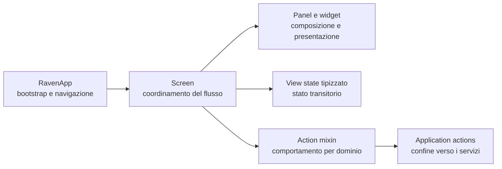

# Architettura dei componenti TUI di Raven

Questa guida descrive i confini introdotti nel refactoring dell’interfaccia Textual. Va letta insieme a `TUI_DEVELOPMENT_GUIDELINES.md` e `ui-component-development-guidelines.md` prima di aggiungere schermate, pannelli o nuovi flussi operativi.

## Il modello mentale

Una schermata coordina il flusso, ma non deve contenere contemporaneamente composizione, stato, accesso ai servizi e rendering di ogni pannello. Raven separa questi compiti in quattro livelli:

`RavenApp` inizializza dipendenze, status e navigazione. Le operazioni applicative usate dalle schermate vivono in `tui/actions/application.py`: questo confine evita che il bootstrap torni a essere un contenitore di logica eterogenea.

`InvestigationWorkspaceScreen` conserva il coordinamento generale, le scorciatoie e gli eventi condivisi. I pannelli Overview, Evidence, Graph e Chat sono componenti distinti in `tui/widgets/workspace/`; il loro comportamento è organizzato negli action mixin omonimi. Lo stato volatile è raccolto in `WorkspaceViewState`, con sotto-stati specifici per evidenze, grafo e chat.

## Contratto di una schermata

Una schermata può conoscere l’applicazione attraverso una proprietà tipizzata, attivare use case della façade e reagire ai messaggi prodotti dai propri widget. Non dovrebbe accedere direttamente a MongoDB, Qdrant, Neo4j o al filesystem. Gli ID CSS esistenti sono parte del contratto di test e di automazione: vanno rinominati solo insieme a una migrazione esplicita.

Le azioni distruttive devono utilizzare `ConfirmDialog` o una sua sottoclasse. La sottoclasse definisce testo, ID e soggetto; il dialogo comune mantiene coerenti interazione, tasti e risultato restituito alla schermata.

## Stato e aggiornamento della vista

Il view state descrive esclusivamente informazioni necessarie alla sessione dell’interfaccia: busy state, selezioni, token, snapshot correnti e preferenze visive. I dati persistenti continuano ad appartenere ai modelli e ai servizi. Quando una proprietà storica è usata da test o integrazioni, una property proxy può mantenerne il nome mentre la sorgente reale viene spostata nel view state tipizzato.

> **Perché questa distinzione è importante**
>
> Un flag come `chat.busy` controlla la vista e può sparire chiudendo il processo. Una conversazione salvata, un documento o un grafo sono invece dati del dominio. Mescolare i due livelli rende difficili sia il ripristino sia i test delle transizioni.

## Stili e responsive layout

Gli stylesheet sono caricati nello stesso ordine della cascata: token, fondazioni, form, workspace, picker, cataloghi, grafo/chat, estensioni e infine override del refactoring. Textual risolve le variabili per singolo stylesheet; per questo ogni modulo che usa la palette dichiara localmente gli stessi token. `tokens.tcss` resta il catalogo canonico da consultare quando si modifica la palette.

Il layout minimo supportato è 80×24. A questa dimensione le azioni principali, lo stato dell’operazione e il contenuto attivo devono restare visibili. Le informazioni secondarie possono ridursi o diventare richiudibili, come il pannello dettagli del grafo. A 140×40 o oltre l’interfaccia deve usare lo spazio aggiuntivo senza fissare altezze arbitrarie.

## Test richiesti

Ogni nuova interazione deve avere almeno un test Pilot che eserciti il comportamento, non soltanto la presenza del widget. Se il componente cambia con la dimensione, il test va eseguito almeno a 80×24 e a una dimensione ampia. Prima della consegna devono passare Ruff, il controllo di formattazione e l’intera suite Pytest.

Per le regressioni visive sono particolarmente importanti: assenza di clipping nelle toolbar, ordine di focus da tastiera, visibilità dello stato durante operazioni lunghe, contenuto dei dialoghi distruttivi e conservazione di selezione o zoom quando cambia il layout.
