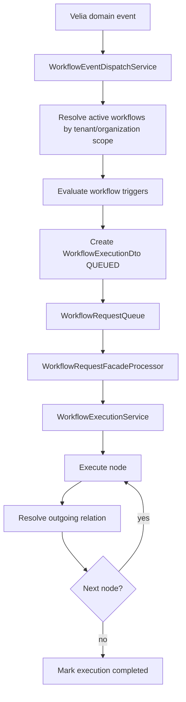

# Velia Workflow Rule Engine Component Design

Data: 2026-06-14
Stato: prima bozza architetturale

## 1) Obiettivo

Integrare in Velia un meccanismo di workflow management event-driven ispirato al Rule Engine di ThingsBoard.

Il componente deve permettere di definire workflow configurabili come grafi di nodi collegati da relazioni nominali. I workflow possono essere creati a livello organization oppure a livello tenant. Un workflow tenant-scoped deve essere visibile ed eseguibile da tutte le organization appartenenti al tenant.

## 2) Riferimento concettuale

ThingsBoard modella il Rule Engine come:

- messaggi/eventi in ingresso;
- rule chain come grafo diretto;
- rule node come unita di elaborazione;
- relazioni nominali tra nodi, per esempio `Success`, `Failure`, `True`, `False` o custom;
- code e strategie di retry/processing;
- root chain e chain richiamabili da altre chain.

In Velia il modello va adattato al dominio esistente:

- `Tenant` Velia corrisponde al top-level operational scope.
- `Organization` Velia corrisponde al customer/sub-organization scope.
- gli eventi principali arrivano da documenti, EDT, Knowledge Base, allarmi, audit, utenti, agenti e runtime configuration.
- il runtime deve seguire i pattern gia presenti in `EdtRequestFacadeProcessor` e `KbRequestFacadeProcessor`.

Fonti di riferimento:

- https://thingsboard.io/docs/pe/user-guide/rule-engine/
- https://thingsboard.io/docs/pe/user-guide/rule-nodes/
- https://thingsboard.io/docs/pe/user-guide/rule-engine/queues/
- https://thingsboard.io/docs/pe/concepts/multi-tenancy/

## 3) Principi di progetto

- Event-driven prima di tutto: il workflow parte da un `WorkflowEventDto`, non da una navigazione UI.
- Configurazione persistente e versionata: una definizione attiva non deve cambiare sotto i piedi di una execution gia avviata.
- Scope esplicito: ogni definizione e ogni execution devono avere tenant/organization risolti in modo deterministico.
- Audit obbligatorio: create/update/delete/activate/disable/execute devono produrre eventi sicuri in `UserActivityAuditService`.
- Runtime osservabile: ogni nodo attraversato deve poter generare trace persistente e log correlati.
- Nodi MVP dichiarativi: evitare scripting libero nella prima iterazione per ridurre rischi di sicurezza e debugging.
- Controller sottili: autorizzazione, validazione dominio e audit stanno nei service/component.
- Raven note: lo stato condiviso di esecuzione deve restare separato dal workflow engine. In Raven questo ruolo e coperto da `it.osint.raven.workflow.WorkflowContext`, che non deve dipendere da LangGraph4j.
- Raven note: il contratto del singolo nodo e `it.osint.raven.workflow.WorkflowNode`. Anche questo contratto resta nel dominio puro: conosce `WorkflowContext`, ma non conosce LangGraph4j, Spring, MongoDB, Neo4j o Qdrant.

### 3.1 Raven WorkflowContext

Per Raven, il modello di stato condiviso tra nodi e agenti e `WorkflowContext`.

Il contesto contiene:

- identificativi e timestamp della execution;
- `SourceDto`;
- `RawDocumentDto`;
- `StructuredDocument`;
- stato `WorkflowStatus`;
- output condivisi come `Map<Class<?>, WorkflowArtifact>`;
- variabili temporanee;
- eventi di audit;
- warning;
- errori strutturati;
- metriche.

La scelta centrale e non aggiungere campi al contesto per ogni nuovo agente. Gli output devono essere registrati come artifact tipizzati e, per i nodi workflow, preferibilmente tramite capability nominate:

```java
context.put("metadata-agent", metadata);
context.put("entity-agent", ENTITY_EXTRACTION, entityExtractionResult);

MetadataDto metadata = context.require(MetadataDto.class);
EntityExtractionResult entities = context.require(ENTITY_EXTRACTION);
```

Ogni `WorkflowArtifact` conserva:

```text
id
type
value
producedBy
producedAt
```

Questa provenienza interna e importante quando molti agenti LLM collaborano nello stesso workflow: permette di capire quale nodo ha prodotto un dato, quando lo ha prodotto e quale risultato downstream lo ha usato.

Regole:

- `WorkflowContext` non deve estendere classi LangGraph4j.
- `WorkflowContext` non deve contenere Spring bean, repository, driver o client di modelli.
- `WorkflowContext` deve poter essere serializzato da adapter esterni senza annotazioni framework obbligatorie nel modello.
- Eventi, warning, errori, variabili e metriche non devono contenere credenziali, prompt, payload LLM completi, documenti completi o stack trace.
- Il workflow engine futuro puo passare, checkpointare o adattare il contesto, ma non deve trasformarlo in un oggetto dipendente dal motore.

### 3.2 Raven WorkflowNode

Per Raven, ogni step eseguibile del workflow implementa `WorkflowNode`.

Il contratto e:

```java
public interface WorkflowNode {
    String id();
    String name();
    String description();
    WorkflowNodeCategory category();
    Set<WorkflowCapability> requires();
    Set<WorkflowCapability> produces();
    WorkflowContext execute(WorkflowContext context) throws Exception;
}
```

Un nodo legge dal `WorkflowContext`, produce nuovi artifact, aggiorna eventi/metriche/warning/errori e restituisce lo stesso context arricchito.

La parte piu importante e dichiarativa:

```java
Set<WorkflowCapability> requires();
Set<WorkflowCapability> produces();
```

`WorkflowCapability` contiene:

```java
record WorkflowCapability(
    String id,
    String namespace,
    String description,
    Class<?> type,
    Version version,
    boolean required,
    Set<String> aliases
)
```

Queste due liste sono la base per costruire il DAG senza hard-code. Il motore puo registrare automaticamente i nodi disponibili, confrontare capability prodotte e richieste, e derivare un ordine di esecuzione compatibile. L'identita della capability e data da namespace, id e version; il tipo Java serve solo per validare e castare il valore, non per definire la dipendenza.

Esempio:

```text
HTML Parser
  produces structured-document -> StructuredDocument

Metadata Extraction
  requires structured-document -> StructuredDocument
  produces metadata-extraction -> MetadataDto

Entity Extraction
  requires structured-document -> StructuredDocument
  produces entity-extraction -> EntityExtractionResult

Relationship Extraction
  requires entity-extraction -> EntityExtractionResult
  produces relationship-extraction -> RelationshipExtractionResult
```

`WorkflowNode` include anche default utili al futuro engine:

```text
configuration()   Collections.emptyMap()
timeout()         5 minuti
maxRetries()      0
parallelizable()  true
idempotent()      true
priority()        100
```

`canExecute(context)` verifica automaticamente tutte le capability dichiarate in `requires()` usando `context.contains(capability)`. Non deve usare reflection complessa o metadata framework-specific.

Nota importante: `contains(...)` verifica gli artifact nominati per capability, non campi arbitrari del context. Se un workflow inizializza `context.document(article)` e un nodo dichiara la capability `structured-document`, il parser o il motore deve anche pubblicare il documento come artifact:

```java
context
        .document(article)
        .put("parser", STRUCTURED_DOCUMENT, article);
```

Categorie disponibili:

```text
CONNECTOR
PARSER
ENRICHMENT
AI
PERSISTENCE
VALIDATION
UTILITY
EXPORT
```

Regole:

- `WorkflowNode` non deve dipendere da LangGraph4j.
- `WorkflowNode` non deve dipendere da Spring o injection framework.
- `WorkflowNode` non deve dipendere da MongoDB, Neo4j, Qdrant o client esterni.
- Eventuali adapter LangGraph4j devono stare fuori dal dominio e devono adattare `WorkflowNode`, non il contrario.
- I nodi con side effect non idempotenti devono dichiarare `idempotent() == false`, salvo deduplicazione/upsert espliciti.
- I nodi devono registrare eventi nel context tramite `context.event(...)`; non usare direttamente logger nel contratto di dominio.

## 4) Scope e visibilita

### 4.1 Tipi di scope

```text
TENANT_SHARED
ORGANIZATION_PRIVATE
```

`TENANT_SHARED`

- creato da un caller `TENANT`;
- `tenantUuid` obbligatorio;
- `organizationUuid` nullo;
- leggibile da tutte le organization del tenant;
- eseguibile per eventi generati da qualunque organization del tenant;
- modificabile da `TENANT` proprietario e da `ADMINISTRATOR` per governance.

`ORGANIZATION_PRIVATE`

- creato da un caller `ORGANIZATION`;
- `tenantUuid` obbligatorio;
- `organizationUuid` obbligatorio;
- leggibile ed eseguibile solo nella organization proprietaria;
- modificabile dalla organization proprietaria, dal tenant padre e da `ADMINISTRATOR` secondo policy da definire.

### 4.2 Risoluzione workflow per evento

Quando arriva un evento organization-scoped:

1. risolvere `tenantUuid` e `organizationUuid`;
2. caricare workflow `ACTIVE` con scope `TENANT_SHARED` per quel tenant;
3. caricare workflow `ACTIVE` con scope `ORGANIZATION_PRIVATE` per quella organization;
4. ordinare per `priority`, poi `updatedAt`, poi `uuid`;
5. enqueuare una execution per ogni workflow candidato il cui trigger corrisponde all'evento.

Quando arriva un evento tenant-scoped senza organization:

1. caricare solo workflow `TENANT_SHARED`;
2. applicare trigger e priority;
3. enqueuare execution tenant-scoped.

## 5) Modello eventi

### 5.1 WorkflowEventDto

Envelope unica per tutti gli eventi intercettabili dal rule engine.

```text
eventUuid
eventType
originatorType
originatorUuid
tenantUuid
organizationUuid
source
payload
metadata
correlationId
createdAt
```

`eventType` deve essere stabile e action-oriented. Esempi iniziali:

```text
DOCUMENT_STATUS_CHANGED
DOCUMENT_PIPELINE_STAGE_CHANGED
DOCUMENT_PROCESSING_COMPLETED
DOCUMENT_PROCESSING_FAILED
KB_DOCUMENT_INDEXING_FAILED
EDT_GENERATION_REQUESTED
EDT_GENERATION_COMPLETED
EDT_GENERATION_FAILED
ALARM_CREATED
ALARM_ESCALATED
ALARM_REMINDER
USER_CREATED
ORGANIZATION_CREATED
RUNTIME_CONFIG_CHANGED
AGENT_STARTED
AGENT_RUNNING
AGENT_FINISHED
```

`payload` contiene dati operativi non sensibili. `metadata` contiene contesto tecnico, routing hints e conteggi. Non inserire password, token, prompt, documenti completi, output LLM completi o stack trace.

## 6) Modello persistente

### 6.1 WorkflowDefinitionDto

Collection proposta: `workflow_definitions`.

```text
uuid
name
description
scopeType
tenantUuid
organizationUuid
status
priority
version
rootNodeUuid
triggers
nodes
edges
createdBy
updatedBy
createdAt
updatedAt
activatedAt
disabledAt
```

Status:

```text
DRAFT
ACTIVE
DISABLED
ARCHIVED
```

Index consigliati:

- `scopeType, tenantUuid, organizationUuid, status, priority`;
- `tenantUuid, status`;
- `organizationUuid, status`;
- `name, tenantUuid, organizationUuid` per unicita logica nello scope;
- `updatedAt`.

### 6.2 WorkflowTriggerDto

```text
eventType
originatorType
enabled
conditions
```

Le condizioni del trigger devono usare lo stesso formato dichiarativo dei filter node.

### 6.3 WorkflowNodeDto

```text
uuid
type
name
description
configuration
position
enabled
timeoutMs
retryPolicy
debugEnabled
```

`position` serve solo alla UI visuale. Il runtime non deve dipendere dalla posizione canvas.

### 6.4 WorkflowEdgeDto

```text
uuid
fromNodeUuid
toNodeUuid
relation
priority
```

`relation` e una stringa controllata. Valori standard:

```text
Success
Failure
True
False
Timeout
Skipped
```

Sono ammessi valori custom solo dopo validazione.

### 6.5 WorkflowExecutionDto

Collection proposta: `workflow_executions`.

```text
uuid
workflowUuid
workflowVersion
workflowName
eventUuid
eventType
tenantUuid
organizationUuid
status
currentNodeUuid
startedAt
finishedAt
durationMs
correlationId
errorCode
errorMessage
createdAt
updatedAt
```

Status:

```text
QUEUED
RUNNING
SUCCEEDED
FAILED
TIMEOUT
CANCELLED
SKIPPED
```

### 6.6 WorkflowExecutionEventDto

Collection proposta: `workflow_execution_events`.

```text
uuid
executionUuid
workflowUuid
nodeUuid
nodeType
relation
status
startedAt
finishedAt
durationMs
inputPreview
outputPreview
errorCode
errorMessage
metadata
createdAt
```

`inputPreview` e `outputPreview` devono essere piccoli, troncati e sanitizzati.

## 7) Nodi MVP

### 7.1 EVENT_TYPE_FILTER

Filtra per `eventType`.

Output:

- `True`
- `False`
- `Failure`

Configurazione:

```json
{
  "eventTypes": ["DOCUMENT_PROCESSING_FAILED"]
}
```

### 7.2 FIELD_FILTER

Valuta condizioni dichiarative su `payload` o `metadata`.

Output:

- `True`
- `False`
- `Failure`

Configurazione:

```json
{
  "all": [
    {"path": "$.payload.processingStatus", "op": "eq", "value": "FAILED"},
    {"path": "$.metadata.retryCount", "op": "gte", "value": 2}
  ]
}
```

Operatori MVP:

```text
eq
ne
contains
in
exists
gt
gte
lt
lte
```

### 7.3 ENRICH_SCOPE

Arricchisce metadata con informazioni risolte da tenant, organization, utente o risorsa.

Output:

- `Success`
- `Failure`

### 7.4 CREATE_ALARM

Crea un allarme automatico usando `AlarmService.createAutomaticAlarm`.

Output:

- `Success`
- `Failure`

Configurazione minima:

```json
{
  "titleTemplate": "Document processing failed",
  "severity": "HIGH",
  "recipientType": "ORGANIZATION",
  "aggregateOccurrences": true,
  "idempotencyKeyTemplate": "workflow:${workflowUuid}:event:${eventType}:originator:${originatorUuid}"
}
```

### 7.5 PUBLISH_MQTT

Pubblica un evento tramite `MqttMessagingService`.

Output:

- `Success`
- `Failure`

### 7.6 ENQUEUE_EDT

Avvia o ritenta una generazione EDT tramite service dedicato.

Output:

- `Success`
- `Failure`

### 7.7 LOG

Scrive trace applicativo e `WorkflowExecutionEventDto`.

Output:

- `Success`

### 7.8 CHAIN_CALL

Invoca un altro workflow attivo nello stesso scope compatibile.

Output:

- `Success`
- `Failure`

Vincoli:

- prevenire ricorsione infinita;
- limite massimo profondita chain, default 5;
- propagare `correlationId`.

## 8) Runtime

### 8.1 Componenti backend

Package proposti:

```text
com.velia.dto.workflow
com.velia.repositories.WorkflowDefinitionRepository
com.velia.repositories.WorkflowExecutionRepository
com.velia.repositories.WorkflowExecutionEventRepository
com.velia.services.WorkflowDefinitionService
com.velia.services.WorkflowEventDispatchService
com.velia.services.WorkflowExecutionService
com.velia.queues.WorkflowRequestQueue
com.velia.components.workflow.WorkflowRequestFacadeProcessor
com.velia.components.workflow.nodes.*
com.velia.components.workflow.policy.*
```

Le classi `@Component` devono stare sotto `com.velia.components`, come richiesto dalle guide backend.

### 8.2 Flusso evento



### 8.3 Node execution contract

Per il modello Raven il contratto implementato e `WorkflowNode`:

```java
public interface WorkflowNode {
    String id();
    String name();
    String description();
    WorkflowNodeCategory category();
    Set<WorkflowCapability> requires();
    Set<WorkflowCapability> produces();
    WorkflowContext execute(WorkflowContext context) throws Exception;
}
```

Il runtime persistente descritto in questo documento puo ancora avere DTO di esecuzione, trace e relazioni nominali (`Success`, `Failure`, `Timeout`, ecc.). Tuttavia il nodo di dominio Raven non produce un `WorkflowNodeResult` separato: arricchisce il `WorkflowContext` con artifact tipizzati, eventi, warning, errori e metriche.

Per compatibility con un rule engine persistente, un adapter puo tradurre l'esito di `execute` in una relazione runtime:

```text
execute ok            -> Success
execute throws        -> Failure
timeout engine-side   -> Timeout
canExecute false      -> Skipped oppure Failure, secondo policy workflow
```

Regola: il nodo non deve modificare direttamente l'evento originale. Lavora sul `WorkflowContext`, pubblica artifact tipizzati e lascia al runtime la decisione su relazione successiva, retry, skip o stop.

### 8.4 Error handling

Eccezioni dedicate:

```text
WorkflowDefinitionValidationException
WorkflowAccessDeniedException
WorkflowExecutionException
WorkflowUnsupportedNodeTypeException
WorkflowUnsupportedEventTypeException
WorkflowGraphValidationException
```

Non usare `RuntimeException` generico in application code.

## 9) Validazione definizioni

Prima di attivare un workflow:

- `name` obbligatorio;
- `scopeType` coerente con `tenantUuid` e `organizationUuid`;
- almeno un trigger abilitato;
- almeno un nodo;
- `rootNodeUuid` presente e riferito a un nodo esistente;
- ogni edge deve riferire nodi esistenti;
- relazioni obbligatorie per tipo nodo dove necessario;
- niente nodi disabilitati nel path obbligatorio del root;
- niente cicli non controllati, salvo nodi flow esplicitamente abilitati;
- `CHAIN_CALL` non puo puntare a se stesso;
- configurazione nodo validata con schema per `type`.

## 10) Autorizzazione

API CRUD:

- `ADMINISTRATOR`: read globale, governance, eventuale delete/disable amministrativo;
- `TENANT`: CRUD sui `TENANT_SHARED` del proprio tenant; read sui workflow organization-private del tenant se richiesto per governance;
- `ORGANIZATION`: CRUD sui propri `ORGANIZATION_PRIVATE`; read sui `TENANT_SHARED` attivi del tenant;
- `USER`: nessun CRUD workflow nel primo MVP.

Execution:

- un evento organization-scoped puo attivare workflow tenant-shared del tenant e organization-private della organization;
- un evento non deve mai attivare workflow fuori scope;
- il processor deve rivalidare lo scope della execution prima di eseguire azioni con side effect.

## 11) API REST bozza

Base path:

```text
/api/workflows
```

Endpoint MVP:

```text
GET    /api/workflows
POST   /api/workflows
GET    /api/workflows/{workflowUuid}
PATCH  /api/workflows/{workflowUuid}
DELETE /api/workflows/{workflowUuid}
POST   /api/workflows/{workflowUuid}/activate
POST   /api/workflows/{workflowUuid}/disable
POST   /api/workflows/{workflowUuid}/validate
GET    /api/workflows/{workflowUuid}/executions
GET    /api/workflow-executions/{executionUuid}
GET    /api/workflow-executions/{executionUuid}/events
POST   /api/workflow-events/test-dispatch
```

`test-dispatch` deve essere disponibile solo per `ADMINISTRATOR`, `TENANT`, `ORGANIZATION` e deve applicare scope reale del caller.

## 12) Audit

Nuovi enum da valutare:

`AuditCategory`:

```text
WORKFLOW_MANAGEMENT
```

`AuditAction`:

```text
WORKFLOW_CREATE
WORKFLOW_UPDATE
WORKFLOW_DELETE
WORKFLOW_ACTIVATE
WORKFLOW_DISABLE
WORKFLOW_VALIDATE
WORKFLOW_EXECUTE
WORKFLOW_EXECUTION_RETRY
WORKFLOW_ACCESS_DENIED
```

`AuditResourceType`:

```text
WORKFLOW_DEFINITION
WORKFLOW_EXECUTION
WORKFLOW_NODE
```

Metadata sicuri:

```text
workflowUuid
workflowVersion
scopeType
nodeCount
edgeCount
triggerCount
eventType
executionStatus
durationMs
```

## 13) Osservabilita

Ogni execution deve avere:

- `correlationId`;
- log start/end;
- log warn per path senza edge;
- log error con `workflowUuid`, `executionUuid`, `nodeUuid`;
- execution event persistiti per debug;
- contatori futuri per dashboard: queued/running/succeeded/failed/avgDuration.

Evitare payload completi nei log e negli audit.

## 14) Integrazione con eventi esistenti

Adapter iniziali consigliati:

### 14.1 Document pipeline adapter

Agganciare `OrganizationDocumentPipelineEventPublisher` oppure creare un publisher interno parallelo che trasformi gli stessi segnali in `WorkflowEventDto`.

Eventi:

```text
DOCUMENT_STATUS_CHANGED
DOCUMENT_PIPELINE_STAGE_CHANGED
DOCUMENT_PROCESSING_COMPLETED
DOCUMENT_PROCESSING_FAILED
```

### 14.2 Alarm adapter

Agganciare `AlarmService`, `AlarmEscalationService`, `AlarmRetentionService`.

Eventi:

```text
ALARM_CREATED
ALARM_STATUS_CHANGED
ALARM_ESCALATED
ALARM_REMINDER
ALARM_ARCHIVED
```

### 14.3 EDT/KB queue adapter

Agganciare enqueue/failure/completion di EDT e Knowledge Base.

Eventi:

```text
EDT_GENERATION_REQUESTED
EDT_GENERATION_FAILED
KB_DOCUMENT_ENQUEUED
KB_DOCUMENT_INDEXING_FAILED
```

## 15) HMI

Prima iterazione UI:

- menu `Workflows` visibile a `TENANT` e `ORGANIZATION`;
- lista workflow con status, scope, version, priority, last update;
- dettaglio workflow in modal/panel con JSON strutturato;
- azioni: create draft, validate, activate, disable, delete;
- tab executions con stato e trace;
- niente editor visuale nel primo MVP.

Seconda iterazione:

- canvas visuale per nodi/edge;
- palette nodi;
- pannello configurazione nodo;
- test trigger/evento.

Regole UI:

- usare i18n centralizzato in `static/js/hmi/core/i18n.js`;
- componenti JS/CSS dedicati;
- nessuna autorizzazione solo frontend.

## 16) Quality gates

Backend:

- DTO con `@Schema`, Jackson e Lombok coerenti;
- repository con index intenzionali;
- service con audit su flussi mutativi;
- controller con `@Tag`, `@Operation`, `@ApiResponses`;
- eccezioni dedicate;
- test su scope resolver, graph validator e dispatcher;
- niente payload sensibili in audit/log.

Runtime:

- processor interrompibile con `@PreDestroy`;
- queue request con `correlationId`;
- execution persistita prima dell'enqueue;
- failure nodo tracciata;
- timeout nodo gestito;
- dead-letter o status `FAILED` per errori non recuperabili.

Frontend:

- i18n `en`, `it`, `de`;
- componenti separati;
- visibilita menu coerente con profilo;
- test almeno per renderer o funzioni principali se introdotte.

## 17) MVP proposto

1. Definire DTO, enum, repository e service CRUD.
2. Implementare `WorkflowGraphValidator`.
3. Implementare `WorkflowEventDispatchService`.
4. Implementare queue e facade processor.
5. Implementare nodi `EVENT_TYPE_FILTER`, `FIELD_FILTER`, `LOG`, `CREATE_ALARM`.
6. Integrare adapter per `DOCUMENT_PROCESSING_FAILED`.
7. Aggiungere API REST e audit.
8. Aggiungere UI lista/dettaglio minimale.
9. Aggiungere test backend su scope, validazione e dispatch.

## 18) Questioni aperte

- Il tenant puo modificare workflow organization-private o solo consultarli?
- Serve una root chain tenant come ThingsBoard o piu workflow attivi per evento sono sufficienti?
- Le execution devono essere retention-based? Se si, quanti giorni?
- Il workflow tenant-shared puo essere disabilitato per singola organization?
- Quando introdurre scripting controllato e con quale sandbox?
- Serve supporto a ordering per originator, tenant o organization nel primo MVP?
