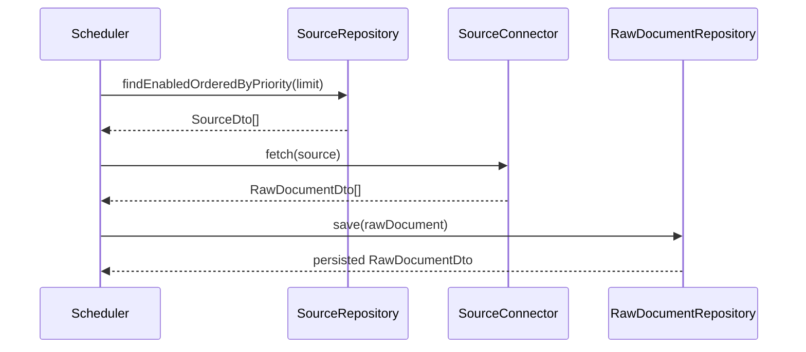
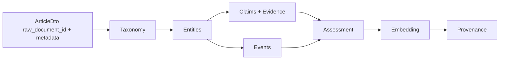
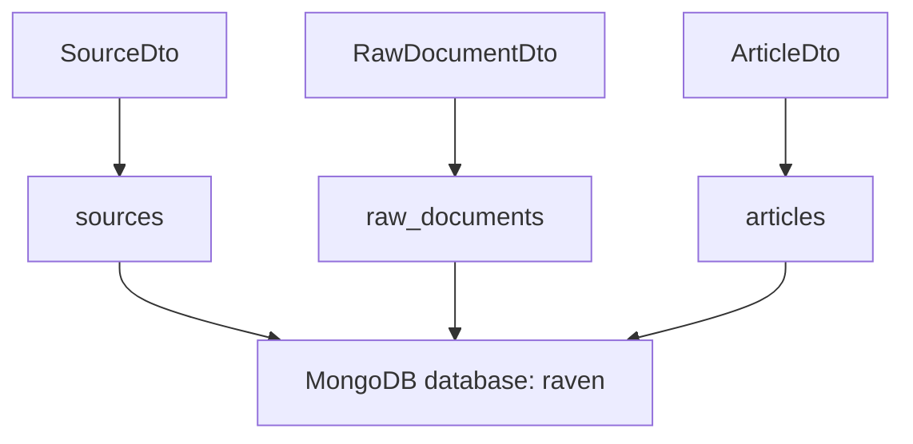
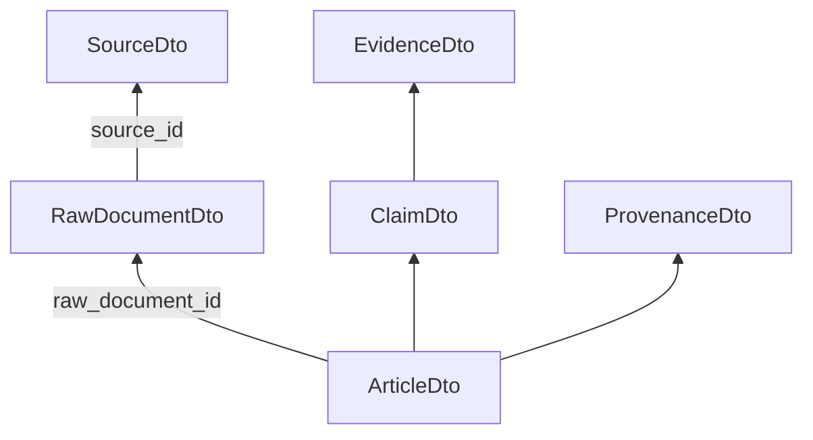

# Data Flows

## High-Level Acquisition Flow

Status: repository and connector interface implemented; scheduler and concrete connectors planned.

## Parsing Flow

```mermaid
flowchart TD
    Raw["RawDocumentDto"]
    Mime{"mime_type"}
    Html["HtmlParser"]
    Pdf["PdfParser"]
    Api["JsonParser / ApiParser"]
    Article["ArticleDto"]
    Document["DocumentDto (planned)"]
    Post["PostDto / MessageDto (planned)"]

    Raw --> Mime
    Mime -->|"text/html"| Html
    Mime -->|"application/pdf"| Pdf
    Mime -->|"application/json"| Api
    Html --> Article
    Pdf --> Document
    Api --> Post
```

Status: DTO boundary defined; parsers planned.

## Article Enrichment Flow

Status: DTO model implemented; enrichment pipeline planned.

## Persistence Flow

Implemented collections:

- `sources`
- `raw_documents`
- `articles`

## Traceability Flow

This flow is central for intelligence use cases: every structured assertion should be traceable back to the raw document, the configured source and the extraction method.

## Deduplication Points

Raw document duplicate control is designed around:

- `source_id + original_uri`;
- `source_id + content_hash`.

Article duplicate control is modeled separately through:

- `assessment.duplicate`;
- unique `raw_document_id` index in the `articles` collection.

Future duplicate detection can compare:

- canonical URLs;
- content hashes;
- embeddings;
- normalized titles;
- event/entity overlap.
