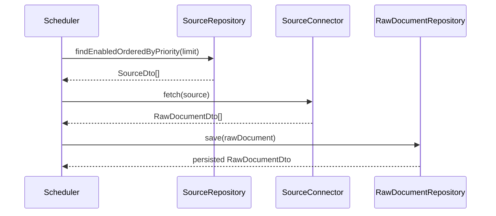
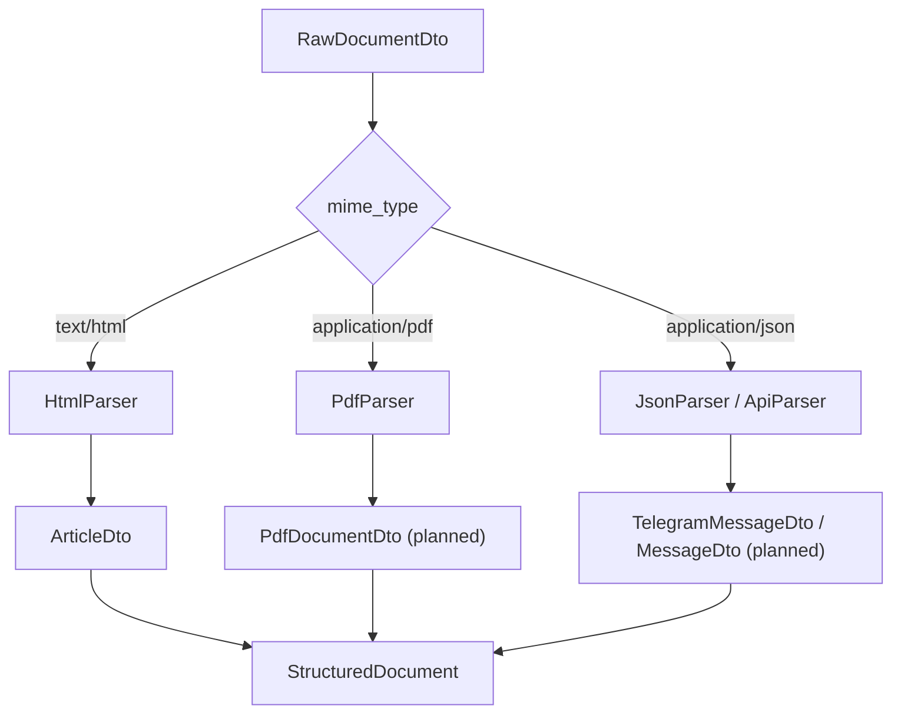
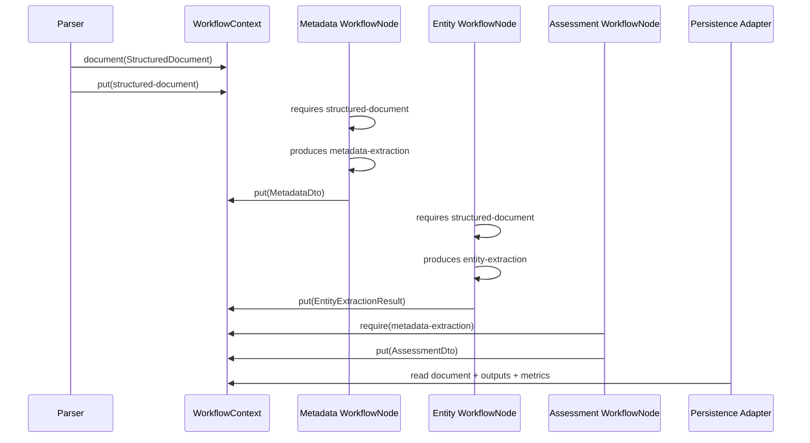
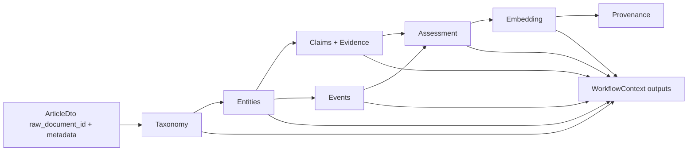
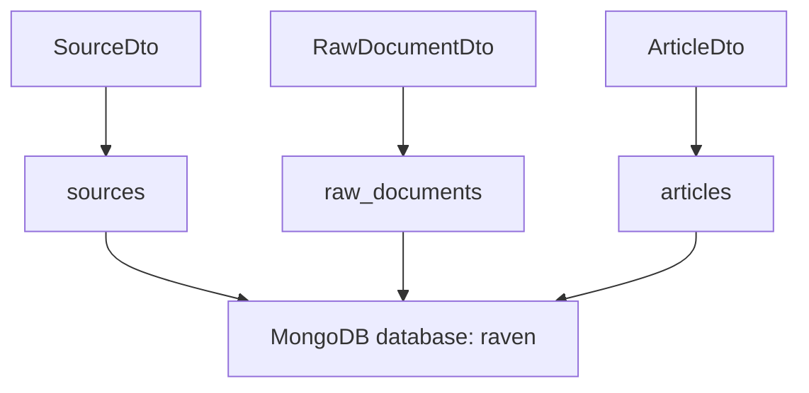
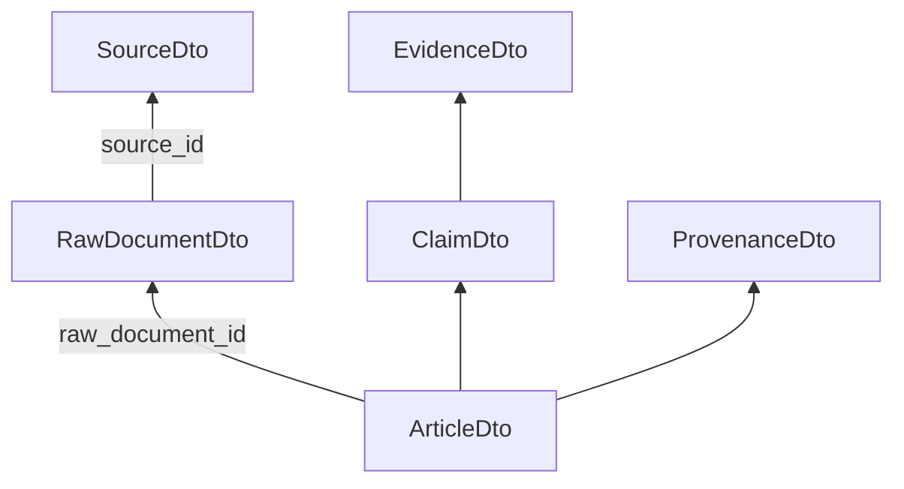

# Data Flows

## High-Level Acquisition Flow

Status: repository and connector interface implemented; scheduler and concrete connectors planned.

## Parsing Flow

Status: DTO boundary defined; parsers planned.

## Workflow Context and Node Flow

`WorkflowContext` is the state carrier between parser output and enrichment/persistence nodes. `WorkflowNode` is the common contract implemented by those executable steps.

The context and node flow is separate from the workflow engine. It is the engine-independent domain model that `SequentialWorkflowEngine` already passes between nodes, and that future runtime adapters can also use.

Shared outputs are stored as `WorkflowArtifact` values. This means Raven can later answer questions such as "which node produced this taxonomy?" or "when were these entities extracted?" without adding provenance fields to every DTO.

The node contract adds one more piece: nodes declare named capabilities through `requires()` and `produces()`. That makes dependency order explicit and gives `WorkflowCompiler` enough information to build an `ExecutionPlan` without hard-coding every pipeline or guessing from Java classes.

Status: `WorkflowContext`, `WorkflowArtifact`, `WorkflowNode`, `WorkflowNodeCategory`, `WorkflowCompiler`, `WorkflowEngine`, `SequentialWorkflowEngine` and tests implemented; concrete production nodes and LangGraph4j adapter planned.

## Article Enrichment Flow

Status: DTO model implemented; enrichment pipeline planned.

## Persistence Flow

Implemented collections:

- `sources`
- `raw_documents`
- `articles`

## Traceability Flow

This flow is central for intelligence use cases: every structured assertion should be traceable back to the raw document, the configured source and the extraction method.

## Deduplication Points

Raw document duplicate control is designed around:

- `source_id + original_uri`;
- `source_id + content_hash`.

Article duplicate control is modeled separately through:

- `assessment.duplicate`;
- unique `raw_document_id` index in the `articles` collection.

Future duplicate detection can compare:

- canonical URLs;
- content hashes;
- embeddings;
- normalized titles;
- event/entity overlap.
