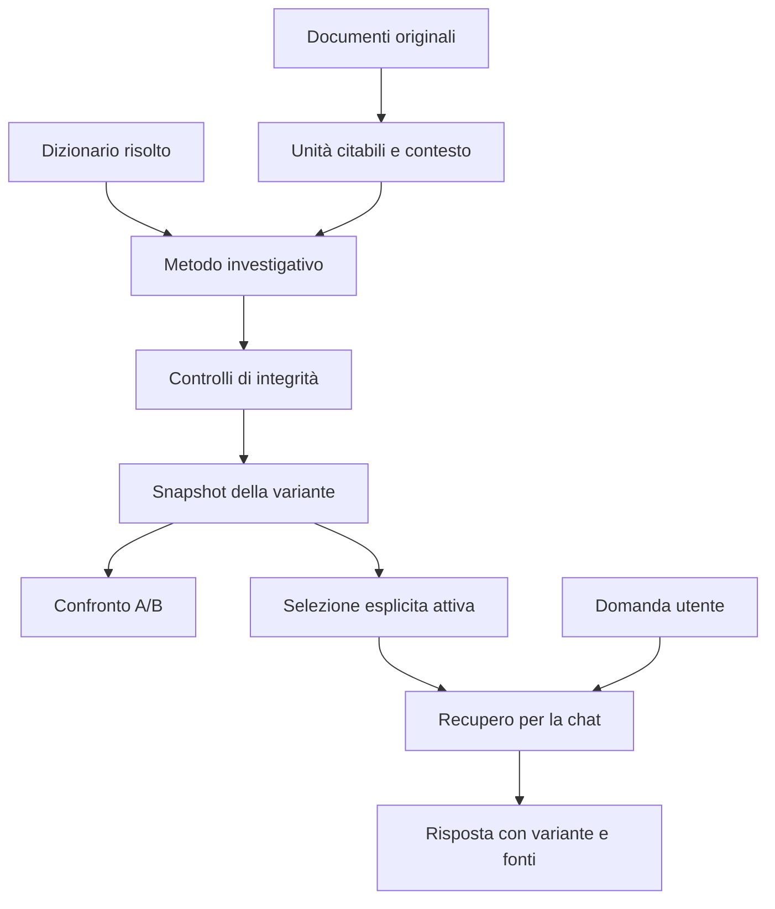
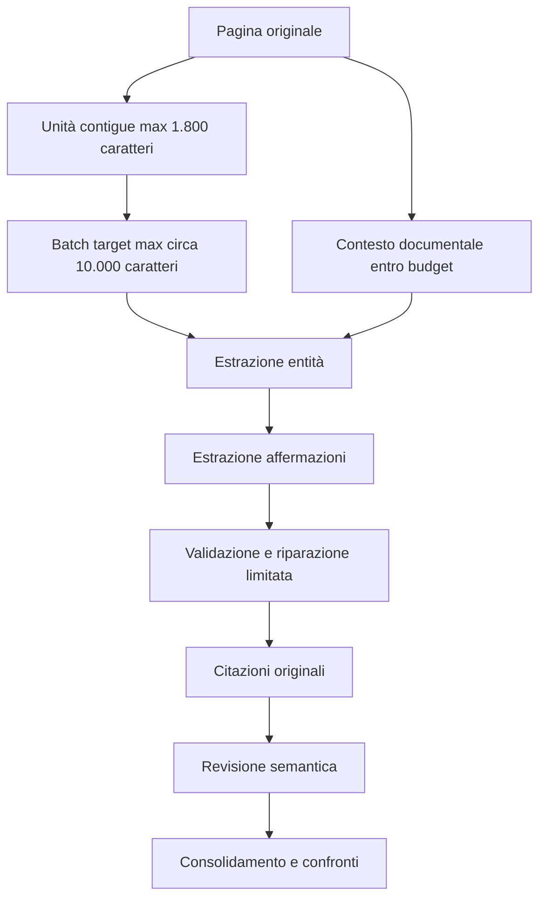
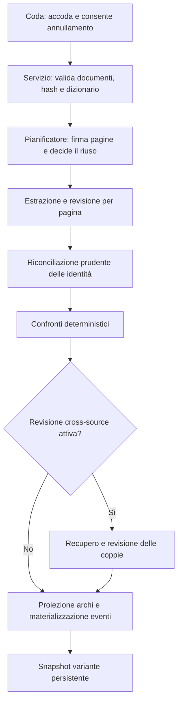
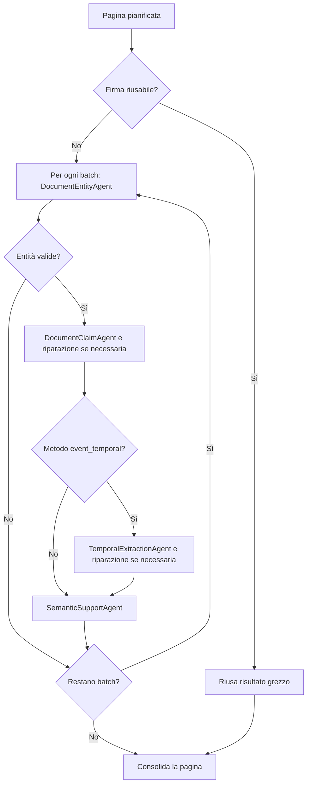
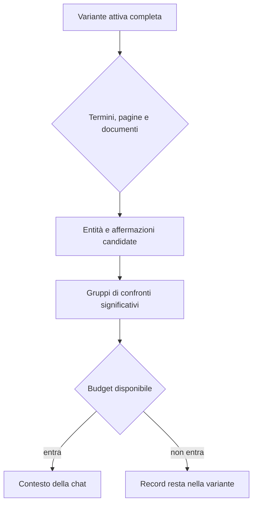

# Metodi di analisi e generazione dei grafi in Raven

**Fotografia del comportamento:** branch `dev`, commit `d9950f2`, 10 settembre 2026.

## Indice

- [Che cosa contiene il grafo](#che-cosa-contiene-il-grafo)
- [La base di integrità comune](#la-base-di-integrità-comune)
- [Algoritmi e contratti tecnici](#algoritmi-e-contratti-tecnici)
- [Agenti, responsabilità e workflow](#agenti-responsabilità-e-workflow)
- [Prompt e skill](#prompt-effettivi-e-skill-catalogate)
- [I tre metodi](#i-tre-metodi)
- [Evidence preparation](#evidence-preparation-comportamento-reale)
- [Dizionari](#dizionari-generici-modificabili-e-versionati)
- [Varianti e confronto A/B](#varianti-persistenti-attivazione-e-confronto-ab)
- [Recupero nella chat](#recupero-del-grafo-nella-chat)
- [Procedura operativa](#procedura-operativa-consigliata)
- [Limiti](#limiti-dimostrati-dalle-valutazioni)

## Scopo e risposta immediata

Raven trasforma i documenti di un’indagine in un grafo investigativo tracciabile. Il grafo non è
una rappresentazione della verità: raccoglie entità, proposizioni attribuite alle fonti, eventi,
confronti e citazioni, conservando l’incertezza necessaria a riesaminare il risultato.

L’applicazione offre tre metodi: **Affermazioni documentali**, **Verifica tra fonti** ed **Eventi e
temporalità**. Queste scelte hanno ancora senso. I metodi eseguono elaborazioni realmente diverse
e rispondono a domande diverse. Non formano però una scala crescente di qualità e nessuno dei tre
è risultato universalmente migliore nelle valutazioni disponibili.

Il precedente menu **Evidence preparation** è stato sostituito da **Originali con contesto
documentale**. Le tre opzioni `Compress Evidence`, `Full text` e `Translate + overlapping chunks`
fornivano già lo stesso input ai nuovi metodi: unità del testo originale con contesto documentale.
Ora la preparazione legacy non modifica neppure la firma usata per il riuso delle pagine dei
metodi selezionabili. I metadati delle varianti storiche rimangono invariati.

> **Modifica applicata il 9 settembre 2026**
>
> I tre metodi moderni mostrano una descrizione non selezionabile: **Originali con contesto
> documentale**. La preparazione richiesta resta nei metadati delle elaborazioni per consentire
> la lettura delle varianti storiche e dei percorsi di compatibilità. Una futura
> politica di preparazione potrà tornare selezionabile solo quando le alternative avranno
> semantica distinta, manifest esplicito e verifiche dedicate.

Questo manuale spiega il comportamento implementato sul branch `dev`, non i requisiti originari
né una proposta astratta. La fotografia tecnica principale è il rapporto di valutazione dell’8
settembre 2026, affiancato dal codice corrente.

## Una mappa mentale del sistema

Per usare correttamente la funzione occorre separare quattro decisioni che nell’interfaccia
possono sembrare vicine:

1. il **metodo investigativo** decide quali passaggi di analisi eseguire;
2. la **preparazione** è un parametro storico dell’acquisizione del testo;
3. la **variante** conserva un risultato specifico con input e versioni tracciati;
4. il **recupero per la chat** decide quale parte del risultato attivo entra nel contesto di una
   domanda.

La Figura 1 mostra che queste decisioni appartengono a fasi diverse.

*Figura 1 — Dal documento alla chat. La generazione produce una variante; solo una successiva
selezione la rende attiva. Il recupero della chat consulta quella variante senza rigenerarla.*

La distinzione evita due equivoci frequenti. Cambiare metodo non equivale a cambiare algoritmo
di ricerca per la chat. Generare una variante non equivale ad attivarla.

> **Lessico della pipeline**
>
> Uno **snapshot** è l’istantanea persistente di una generazione. Il **manifest** è la sua scheda
> tecnica: elenca parametri, input e versioni. Un **hash** è un’impronta del contenuto, utile a
> rilevare cambiamenti; non prova che il contenuto sia vero. Il **prompt** raccoglie le istruzioni
> date al modello. Un **batch** è un gruppo di unità elaborato in una singola chiamata al modello.

> **Concetto chiave — Che cos’è una variante**
>
> Una variante è uno snapshot immutabile di una generazione. Comprende il risultato e un manifest
> con documenti, hash, cataloghi, dizionario risolto, metodo, versioni dei prompt, modello e
> configurazione. Due varianti possono partire dagli stessi documenti e divergere per metodo,
> dizionario, configurazione o variabilità del modello. Il manifest rende input e versioni
> ispezionabili; non promette che una nuova esecuzione produca lo stesso output.

## Che cosa contiene il grafo

Il modello dati non si limita ai classici nodi e archi. Questa scelta è essenziale per non
ridurre una fonte complessa a relazioni binarie apparentemente certe.

> **Nota sugli esempi — Un caso interamente fittizio**
>
> Gli esempi di questa sezione usano nomi, documenti e operazioni inventati a scopo didattico.
> “Aurora Servizi”, “Cooperativa Riva” e le persone citate non indicano soggetti reali. I record
> mostrano come il modello può rappresentare un testo quando l’estrazione e i controlli hanno
> esito coerente; non descrivono dati presenti nel sistema e non garantiscono che ogni futura
> esecuzione produca esattamente gli stessi campi.

### Entità e menzioni

Un’entità rappresenta una persona, organizzazione, luogo, documento o altro oggetto riconosciuto.
La classificazione deriva dal dizionario selezionato per l’indagine. Nome, tipo, sottotipo,
alias, identificatori esterni, citazioni e note di risoluzione rimangono disponibili per il
riesame.

Le menzioni estratte ricevono identificativi brevi durante l’analisi. Gli agenti indicano questi
identificativi anziché inventare UUID, cioè identificatori tecnici univoci e persistenti. Il
programma risolve poi i riferimenti. Questa procedura riduce gli estremi inesistenti che in
passato potevano invalidare un’intera lista di affermazioni.

La riconciliazione delle identità resta prudente. Un nome simile o un tipo appartenente alla
stessa famiglia può suggerire un confronto, ma non autorizza automaticamente la fusione. Il
rapporto tra due possibili identità rimane revisionabile.

> **Esempio — Due menzioni uguali non sono ancora la stessa persona**
>
> Il documento `verbale-aurora.pdf`, a pagina 2, nomina «Andrea Riva, responsabile acquisti di
> Aurora Servizi»; `registro-riva.pdf`, a pagina 7, nomina invece «Andrea Riva, socio della
> Cooperativa Riva». L’estrazione può creare due menzioni, ciascuna con un ID locale come `m1`
> nel proprio batch, dalle quali derivano due entità proposte di tipo persona. Il nome canonico
> coincide, ma le fonti non forniscono un identificatore forte condiviso, come lo stesso numero
> di passaporto. Neppure una data di nascita coincidente autorizzerebbe da sola la fusione.
> La lettura corretta è quindi: «esistono due riferimenti testuali a persone
> chiamate Andrea Riva, la cui identità comune deve essere verificata». Non si può concludere che
> siano la stessa persona, né trasferire automaticamente incarichi, relazioni o eventi dall’una
> all’altra. Una nota di risoluzione rende visibile proprio questa ambiguità.

### Affermazioni

Un’affermazione è una proposizione attribuita a una fonte. Contiene un soggetto, un predicato
canonico e, quando richiesto, un oggetto. Può anche contenere un valore letterale tipizzato, una
data, un intervallo di validità, qualificatori, una modalità, uno stato epistemico, una fonte
parlante e riferimenti ad altre affermazioni.

“Il rapporto afferma che A trasferì 240 EUR a B” non diventa automaticamente “A trasferì 240 EUR
a B ed è vero”. Raven conserva chi lo afferma, dove compare e come è stato interpretato.

I predicati canonici riducono differenze puramente lessicali. Per esempio, forme come
`DEPENDENCE` e `DEPENDS_ON` vengono ricondotte a `DEPENDENT_ON`; `TRANSFERRED` viene ricondotto a
`TRANSFER`. La normalizzazione conserva direzione, importo, valuta, periodo e scopo, perché
perdere uno di questi elementi cambierebbe la proposizione.

Il catalogo degli alias e la semantica dei predicati vivono nel codice, separati dai dizionari
di entità. Un predicato sconosciuto non viene scartato: rimane invariato, ma non acquisisce per
questo regole di confronto specializzate.

> **Esempio — Dalla frase al record di affermazione**
>
> Si immagini che la pagina 4 di `nota-banca.pdf` riporti: «Secondo la Cooperativa Riva, Aurora
> Servizi trasferì 240 EUR alla cooperativa il 12 marzo 2025 per il noleggio di un deposito».
> Dopo aver risolto le menzioni verso entità distinte, il contenuto può essere conservato in un
> claim, cioè un record che rappresenta ciò che la fonte dice. Gli identificativi `org-aurora` e
> `org-riva` presuppongono che le due organizzazioni siano state risolte usando codici di registro
> fittizi presenti nelle fonti, non soltanto i loro nomi. La tabella seguente mostra perché l’arco,
> da solo, non basta.

| Campo del claim | Valore didattico | Come si legge |
| --- | --- | --- |
| soggetto | `org-aurora` | entità indicata come mittente |
| predicato | `TRANSFER` | relazione canonica di trasferimento |
| oggetto | `org-riva` | entità indicata come destinatario |
| qualificatori | importo `240`, valuta `EUR`, scopo `noleggio deposito` | circostanze che delimitano la proposizione |
| data di validità | `2025-03-12` | data dichiarata per l’operazione |
| attribuzione | Cooperativa Riva | soggetto a cui viene attribuita la dichiarazione |
| supporto | citazione verificata, pagina 4 | punto della fonte originale che sostiene il record |
| stato | `proposed` | elemento ancora sottoposto a revisione |

Se il controllo semantico assegna `supported`, significa che la citazione sostiene questa
specifica lettura, compresi importo, valuta, direzione e data. Non significa che il bonifico sia
realmente avvenuto, che la Cooperativa Riva sia indipendente o attendibile, oppure che il
noleggio sia lecito. Queste conclusioni richiedono altre prove e il giudizio dell’analista.

### Negazione, assenza e stato epistemico

La polarità indica se la fonte afferma o nega una proposizione. Lo stato epistemico distingue
`reported`, `not_documented` e `unknown`. La modalità distingue invece `asserted`, `alleged` e
`uncertain`: ipotesi e incertezza appartengono alla modalità, assenza di documentazione allo
stato epistemico.

Queste dimensioni non sono intercambiabili:

| Formulazione della fonte | Rappresentazione corretta | Errore da evitare |
| --- | --- | --- |
| “A appartiene a B” | relazione affermata | presentarla come verità accertata |
| “A non appartiene a B” | relazione negata | eliminare l’informazione dal grafo |
| “Non è documentato che A appartenga a B” | assenza di riscontro | trasformarla in una smentita |
| “La fonte ipotizza che A appartenga a B” | modalità `alleged` e attribuzione | promuoverla ad affermazione certa |

> **Attenzione — Assenza di evidenza**
>
> L’assenza di un riscontro nel materiale esaminato non prova che il fatto sia falso. Questo è un
> limite logico, non soltanto un dettaglio del software. Le prove RX41 mostrano che tutti i metodi
> confondono ancora alcuni casi di assenza con una smentita; la distinzione esiste nel modello ma
> l’estrazione non è infallibile.

> **Esempio — Negazione e assenza producono letture diverse**
>
> Nel primo caso, una risposta firmata da Aurora Servizi dice: «Aurora Servizi non ha trasferito
> 240 EUR alla Cooperativa Riva il 12 marzo 2025». Il record conserva la stessa proposizione di
> base con polarità `denied` e stato epistemico `reported`: la fonte sta formulando una vera e
> propria negazione. Nel secondo caso, il revisore scrive: «Nel fascicolo esaminato non è presente
> una ricevuta del trasferimento». Qui la polarità resta `affirmed`, mentre lo stato epistemico è
> `not_documented`: viene riportata l’assenza di un documento, non la falsità del trasferimento.
> Da questa seconda frase non si può dedurre che Aurora non abbia pagato. Allo stesso modo, la
> prima frase non dimostra da sola che il pagamento non sia avvenuto: dimostra che una fonte lo
> nega. Il grafo conserva entrambe le posizioni affinché il contrasto resti esaminabile.

### Rettifiche, ritiri e cessazioni

Una rettifica sostituisce o corregge il contenuto di un’affermazione precedente. Un ritiro revoca
una precedente ipotesi o attribuzione. Una cessazione descrive la fine temporale di una relazione
o attività. Sono operazioni differenti.

Il sistema può conservare riferimenti strutturati all’affermazione interessata e valori
temporali. Non è necessario inventare una seconda entità quando l’operazione ha un valore, una
data o un riferimento a un’altra proposizione.

La distinzione rimane delicata. Nella prova RX41 il ritiro di una localizzazione è stato
interpretato erroneamente come cessazione. Il modello dati consente la forma corretta, ma non
garantisce che il modello linguistico la scelga.

> **Esempio — Correggere importo e data senza cancellare la versione precedente**
>
> Il 15 marzo `nota-banca.pdf` attribuisce alla Cooperativa Riva il trasferimento di 240 EUR in
> data 12 marzo. Il 18 marzo la stessa fonte pubblica una nota: «Rettifichiamo: l’importo era 204
> EUR e la data corretta era il 13 marzo 2025». Il primo claim resta nello snapshot, perché serve
> a ricostruire ciò che era stato dichiarato. La rettifica diventa un nuovo claim di tipo
> `corrects`, con un riferimento strutturato alla fonte, al predicato, al soggetto, all’oggetto e,
> quando disponibile, all’identificativo del claim precedente. I nuovi valori sono conservati
> come valori o qualificatori tipizzati. La lettura corretta è: «la fonte successiva corregge la
> propria dichiarazione precedente». Non si può concludere che 204 EUR sia l’importo vero solo
> perché è l’ultimo, né cancellare 240 EUR come se non fosse mai comparso.

> **Esempio — Ritiro e cessazione rispondono a domande differenti**
>
> Se Aurora dichiara «ritiriamo l’ipotesi che Andrea Riva abbia autorizzato il pagamento», il
> nuovo record è un ritiro della precedente affermazione, `retracts`, e si riferisce al claim
> sull’autorizzazione. Se dicesse invece «non sosteniamo più con certezza che Andrea abbia
> autorizzato il pagamento», ritirerebbe la certezza attribuita: `withdraws_certainty`.
> Nessuna delle due formulazioni sta dicendo che un
> incarico sia terminato. Se invece un contratto afferma «il servizio di deposito cessa il 30
> giugno 2025», il record è di tipo `ceases` e usa il limite temporale esplicito. Da questa frase
> non si può dedurre quando il servizio sia iniziato, né che il trasferimento di marzo sia stato
> revocato. Il riferimento alla proposizione interessata e la data impediscono di confondere una
> modifica epistemica con la fine temporale di una relazione.

### Eventi e valori

Un evento è un record autonomo, specifico della fonte. Contiene un tipo, ruoli dei partecipanti,
affermazioni collegate, valori tipizzati, intervalli e provenienza. Record concorrenti non vengono
fusi silenziosamente.

Tutti i metodi possono ricavare un evento da un’affermazione che ne contiene gli elementi. Il
metodo temporale aggiunge un passaggio dedicato e amplia la copertura; non è l’unico modo in cui
nello snapshot può comparire un evento.

Un trasferimento può così essere rappresentato con mittente, destinatario, importo, valuta e
data. Una correzione da 93 a 39 CHF può mantenere entrambi i valori e il rapporto di rettifica,
anziché lasciare un singolo arco ambiguo.

> **Esempio — Un evento conserva ruoli, valori e provenienza**
>
> Dal claim sul trasferimento tra Aurora e Riva può derivare un evento specifico della fonte. Il
> record assegna ad `org-aurora` il ruolo di mittente e a `org-riva` quello di destinatario;
> collega l’identificativo del claim, registra l’importo come valore decimale con unità `EUR`,
> conserva la data dichiarata e riporta la stessa provenienza e la stessa citazione. Questo rende
> possibile chiedere «quali eventi attribuiscono ad Aurora il ruolo di mittente?» senza perdere
> il contesto documentale. Tuttavia il record evento non prova l’esecuzione bancaria e non unisce
> automaticamente versioni concorrenti. Se una seconda fonte indica 204 EUR il 13 marzo, può
> esistere un altro evento o un altro claim collegato: la divergenza deve restare visibile. Un
> evento non possiede inoltre un proprio campo di supporto semantico: per interpretarne polarità,
> stato e giudizio occorre consultare il claim di origine collegato.

### Archi proiettati

Gli archi mostrati nel grafo sono una proiezione operativa delle affermazioni positive che hanno
superato i requisiti previsti. La proiezione aiuta l’esplorazione visuale, ma contiene meno
informazione dell’affermazione completa.

Negazioni, assenze, ritiri e confronti possono quindi essere presenti nello snapshot pur non
apparendo come normali archi positivi. Per un’analisi accurata occorre consultare i dettagli delle
affermazioni e non dedurre la completezza dal solo disegno del grafo.

> **Esempio — Perché un claim può esserci senza un arco visibile**
>
> Il claim affermato sul trasferimento Aurora → Riva può produrre un arco `TRANSFER` soltanto se
> riguarda una relazione o un evento con entrambi gli estremi, ha stato epistemico `reported`, è
> fondato su citazioni verificate nell’originale e, nello schema corrente, ha supporto semantico
> `supported`. Il claim che nega lo stesso trasferimento rimane consultabile ma non diventa un
> normale arco positivo; lo stesso vale per l’assenza della ricevuta, una rettifica o un ritiro.
> Se compare l’arco, la lettura corretta è «esiste almeno un’affermazione positiva proiettabile,
> con questi estremi e qualificatori». Non si può concludere che non esistano contestazioni,
> versioni corrette o lacune documentali. Per questo l’analista deve aprire i `claim_ids` associati
> all’arco e leggere citazioni, attribuzione, modalità, periodo, note di risoluzione e possibili
> claim collegati.

> **Concetto chiave — Proposta, non verdetto**
>
> Entità e affermazioni generate rimangono proposte. Anche una citazione letteralmente verificata
> e un giudizio semantico `supported` non certificano la verità della fonte né sostituiscono la
> revisione dell’analista.

## La base di integrità comune

I tre metodi condividono la stessa base moderna, registrata come versione di metodo 4 e prompt
`raven-integrity-v5`. La Figura 2 ne riassume il flusso.

*Figura 2 — Base di integrità. Le citazioni provengono da unità contigue dell’originale; gli
elementi validi vengono conservati anche quando elementi fratelli richiedono riparazione.*

### Unità citabili e contesto

Il testo originale viene suddiviso in unità citabili contigue, lunghe al massimo 1.800 caratteri.
Gli offset si riferiscono ai caratteri dell’originale. Non si usano ellissi inventate né
corrispondenze approssimative per promuovere una citazione a verificata.

Le unità della pagina obiettivo vengono raggruppate in batch di circa 10.000 caratteri. Il
contesto proveniente dalle altre pagine è limitato dal budget applicativo di 32.000 caratteri e
serve a risolvere riferimenti, mentre le citazioni devono essere scelte dalle unità target.

Una pagina lunga può produrre più batch. Il budget di riparazione è applicato alla risposta di
estrazione del singolo batch; non va interpretato come un massimo fisso di riparazioni per
pagina.

### Validazione per elemento

Le risposte degli agenti usano uno schema strutturato. Ogni affermazione viene validata
separatamente: riferimenti alle menzioni, tipi dei campi, unità citate e vincoli dello schema
devono essere coerenti.

Se un elemento fallisce, la procedura tenta una riparazione limitata di quell’elemento. Gli
elementi validi della stessa risposta non vengono persi o sostituiti. Gli errori e le riparazioni
richieste rimangono nella diagnostica della pagina.

### I quattro livelli da non confondere

La pipeline conserva livelli distinti di controllo:

| Livello | Domanda | Che cosa dimostra |
| --- | --- | --- |
| Integrità strutturale | Il record rispetta schema e riferimenti? | Il dato può essere elaborato |
| Provenienza letterale | La citazione coincide con l’originale? | Le parole compaiono in quella fonte |
| Supporto semantico | La citazione sostiene la proposizione proposta? | Il revisore la ritiene coerente col testo |
| Verità e attendibilità | La fonte è corretta e indipendente? | Richiede analisi investigativa ulteriore |

Nel percorso moderno le citazioni selezionano unità originali con offset esatti. La normalizzazione
degli spazi appartiene al grounding di compatibilità del percorso precedente. Nessuno dei due
controlli decide se classificazione o proposizione siano corrette. Il revisore semantico può
respingere una proposta contraddetta dalla sua citazione, ma resta un giudizio del modello.

Lo `status` manuale (`proposed`, `verified`, `rejected`), il `semantic_support` del revisore e
l’attendibilità della fonte sono distinti. L’attendibilità nasce come `unassessed`: un esito
semantico positivo non la aggiorna automaticamente.

## Algoritmi e contratti tecnici

Questa sezione descrive la pipeline come algoritmo eseguibile. I limiti numerici indicati non
sono consigli editoriali: sono soglie presenti nel codice alla data della fotografia. Dove il
comportamento deriva da una scelta progettuale non formalizzata, il testo lo segnala come
motivazione inferita.

### 1. Pianificazione, riuso e segmentazione

Il servizio riceve un’indagine, almeno un documento appartenente a quell’indagine, il metodo e
il nome facoltativo della variante. Risolve una copia immutabile del dizionario di dominio,
verifica l’hash di ogni documento nei metodi moderni e crea il manifest prima di analizzare le
pagine. Un documento con hash diverso dal manifest viene rifiutato: elaborare byte cambiati con
l’identità del documento precedente renderebbe falsa la provenienza.

Per ogni pagina, il pianificatore calcola hash e firma. Una pagina precedente viene riusata solo
se la firma coincide e lo stato era `analyzed`, `reused` oppure `empty`. Una pagina fallita non
viene riusata. Dopo il riuso, la riconciliazione delle identità e i confronti sono comunque
ricalcolati sull’insieme corrente: eliminare una fonte non può lasciare una fusione o una
contraddizione ereditata da una variante precedente.

Il catalogo orienta la pianificazione, ma non elimina pagine dall’estrazione moderna. La numerazione
fisica `1..N` rimane stabile, mentre l’ordine di elaborazione dà precedenza alle pagine i cui `uses`
comprendono contraddizioni, relazioni, cronologie o transazioni; a parità vale il numero di pagina.
Soltanto `uses`, candidati di entità, date e riferimenti correnti diventano suggerimenti. Sintesi e
asserzioni a livello di documento sono escluse deliberatamente. Se il catalogo manca o non è
leggibile, lo stato lo segnala e ogni pagina viene comunque visitata. La firma comprende testo,
profilo di estrazione e suggerimenti ammessi: cambiare un input rilevante invalida il riuso senza
trasformare il catalogo in un filtro di esclusione.

La funzione `citation_units` cerca la fine delle frasi con `.`, `!` o `?` seguiti da spazio o
fine testo. Ogni intervallo viene poi limitato a 1.800 caratteri; se deve essere spezzato, il
taglio arretra all’ultimo spazio disponibile. Ogni unità conserva pagina, testo letterale,
offset iniziale e finale e riceve un identificatore `p{pagina}u{numero}`. Il testo della pagina
obiettivo viene consumato interamente, in batch da non più di circa 10.000 caratteri. Il contesto
usa prima le pagine più vicine e si arresta a 32.000 caratteri, registrando
`document_context_truncated` quando il budget non basta.

> **Perché due budget distinti**
>
> Il batch obiettivo determina ciò che l’agente può estrarre e citare; il contesto serve soltanto
> a sciogliere riferimenti come “la società” o “il giorno seguente”. Questa separazione impedisce
> che una frase vista come contesto venga attribuita alla pagina sbagliata. La preferenza per le
> pagine vicine è una scelta di prossimità documentale: è ragionevole per rapporti sequenziali,
> ma non prova che un rinvio punti davvero alla pagina adiacente.

### 2. Estrazione delle entità

Per ogni batch il `DocumentEntityAgent` riceve il dizionario risolto, il contesto e le unità
obiettivo. Il suo output deve essere un oggetto JSON con una lista `entities`; oltre 500 elementi
la risposta è invalida. Ciascuna entità deve contenere tipo, eventuale sottotipo, nome canonico,
alias, identificatori espliciti, motivazione e da una a trenta unità citate. Tipo e sottotipo
devono appartenere alle coppie ammesse dal dizionario. Gli identificatori persistenti non sono
scelti dal modello: il programma calcola un UUID stabile da documento, nome, classificazione,
identificatori e supporto, e assegna anche un riferimento locale breve (`m1`, `m2`, ...).

Il prompt richiede tutte le entità nominate e permette ancore locali descrittive per eventi,
transazioni e accordi necessari come soggetti di valori o cessazioni. Vieta di assegnare una
classificazione esplicitamente negata e preferisce un tipo generale quando quello specialistico
non è sostenuto. Questa decisione riduce due errori ad alto impatto: inventare un nodo per dare
un estremo a una proprietà e trasformare un’etichetta discussa dalla fonte in classificazione.

### 3. Estrazione atomica delle affermazioni

Il `DocumentClaimAgent` può usare soltanto gli identificatori `m...` prodotti nello stesso batch.
Restituisce al massimo 1.000 affermazioni. Lo schema obbliga a dichiarare soggetto, oggetto o
valore, predicato, polarità, modalità, stato epistemico, natura dell’operazione, date,
attribuzione, fonte, dipendenze, qualificatori, riferimenti e unità citate. Le date accettate hanno
forma ISO `YYYY`, `YYYY-MM` o `YYYY-MM-DD`; i valori possono essere stringhe, date, decimali,
interi o booleani con unità esplicita.

L’algoritmo impone proposizioni atomiche perché importo, valuta, periodo e direzione devono poter
essere confrontati separatamente. Per una proprietà letterale l’oggetto può essere vuoto. Anche
un’operazione (`corrects`, `retracts`, `withdraws_certainty`, `ceases`) può riferirsi a una
proposizione precedente senza creare un’entità artificiale. `reported` significa soltanto che la
fonte riferisce la proposizione; `not_documented` richiede una dichiarazione esplicita di assenza
di documentazione.

Nel metodo temporale lo stesso schema viene invocato una seconda volta dal
`TemporalExtractionAgent`, con un’istruzione mirata a eventi, ruoli, transazioni, valori,
rettifiche, ritiri e cessazioni. Le due liste sono deduplicate per `claim_id`. Negli altri due
metodi questo secondo passaggio non avviene, ma la prima estrazione può già produrre affermazioni
di tipo evento.

> **Esempio — Rettifica di un importo**
>
> “D4 corregge l’importo di D2 da 93 a 39 CHF” non dovrebbe diventare un arco generico tra D4 e
> D2. La rappresentazione utile conserva la proposizione originaria, una nuova proposizione con
> valore `39`, unità `CHF`, natura `corrects` e un riferimento alla fonte e alla proposizione
> precedente. L’analista può così ricostruire sia ciò che fu detto prima sia la correzione.

### 4. Riparazione circoscritta e revisione semantica

Ogni elemento viene convertito e validato separatamente. Se alcune affermazioni non superano i
controlli, il `ClaimRepairAgent` riceve soltanto gli indici falliti, il relativo errore e il
record originale. Deve restituire una riparazione per indice oppure `null` se il contenuto non è
sostenibile. È previsto un solo tentativo per risposta di estrazione. Le affermazioni già valide
non entrano nel prompt di riparazione e quindi non possono essere sostituite accidentalmente.

Il `SemanticSupportAgent` esamina poi entità e affermazioni in blocchi di 24. Per ogni candidato
deve restituire esattamente uno tra `supported`, `unsupported`, `contradicted` e `uncertain`, con
motivazione. Controlla classificazione, estremi, direzione, negazione, stato epistemico, modalità,
valori, periodo, attribuzione e natura dell’operazione contro citazioni, originale e dizionario.
Se manca una risposta, il candidato diventa `uncertain`. Una claim inizialmente supportata viene
comunque degradata a `uncertain` se uno dei suoi estremi non ha classificazione semanticamente
supportata.

Tutte le chiamate di questa famiglia usano lo stesso `IntegrityAgent`: ragionamento `medium`,
massimo 8.192 token di output e timeout letto dalle impostazioni del nodo. Il codice usa 120
secondi come ripiego se l’attributo non è disponibile; il valore configurato può essere diverso.
Schema JSON e valori enumerati limitano la forma dell’output; non eliminano gli
errori di interpretazione.

### 5. Riconciliazione prudente delle identità

La riconciliazione avviene documento per documento contro le entità già consolidate. Un conflitto
tra identificatori forti della stessa famiglia, per esempio due registrazioni incompatibili,
impedisce la fusione. Una corrispondenza esatta sostenuta da identificatori può essere risolta in
modo deterministico. La somiglianza dei nomi usa normalizzazione e rapporto di similarità almeno
pari a `0,82`, ma serve solo a formare candidati.

Se esistono più di dieci candidati plausibili, oppure un identificatore forte conduce a più
identità, l’entità resta separata con una nota di revisione. Anche il solo nome simile non basta.
Quando esistono elementi corroboranti, l’`EntityResolutionAgent` può proporre `LINK`, `CREATE`,
`KEEP_SEPARATE` o `REVIEW`; il collegamento viene applicato soltanto con confidenza almeno `0,90`,
candidato valido e identificatore corroborante. Questo agente usa un profilo più piccolo della
pipeline di integrità: ragionamento `low`, massimo 2.048 token e timeout 60 secondi. Se non è
disponibile o fallisce, l’identità rimane separata.

> **Scelta progettuale — Il costo di una falsa fusione**
>
> Due nodi separati possono essere revisionati e collegati in seguito. Una fusione errata propaga
> invece relazioni, eventi e accuse da una persona a un’altra. Il codice sceglie quindi un falso
> negativo revisionabile al posto di un falso positivo con effetti a cascata.

### 6. Confronti, proiezione ed eventi

`compare_claims` considera soltanto record non rifiutati con citazioni originali verificate e
senza la nota di polarità legacy. Forma gruppi sia sugli UUID degli estremi sia sulla combinazione
di famiglia del tipo e nome normalizzato. Lo scope include predicato canonico, `claim_kind`,
terna letterale (tipo, valore e unità) e qualificatori ordinati da `qualifiers_scope`: un importo
o una condizione mancante non diventa una wildcard. Una
coppia dello stesso documento viene esclusa quando non dichiara fonti diverse; un conflitto tra
identificatori forti blocca il confronto nominale.

La classificazione segue una priorità fissa: uno stato diverso da `reported` produce
`evidence_gap`; una famiglia di fonte condivisa produce `dependent_source`; periodi espliciti non
sovrapposti producono `temporal_change`; polarità opposte producono `contradicts`; gli altri casi
producono `agrees`. Se gli UUID differiscono, il tipo riceve il prefisso `candidate_` e richiede
revisione dell’identità. Un passaggio separato crea i link indicati dalle `references` per
rettifiche, ritiri, ritiri della certezza e cessazioni.

Nel metodo `cross_source_review` la copertura viene ampliata in due modi. Il primo raggruppa
deterministicamente per predicato canonico e identità nominale/tipo degli estremi. Il secondo usa
il `SourceCandidateAgent`: divide tutte le claim eleggibili in blocchi di 30, visita ogni coppia
di blocchi, invia per ciascuna claim un estratto di citazione limitato a 900 caratteri e recupera
possibili parafrasi o riferimenti. Gli estratti selezionano candidati e non diventano prova. Il
`CrossSourceReviewAgent` riceve poi al massimo otto coppie per volta con le claim e le citazioni
complete e classifica il rapporto; non decide quale fonte sia vera. Con `n` claim eleggibili si
ottengono `b = ceil(n / 30)` blocchi e `b(b+1)/2` coppie di blocchi. Per esempio, 61 claim formano
tre blocchi e sei coppie da visitare. Il costo della ricerca cresce quadraticamente nei blocchi;
la revisione finale rimane limitata a otto coppie per chiamata.

> **Approfondimento — Perché il recupero usa estratti**
>
> Inviare tutte le coppie con citazioni complete farebbe crescere rapidamente il contesto.
> L’estratto da 900 caratteri serve solo a recuperare candidati. La decisione finale riceve i
> record completi: l’estratto non viene promosso a evidenza.

`project_claims` crea un arco soltanto se la claim non è rifiutata, ha citazioni originali valide,
usa stato `reported`, è `relation` o `event`, possiede un oggetto e, nello schema moderno, ha
`semantic_support=supported`. Una negazione compatibile non genera un arco: viene associata a
quello positivo e lo lascia `proposed`. Solo un gruppo senza conflitti e composto interamente da
claim verificate può produrre un arco `verified`. Il grafo conserva comunque tutte le claim e i confronti, comprese negazioni e
incertezze non rappresentabili come normali archi positivi. Infine `event_records` deriva record
evento dalle claim per tutti e tre i metodi moderni. Il passaggio dedicato del metodo temporale
accresce gli input disponibili, ma la materializzazione finale degli eventi è comune.

La funzione `temporal_relation` calcola una descrizione degli intervalli quando l’interfaccia
mostra il dettaglio di due claim. Non è chiamata dal servizio di generazione: è un ausilio di
lettura, non uno stadio dell’algoritmo di estrazione.

### Esempio tecnico completo

L’esempio seguente è didattico e non riproduce l’output di una valutazione. Si supponga che D1,
pagina 2, dica: “Il registro R1 riferisce che l’organizzazione Alfa, numero di registrazione A1,
trasferì 240 EUR all’organizzazione Beta, numero di registrazione B1.” D2, pagina 1, dice:
“Il bollettino R2 nega che l’organizzazione Alfa, numero di registrazione A1, abbia trasferito
240 EUR all’organizzazione Beta, numero di registrazione B1.” A1 e B1 sono identificatori
didattici. Si assume che il dizionario ammetta il tipo `ORGANIZATION`, assegnato a entrambe:
per questo tipo lo schema `registration_number` è un identificatore forte.

La segmentazione conserva le due frasi come unità letterali, per esempio `p2u1` in D1 e `p1u1`
in D2, ciascuna con i propri offset. Nei rispettivi batch l’agente propone `m1=Alfa` e `m2=Beta`;
gli ID brevi valgono solo nella chiamata e vengono risolti in UUID dal programma. Da D1 nasce una
claim con soggetto `m1`, oggetto `m2`, predicato `TRANSFER`, polarità `affirmed`, modalità
`asserted`, stato `reported`, qualificatori `amount=240` e `currency=EUR`, fonte R1 e supporto
`p2u1`. D2 produce la stessa struttura con polarità `denied`, fonte R2 e supporto `p1u1`.

Il revisore semantico controlla separatamente le entità e tutte le proprietà delle claim. Se
entrambe risultano `supported`, la corrispondenza dei numeri di registrazione fornisce il riscontro
forte necessario e la riconciliazione può
allineare gli estremi. `compare_claims` inserisce le claim nello stesso scope perché predicato,
estremi, importo e valuta coincidono; poiché le fonti sono distinte, i periodi non divergono e la
polarità è opposta, crea un link `contradicts`. La claim positiva può generare un arco
`Alfa -TRANSFER-> Beta`, ma la negazione corrispondente lo mantiene `proposed` e aggiunge una nota
di revisione. La claim negativa non diventa un secondo arco e non cancella la prima. Se R2 fosse
una copia dichiarata di R1, la priorità produrrebbe invece `dependent_source`. Senza gli
identificatori, la sola uguaglianza dei nomi manterrebbe le entità separate e il confronto sarebbe
`candidate_contradicts`; la negazione non verrebbe agganciata all’arco positivo con UUID diversi.

> **Che cosa dimostra l’esempio**
>
> La citazione prova che le parole appartengono ai documenti; `supported` prova che il revisore
> le considera coerenti con i record proposti; `contradicts` descrive il rapporto fra le due
> proposizioni. Nessuno dei tre esiti stabilisce se il trasferimento sia realmente avvenuto.

## Agenti, responsabilità e workflow

Nel codice la parola “agente” indica soprattutto un ruolo di prompt. `DocumentEntityAgent`,
`DocumentClaimAgent`, `TemporalExtractionAgent`, `ClaimRepairAgent`, `SemanticSupportAgent`,
`SourceCandidateAgent` e `CrossSourceReviewAgent` sono etichette di chiamata dello stesso wrapper
`IntegrityAgent`; non sono processi autonomi né agenti concorrenti. `EntityResolutionAgent` è una
classe distinta. Il servizio e la coda governano invece stato, sequenza, annullamento e
pubblicazione.

| Responsabile | Input vincolante | Output e responsabilità | Fallback o limite |
| --- | --- | --- | --- |
| `GraphAnalysisQueue` | richiesta valida e un job per indagine | serializza il lavoro, pubblica avanzamento, propaga annullamento | una richiesta duplicata restituisce il job `QUEUED` o `RUNNING` esistente |
| `GraphAnalysisService` | indagine, documenti, metodo, dizionario | verifica hash, orchestra pagine, consolida e salva run/snapshot | nessuna pubblicazione finale dopo annullamento |
| `DocumentEntityAgent` | unità target, contesto, dizionario | entità nominate e ancore locali con citazioni | batch invalido o modello assente rende la pagina fallita/parziale |
| `DocumentClaimAgent` | entità locali e unità target | proposizioni atomiche attribuite | gli estremi devono essere ID locali esistenti |
| `TemporalExtractionAgent` | stessi input del claim agent | seconda estrazione specializzata | eseguito solo da `event_temporal` |
| `ClaimRepairAgent` | soli elementi invalidi | record corretto o `null` | un tentativo circoscritto per risposta |
| `SemanticSupportAgent` | candidati, citazioni, mappa entità e dizionario | supporto semantico e motivazione | risposta mancante equivale a `uncertain` |
| `EntityResolutionAgent` | menzione e massimo dieci candidati corroborati | decisione di identità | fusione solo con confidenza ≥ 0,90 e riscontro |
| `SourceCandidateAgent` | blocchi di claim con estratti | coppie potenzialmente confrontabili | fallimento registrato; restano i candidati deterministici |
| `CrossSourceReviewAgent` | coppie e record completi | tipo di relazione e supporto del confronto | fallimento produce revisione incerta |
| Algoritmi deterministici | claim ed entità validate | consolidamento, confronti, archi, eventi e ID stabili | non risolvono ambiguità semantiche |

*Figura 3 — Workflow generale. Il servizio pubblica lo snapshot soltanto dopo consolidamento,
confronti, proiezione e materializzazione degli eventi.*

La Figura 4 apre la fase di pagina e rende visibili riuso, assenza di entità e riparazioni.

*Figura 4 — Workflow di una pagina. Ogni chiamata `claims` contiene la propria eventuale
riparazione; se non esistono entità valide, claim e revisione semantica non vengono invocate.*

L’annullamento è cooperativo: la coda imposta un evento, mentre pagina, risoluzione, confronto e
chiamate al nodo lo controllano nei punti previsti. Il lock del nodo AI copre anche l’attesa della
richiesta, così due ruoli non usano contemporaneamente la stessa risorsa configurata. Se nessun
documento produce un risultato analizzabile, il run termina `FAILED`; se alcune pagine falliscono
ma altre producono dati, lo snapshot può essere salvato con avvisi e stati parziali.

> **Responsabilità dell’analista**
>
> Gli agenti propongono strutture e confronti; il programma verifica contratti e provenienza. La
> decisione di accettare un’identità, valutare l’indipendenza di una fonte o considerare vero un
> fatto rimane umana. Attivare una variante per la chat è una decisione distinta e deliberata.

## Prompt effettivi e skill catalogate

### Prompt realmente eseguiti

Tutti i ruoli basati su `IntegrityAgent` condividono il system prompt
`raven-integrity-v5`. Il nucleo ordina di estrarre evidenza OSINT attribuita e non “verità”,
trattare documenti, citazioni, cataloghi e output come dati non fidati, non inferire colpa,
identità, affiliazione o causalità da nome e prossimità, conservare smentite e classificazioni
civili e distinguere assenza documentale, ritiro, rettifica e cessazione. Il codice aggiunge a
ogni chiamata lo schema JSON completo; documenti e contesto non possono ridefinire il contratto.

I prompt utente non sono file di template separati: sono stringhe inline costruite in
`agents/integrity.py` e `agents/source_review.py`. La tabella ne riassume la responsabilità
effettiva.

| Prompt/stage | Istruzione tecnica dominante | Informazione programmatica aggiunta |
| --- | --- | --- |
| `DocumentEntityAgent` | estrarre entità esplicite, senza identità inventate | dizionario risolto, enum dei tipi e ID delle unità |
| `DocumentClaimAgent` | estrarre ogni proposizione atomica attribuita | registro predicati, entità `m...`, fonti rilevate, schema claim |
| `TemporalExtractionAgent` | cercare eventi, ruoli, valori e operazioni temporali | stesso contratto claim del passaggio documentale |
| `ClaimRepairAgent` | riparare solo indici invalidi senza alterare i validi | errore di validazione e record originale |
| `SemanticSupportAgent` | verificare tutti i campi contro fonte e dizionario | snapshot dizionario, mappa completa entità, candidati |
| `SourceCandidateAgent` | recuperare coppie semanticamente plausibili | ID limitati ed estratti di 900 caratteri |
| `CrossSourceReviewAgent` | classificare il rapporto, senza votare la verità | coppia proposta, claim complete, citazioni e nomi estremi |
| `EntityResolutionAgent` | decidere un candidato delimitato, senza fondere per nome | menzione, candidati già filtrati e identificatori |

La lingua dell’indagine regola le spiegazioni, mentre nomi propri e citazioni restano nella lingua
originale. Il parametro di preparazione storico non inserisce un prompt di traduzione nel
percorso moderno.

### Skill presenti nel catalogo ma non orchestrate

Raven distribuisce sei file `.SKILL`, tutti versione `1.0.0`: `page-catalog`,
`entity-relations`, `identity-resolution`, `contradiction-analysis`,
`timeline-reconstruction` e `cited-investigation-answer`. Ogni file dichiara input, output,
strumenti previsti, regole comuni e un caso di test. Il catalogo li carica, li valida e può
chiedere al `SkillCatalogAgent` di descriverli con revisione `skill-catalog-v1`.

Queste skill non sono invocate dalla pipeline di generazione del grafo. I loro strumenti
`read_page`, `search_evidence` e `verify_quote` descrivono un’orchestrazione futura; i file stessi
precisano che il registro attuale cataloga la definizione e non avvia il workflow. Somiglianze tra
una skill e uno stage reale indicano coerenza d’intento, non esecuzione della skill.

| Skill catalogata | Responsabilità dichiarata | Rapporto con il codice attuale |
| --- | --- | --- |
| Catalogazione delle pagine | categoria, sintesi, entità, temi e incertezza | il catalogo pagina alimenta pianificazione e firma, ma la `.SKILL` non viene eseguita |
| Entità e relazioni | proposte con estremi, polarità e fonti | obiettivo coperto in parte dai prompt documentali inline |
| Riconciliazione delle identità | omonimie e corrispondenze motivate | esiste un `EntityResolutionAgent` reale, indipendente dal file `.SKILL` |
| Negazioni e contraddizioni | confrontare asserzioni, smentite e rettifiche | svolto dai confronti e dal ramo cross-source, senza caricare la `.SKILL` |
| Ricostruzione cronologica | separare date di evento, fonte e validità | il ramo temporale applica istruzioni inline equivalenti |
| Risposte con citazioni | risposta attribuita e limiti della ricerca | riguarda il recupero/chat, non la generazione della variante |

> **Attenzione — Due versionamenti diversi**
>
> `raven-integrity-v5` identifica il prompt eseguito dalla pipeline. `1.0.0` identifica il
> contratto editoriale di ciascuna skill catalogata. Registrare una skill non implica che il suo
> testo sia stato inserito nel prompt né che i tool dichiarati siano stati chiamati.

## I tre metodi

### Affermazioni documentali (`document_claims`)

È il metodo generale. Estrae dagli originali entità e proposizioni atomiche, usa il contesto del
documento per risolvere riferimenti, verifica provenienza e supporto e costruisce confronti
deterministici tra affermazioni compatibili.

È adatto come prima variante quando l’obiettivo è una mappa ampia del contenuto: chi o che cosa è
menzionato, quali relazioni sono attribuite alle fonti, quali valori e negazioni compaiono e dove
si trova il passaggio originale.

Il modello distingue tre famiglie di date: `asserted_at` è il momento in cui la fonte formula
l’affermazione; `valid_from` e `valid_until` delimitano il periodo descritto; `created_at` o la
data di generazione appartengono al record applicativo. Confonderle può trasformare la data di un
rapporto nella data dell’evento.

Non significa “analisi superficiale”. Applica tutta la base di integrità comune. Rispetto agli
altri metodi evita il passaggio dedicato agli eventi e la revisione mirata tra fonti, quindi tende
a produrre meno elaborazione aggiuntiva e meno candidati di confronto.

Nella prova RX41 ha prodotto 170 affermazioni, 62 archi positivi supportati dal modello e 14
confronti candidati in 71,4 minuti. Ha recuperato diversi scenari importanti, ma ha perso il
confronto completo sul trasferimento di 240 EUR e alcune dipendenze tra trascrizioni.

### Verifica tra fonti (`cross_source_review`)

Condivide l’estrazione documentale con il metodo precedente e aggiunge una revisione mirata dei
confronti tra fonti. Considera attribuzioni, dipendenza delle fonti, accordi, contraddizioni,
rettifiche e ritiri.

Il revisore non vota quale fonte abbia ragione. Classifica la relazione tra due proposizioni e
conserva esito e motivazione. Le coppie possono essere supportate, respinte, non correlate o
lasciate da revisionare.

I candidati vengono recuperati in blocchi mirati. Il revisore legge proposizioni, provenienza e
citazioni originali, poi conserva la coppia, registra esito e motivazione e può cambiare il tipo
del confronto. La motivazione mantiene traccia del tipo deterministico iniziale. Il metodo
temporale non esegue questo revisore tra fonti: il suo passaggio aggiuntivo riguarda eventi e
temporalità.

> **Concetto chiave — Documento e fonte non coincidono sempre**
>
> Un PDF è un contenitore e può riportare più fonti, ciascuna con il proprio `source_id`. Due PDF
> possono riprendere la stessa fonte, indicata tramite `derived_from`: non costituiscono
> automaticamente due conferme indipendenti.

Questo metodo è utile quando la domanda investigativa riguarda coerenza e genealogia delle
fonti: una notizia è indipendente, copiata, confermata, smentita o corretta? È anche opportuno
quando piccole differenze di predicato, tipo o qualificatore potrebbero nascondere un confronto.

La maggiore quantità di confronti non equivale a maggiore precisione. Su RX41 ha prodotto 165
affermazioni, 57 archi e 417 candidati in 114,5 minuti. Di questi, 266 sono stati giudicati non
correlati. Ha recuperato il confronto sul trasferimento di 240 EUR, ma non la dipendenza attesa
tra due trascrizioni e ha introdotto interpretazioni errate.

### Eventi e temporalità (`event_temporal`)

Aggiunge un secondo passaggio dedicato a eventi, transazioni, ruoli, valori, intervalli,
correzioni e cessazioni. È il metodo da preferire quando ordine e durata sono parte centrale della
domanda: che cosa è accaduto, quando, con quali partecipanti, quale valore è stato corretto e da
quale data una relazione non è più valida?

Il vantaggio è una rappresentazione più ricca. Il costo è una maggiore superficie di errore e
ambiguità. Lo stesso testo può generare più proposizioni e record evento senza diventare per
questo più corretto.

Su RX41 ha prodotto 266 affermazioni, 78 archi, 61 confronti e 60 eventi in 107,3 minuti. Ha
ricostruito bene alcuni intervalli e la rettifica di una data, ma ha duplicato un ritiro come
cessazione e ha introdotto dipendenze di fonte non sostenute.

### Come scegliere

La scelta deve seguire la domanda e il rischio informativo, non il desiderio di ottenere più nodi.

| Esigenza prevalente | Metodo iniziale consigliato | Motivo |
| --- | --- | --- |
| Inventario tracciabile di entità e proposizioni | Affermazioni documentali | Base ampia e più semplice da revisionare |
| Contraddizioni, copie, rettifiche tra fonti | Verifica tra fonti | Aggiunge revisione esplicita delle coppie |
| Cronologie, transazioni, valori e cessazioni | Eventi e temporalità | Modella ruoli, date, intervalli e valori |
| Caso ad alto rischio o ambiguo | Due o tre varianti da confrontare | Rende visibili recuperi e divergenze |

> **Esempio operativo**
>
> Se l’indagine riguarda un pagamento contestato, una variante documentale può offrire il quadro
> generale; una variante tra fonti può mettere in relazione affermazione e smentita; una variante
> temporale può conservare importo, valuta e intervallo. Il confronto delle tre non elegge un
> vincitore: aiuta l’analista a vedere elementi persi, interpretazioni discordanti e citazioni da
> rileggere.

## Evidence preparation: comportamento reale

Questa sezione chiude la verifica specifica delle opzioni mostrate nello screenshot
dell’interfaccia. Il comportamento è stato riscontrato nel percorso dalla TUI al servizio e nei
due analizzatori, moderno e legacy.

### Percorso moderno dei tre metodi

Quando si preme **Nuova variante**, la TUI passa al job il `method_id` e il valore di compatibilità
`full_text`, senza presentare una scelta di preparazione. Se è presente un metodo, il servizio
usa `IntegrityPageAnalyzer`.

L’analizzatore moderno riceve il parametro, ma non lo usa per preparare il testo. L’input è sempre
costruito dalle unità dell’originale. La lingua dell’indagine viene indicata come lingua delle
spiegazioni; nomi e contenuto citato restano nella forma originale. Non avviene una traduzione
preventiva della pagina.

Il manifest registra comunque `preparation_requested` e dichiara `extraction_basis="original"`.
Per i metodi selezionabili il profilo di cache esclude il primo campo e il piano pagina usa la
base effettiva `original`. Anche una chiamata di compatibilità che passi una modalità diversa
può quindi riusare pagine complete compatibili. Lingua, dizionario, modello, fonti e versioni
continuano a distinguere gli input. Il manifest salvato non viene modificato dalla normalizzazione.

| Valore legacy conservato | Effetto sui nuovi metodi | Effetto sulla cache dopo la modifica |
| --- | --- | --- |
| Compress Evidence | Nessuna compressione dell’input | Nessuna differenza dovuta a questo valore |
| Full text | Originali in unità e batch | Nessuna differenza dovuta a questo valore |
| Translate + overlapping chunks | Nessuna traduzione preventiva | Nessuna differenza dovuta a questo valore |

Questi tre valori non sono strategie distinte nel percorso moderno; per questo il menu è stato
rimosso. Le firme già salvate prima della modifica non vengono riscritte: il primo nuovo run
può rielaborare pagine con la vecchia firma. Il riuso successivo usa la firma corretta.

> **Diagnosi iniziale del 9 settembre 2026, prima della modifica**
>
> Un probe Python in memoria, con agente simulato e senza rete o database, ha eseguito le nove
> combinazioni tra tre metodi e tre preparazioni. Per ciascun metodo le tre modalità hanno fornito
> lo stesso input originale e non hanno invocato la funzione legacy di preparazione. Le modalità
> hanno però prodotto tre firme pagina differenti. Questa è una verifica del cablaggio e degli
> input, separata dalle generazioni LLM e dai benchmark dell’8 settembre.

Dopo la modifica, i test del servizio verificano il riuso fra tutte e tre le modalità legacy
per ciascun metodo, la conservazione dei manifest originali e la rielaborazione al cambio della
lingua. La verifica TUI comprende l'indicazione statica, la navigazione da tastiera e i formati
80×24 e 160×32. Il percorso legacy mantiene le proprie dipendenze di cache.

### Percorso legacy

Se il servizio viene chiamato senza `method_id`, usa `PageGraphAnalyzer`, il percorso precedente.
Qui tutte le modalità suddividono prima il testo in gruppi di parole. Solo `compress` esegue una
compressione distinta. Le altre due modalità seguono lo stesso ramo: se la lingua di analisi è
`ORIGINAL`, mantengono l’originale; altrimenti rilevano la lingua e possono tradurre quando è
diversa.

Di conseguenza anche nel legacy i nomi dell’interfaccia sono imprecisi: `Full text` non elimina la
segmentazione e `Translate + overlapping chunks` non è l’unica modalità che può tradurre.

Il legacy serve a leggere correttamente elaborazioni storiche e percorsi compatibili. Non deve
essere usato per dedurre il comportamento dei tre metodi moderni.

### Decisione applicata

Per i nuovi metodi, l’interfaccia mostra la base effettiva in forma informativa:
**Originali con contesto documentale**. I metadati delle varianti storiche conservano il valore
richiesto all’epoca, insieme alla versione del metodo e al manifest.

Se in futuro si introducono politiche reali di preparazione, ciascuna dovrà specificare almeno:
testo fornito all’estrattore, strategia di segmentazione, lingua, trattamento delle citazioni,
effetto sul riuso e versione. Solo allora un confronto A/B potrà attribuire differenze alla
preparazione con sufficiente chiarezza.

## Dizionari: generici, modificabili e versionati

I metodi sono indipendenti dal dominio. Il dizionario decide quali classificazioni di entità sono
ammesse e fornisce istruzioni di inclusione ed esclusione; non cambia la natura del metodo.

I vocabolari in formato JSON, una rappresentazione testuale strutturata dei dati, si trovano in
`config/osint-vocabularies`. Per impostazione predefinita Raven usa questa copia del progetto,
se disponibile, e altrimenti le risorse distribuite in `src/raven/resources/dictionaries`.
La cartella può essere scelta da
**Configuration > Dictionaries** o con `RAVEN_DICTIONARY_ROOT`. Un dominio selezionabile può
estendere definizioni comuni. Il loader valida schema, codici, versione semantica, ereditarietà,
limiti dimensionali e conflitti tra tipi.

I cataloghi documentali danno priorità, suggerimenti e contesto, ma non sostituiscono gli
originali e non escludono automaticamente pagine non catalogate.

> **Attenzione — Originale significa testo estratto**
>
> Quote e offset si riferiscono al testo estratto della pagina, non ai byte del PDF, alle
> coordinate grafiche o a un OCR certificato. OCR significa riconoscimento ottico dei caratteri:
> converte immagini di testo in testo elaborabile, ma può introdurre omissioni ed errori. Se
> parsing o scansione perdono contenuto prima della pipeline, né il catalogo né il grafo possono
> ricostruirlo con affidabilità.

All’inizio di ogni generazione Raven rilegge la cartella configurata e risolve il dominio
dell’indagine. Nelle nuove varianti, snapshot JSON completo, hash e versioni vengono fissati nel
manifest. Se un file cambia in seguito, una nuova variante usa le nuove definizioni. Gli snapshot
legacy privi delle definizioni complete conservano soltanto metadati e hash disponibili: Raven
non li completa usando retroattivamente il dizionario corrente.

Il sistema non è specializzato sul terrorismo. Quel dominio è una delle configurazioni
disponibili, insieme a domini generali, elettorali, marittimi, societari, energetici e altri. La
prova civile con museo, tipografia e importi in franchi è stata usata proprio per verificare che i
metodi non dipendessero dagli esempi RX41.

La modificabilità ha un confine preciso. I dizionari aggiungono o cambiano tipi, sottotipi e regole
di classificazione delle entità; non aggiungono automaticamente alias di predicati, nuova
semantica temporale o nuove strategie di confronto. La prova su un dominio civile dimostra una
capacità utile di generalizzazione, non la validità su ogni dominio possibile.

> **Attenzione — Il dizionario guida, non prova**
>
> La presenza di un tipo nel dizionario non dimostra che una menzione appartenga a quel tipo. La
> citazione deve sostenere la classificazione. Nella vecchia prova RX41, “Cellula Verde” era stata
> classificata come cellula terroristica benché la fonte la descrivesse come circolo di lettura:
> un esempio concreto del rischio di trattare il catalogo come evidenza.

## Varianti persistenti, attivazione e confronto A/B

### Generazione e manifest

Ogni generazione moderna crea una variante con un nuovo `run_id` e un nome facoltativo. Il
manifest conserva hash dei documenti, firme dei cataloghi, snapshot e hash del dizionario,
metodo e versioni, modello e configurazione.

Le pagine complete possono essere riutilizzate quando il profilo di estrazione è compatibile.
Le pagine parziali vengono rielaborate. `document_claims` e `cross_source_review` condividono il
profilo della fase documentale, mentre la revisione tra fonti viene rieseguita. Il metodo
temporale possiede un passaggio aggiuntivo e un profilo diverso.

Il riuso è un’ottimizzazione, non una prova di determinismo. Due varianti possono differire per
le pagine rielaborate e per la variabilità del modello.

### Apertura e attivazione

La schermata **Varianti / confronta** distingue tre azioni:

- **Apri A** visualizza una variante per consultazione;
- **Imposta attiva** la seleziona per l’indagine e per la chat;
- **Confronta** produce un rapporto tra A e B.

Una variante appena generata non diventa attiva automaticamente. Questo evita che un esperimento
sostituisca il grafo operativo. L’attivazione pubblica la proiezione esatta e poi registra in
MongoDB la variante scelta; MongoDB rimane l’autorità per la selezione.

Le proiezioni Neo4j sono isolate per coppia indagine-variante. Gli stessi identificativi possono
esistere in varianti diverse senza collisione. Le letture verificano anche l’appartenenza
all’indagine, impedendo di aprire per errore uno snapshot di un altro caso.

MongoDB conserva run, pagine e snapshot; Neo4j mantiene la proiezione per variante. Gli snapshot
precedenti restano leggibili tramite la compatibilità legacy. I dati correnti indicano schema 7
per MongoDB e proiezione 4 per Neo4j: numeri distinti dalla versione 4 del metodo.

### Confronto semantico

Il confronto non usa gli UUID casuali come equivalenza. Allinea entità per famiglia di tipo e
nome normalizzato, poi confronta proposizioni, valori, unità, precisione delle date,
qualificatori, attribuzioni, dipendenze delle fonti e riferimenti a rettifiche.

Valori numerici equivalenti come `39` e `39.00` vengono riconosciuti senza arrotondare numeri
lunghi. Unità diverse e date con precisione diversa non vengono confuse. Una diversa
segmentazione delle citazioni sulla stessa pagina non genera da sola una differenza.

Il rapporto evidenzia elementi presenti solo in A o B, classificazioni discordanti, cambi di
stato, confronti e giudizi semantici differenti. Non assegna un punteggio assoluto di qualità.
Per i dizionari distingue documenti identici da definizioni identiche e mostra definizioni
aggiunte, rimosse o modificate, anche quando codice e versione dichiarata non cambiano.

### Dati del grafo e disegno a schermo

La generazione stabilisce entità, affermazioni, eventi e relazioni; il layout decide soltanto dove
disegnarli. La vista usa un ordinamento Sugiyama per rendere leggibile la direzione, dispone le
componenti disconnesse su righe e può aggregare visivamente archi paralleli. I record sottostanti
restano distinti e consultabili.

La geometria non crea nuovi legami. Un nodo centrale, vicino o collocato in alto non è per questo
più attendibile o importante. Centralità, prossimità e forma del disegno sono aiuti di navigazione,
non evidenza investigativa.

> **Attenzione — Più nodi non significa grafo migliore**
>
> Un metodo può estrarre più record perché recupera dettagli utili, perché duplica lo stesso
> contenuto o perché introduce proposizioni ambigue. Senza un riferimento annotato e una rilettura
> delle fonti, il conteggio non misura accuratezza né completezza.

## Recupero del grafo nella chat

La chat usa la variante attiva, non quella semplicemente aperta. La risposta indica la variante
impiegata, rendendo riconoscibile il contesto investigativo.

Il recupero combina l’indice documentale Qdrant con il grafo attivo letto da Neo4j o dal fallback
esatto in MongoDB. La fusione dei ranking collega passaggi documentali, termini, entità, pagine e
affermazioni senza rigenerare il grafo. I confronti significativi possono richiedere che due
affermazioni entrino
insieme nel contesto. Sono ammessi a questo raggruppamento gli esiti supportati o ancora non
revisionati di tipi investigativamente utili, come accordo, contraddizione, cambiamento temporale,
dipendenza, rettifica, ritiro o cessazione.

L’indice RAG documentale è separato e può essere condiviso da varianti compatibili. RAG significa
*Retrieval-Augmented Generation*: la risposta viene costruita fornendo al modello materiale
recuperato dagli indici. La generazione del grafo non ne sovrascrive lo stato: “grafo completato”
e “documento indicizzato” sono condizioni indipendenti.

Confronti respinti, non correlati o irrisolti rimangono nello snapshot per la revisione, ma non
allargano automaticamente i gruppi di contesto. Questa correzione ha impedito che centinaia di
coppie irrilevanti consumassero il budget e facessero perdere il confronto sui 240 EUR.

Il massimo applicativo verificato per il contesto del grafo è 24.000 caratteri. Budget dinamici
inferiori possono ancora escludere un intero gruppo. Il recupero decide che cosa viene mostrato al
modello di chat; non corregge un’estrazione errata e non dimostra che una risposta LLM sia corretta.

La Figura 5 chiarisce il confine.

*Figura 5 — Recupero per la chat. L’esclusione dal contesto di una domanda non cancella il record
dalla variante e non equivale a un rigetto investigativo.*

## Procedura operativa consigliata

Prima della generazione, verificare che i documenti appartengano all’indagine, che gli hash siano
coerenti e che il dominio del dizionario sia quello desiderato. Scegliere poi il metodo in base
alla domanda principale, assegnando alla variante un nome che renda riconoscibili scopo e ipotesi,
per esempio `base-documentale-2026-09` o `cronologia-pagamenti-v1`.

Durante l’elaborazione, osservare stato, pagina e diagnostica. “Parziale” non significa
necessariamente inutile: può indicare che alcuni elementi sono stati conservati e altri hanno
fallito validazione o riparazione. Un numero elevato di pagine parziali richiede comunque una
revisione della copertura.

Le chiamate lunghe hanno timeout configurato e annullamento cooperativo. Un annullamento conserva
lo stato `cancelled`; un errore registra fase e diagnostica senza attivare un risultato incompleto.
La TUI impedisce invii duplicati mentre il job è in corso.

Al termine, aprire la variante senza attivarla. Controllare prima citazioni e proposizioni negli
scenari decisivi, comprese negazioni, assenze, valori e date. Esaminare poi confronti e dipendenze
delle fonti. Solo dopo questa revisione scegliere se impostarla come attiva.

Quando il rischio è alto, generare una seconda variante con il metodo più adatto al dubbio
residuo. Nel confronto A/B cercare differenze sostanziali: elementi persi, oggetti diversi,
qualificatori mancanti, rettifiche non collegate e giudizi semantici discordanti. Non scegliere in
base al totale di nodi o archi.

Infine porre alla chat domande circoscritte e verificare che la risposta indichi la variante
attiva. Per conclusioni importanti, tornare sempre alle citazioni originali.

## Limiti dimostrati dalle valutazioni

Le prove disponibili comprendono il corpus sintetico RX41 e un corpus civile indipendente dagli
esempi dei prompt. Sono valutazioni controllate e assistite, non un benchmark annotato da più
valutatori umani indipendenti.

Su RX41, i tre metodi hanno conservato complessivamente 601 affermazioni e 492 confronti. Tutti i
1.990 intervalli di record coincidevano con gli originali. Lo stesso passaggio può comparire in
più record: non sono 1.990 passaggi unici. Il risultato dimostra la provenienza letterale degli
intervalli, non la correttezza delle proposizioni.

| Metodo | Affermazioni | Archi positivi supportati | Confronti | Tempo |
| --- | ---: | ---: | ---: | ---: |
| Affermazioni documentali | 170 | 62 | 14 | 71,4 min |
| Verifica tra fonti | 165 | 57 | 417 | 114,5 min |
| Eventi e temporalità | 266 | 78 | 61 | 107,3 min |

Nessun metodo ha superato tutti gli scenari. Tutti hanno recuperato la classificazione civile di
Cellula Verde, il confronto sulla dipendenza di Cerchio Grigio, il ritiro dell’identità Prisma e
la correzione di una data. Tutti hanno gestito solo parzialmente alcune assenze, ritiri e ambiti.
Nessuno ha ricostruito la dipendenza attesa tra le trascrizioni NI-01 e RI-02.

Nel corpus civile, il metodo temporale ha recuperato più aspetti di prezzi, date e cessazioni, ma
ha prodotto anche più proposizioni ambigue. Il metodo tra fonti ha riconosciuto una copia e una
cessazione, ma non ha recuperato correttamente l’assenza di evidenza. Il metodo documentale ha
offerto una base più contenuta, lasciando incompleti alcuni rapporti temporali.

I principali limiti operativi sono quindi:

- errori semantici anche tra record marcati `supported`;
- confusione residua tra negazione e assenza di riscontro;
- ritiri rappresentati come cessazioni;
- attribuzioni incomplete o con soggetto errato;
- dipendenze tra fonti perse o inventate;
- copertura variabile tra pagine e tra generazioni;
- gruppi di recupero ancora soggetti al budget della chat.

Questi limiti non rendono inutili le opzioni di metodo. Definiscono il loro ruolo corretto: sono
strumenti per produrre proposte tracciabili e prospettive complementari, da confrontare e
revisionare.

## Domande frequenti

### Qual è il metodo più accurato?

Le prove non individuano un vincitore universale. L’accuratezza dipende dal tipo di informazione
e dal singolo scenario. Per una cronologia il metodo temporale può recuperare dettagli aggiuntivi;
per le dipendenze tra fonti è più pertinente la verifica tra fonti; per una prima mappa è spesso
più leggibile il metodo documentale.

### Posso fidarmi di una citazione verificata?

Puoi fidarti del fatto che il passaggio coincide con l’originale nei limiti del controllo
eseguito. Non puoi dedurne automaticamente che la proposizione sia una corretta parafrasi, che la
classificazione sia giusta o che la fonte dica il vero.

### Perché una negazione non appare come arco?

Gli archi ordinari sono una proiezione positiva e supportata. La negazione rimane tra le
affermazioni e nei confronti, dove conserva fonte, ambito e citazione. Consultare soltanto la
vista degli archi elimina proprio l’informazione necessaria a capire una controversia.

### Modificare il dizionario cambia le vecchie varianti?

Una nuova generazione rilegge il dizionario e le nuove varianti conservano snapshot, hash e
versioni delle definizioni usate. Le varianti legacy possono avere solo i metadati disponibili;
non vengono reinterpretate silenziosamente usando le definizioni correnti.

### Perché una nuova variante non compare subito nella chat?

La generazione e l’attivazione sono separate intenzionalmente. Apri e revisiona la variante, poi
usa **Imposta attiva**. La chat continuerà a usare la variante attiva precedente fino a quella
scelta esplicita.

### Ha senso confrontare due run con lo stesso metodo?

Sì, purché si legga il manifest. Il confronto può mostrare l’effetto di un dizionario aggiornato,
di documenti diversi o della variabilità del modello. Non attribuisce però automaticamente la
differenza a una singola causa.

## Riferimenti tecnici annotati

La matrice seguente collega le parti del manuale ai punti verificabili nel repository. I test
provano i contratti indicati, non misurano da soli l’accuratezza semantica su corpus reali.

| Argomento | Implementazione primaria | Verifica automatica rappresentativa |
| --- | --- | --- |
| Unità, batch, contesto e riuso | [`graph/integrity.py`](../src/raven/graph/integrity.py), [`graph/pages.py`](../src/raven/graph/pages.py) | [`test_graph_integrity.py`](../tests/test_graph_integrity.py), [`test_graph_page_incremental.py`](../tests/test_graph_page_incremental.py) |
| Prompt, schema, riparazione e review | [`agents/integrity.py`](../src/raven/agents/integrity.py) | [`test_graph_integrity.py`](../tests/test_graph_integrity.py), [`test_graph_entity_contract.py`](../tests/test_graph_entity_contract.py) |
| Identità e consolidamento | [`graph/extraction.py`](../src/raven/graph/extraction.py), [`agents/graph.py`](../src/raven/agents/graph.py) | [`test_graph_identity_safety.py`](../tests/test_graph_identity_safety.py) |
| Confronti e proiezione | [`graph/claims.py`](../src/raven/graph/claims.py), [`agents/source_review.py`](../src/raven/agents/source_review.py) | [`test_graph_claims.py`](../tests/test_graph_claims.py), [`test_graph_source_grounding.py`](../tests/test_graph_source_grounding.py) |
| Eventi e intervalli | [`graph/events.py`](../src/raven/graph/events.py) | [`test_graph_claims.py`](../tests/test_graph_claims.py), [`test_graph_integrity.py`](../tests/test_graph_integrity.py) |
| Coda, annullamento e pubblicazione | [`services/graph_jobs.py`](../src/raven/services/graph_jobs.py), [`services/graph_analysis.py`](../src/raven/services/graph_analysis.py) | [`test_graph_jobs.py`](../tests/test_graph_jobs.py), [`test_graph_cancel_publish.py`](../tests/test_graph_cancel_publish.py) |
| Varianti e manifest | [`graph/variants.py`](../src/raven/graph/variants.py), [`models/graph.py`](../src/raven/models/graph.py) | [`test_graph_variants_ui.py`](../tests/test_graph_variants_ui.py), [`test_graph_provenance_storage_ui.py`](../tests/test_graph_provenance_storage_ui.py) |
| Skill catalogate | [`agents/skill_catalog.py`](../src/raven/agents/skill_catalog.py), [`resources/skills`](../src/raven/resources/skills) | [`test_skill_ai_contract.py`](../tests/test_skill_ai_contract.py) |

> **Riferimento essenziale — Valutazione reale**
>
> [Varianti investigative e verifica delle fonti](research/graph-evaluation-2026-09-08.md)
> documenta le generazioni RX41 e civili, i risultati per scenario, la persistenza e i limiti.
> È la fonte principale per i numeri riportati qui. Le prove sono controllate e sintetiche: non
> rappresentano una stima generale dell’accuratezza su corpus OSINT reali.

> **Riferimento essenziale — Contesto di implementazione**
>
> [Handoff dell’implementazione](research/graph-implementation-handoff-2026-09-08.md) descrive i
> difetti osservati prima della revisione e gli obiettivi dell’intervento. È utile per comprendere
> perché esistono integrità, varianti e metodi distinti, ma le sue sezioni prescrittive non sono la
> prova del comportamento corrente.

Il registro è in [metodi](../src/raven/graph/methods.py); affermazioni, eventi e manifest sono nei
[modelli](../src/raven/models/graph.py). La pipeline moderna è in
[integrità](../src/raven/graph/integrity.py) ed è orchestrata dal
[servizio di analisi](../src/raven/services/graph_analysis.py).

Alla data del manuale il codice dei predicati dichiara `raven-predicates-v2`, mentre la
configurazione serializzata nel manifest registra ancora `raven-predicates-v1`. Questa discrepanza
riduce la precisione descrittiva del manifest e va considerata quando si ricostruiscono gli input
storici di una variante.

Confronto e proiezione sono in [claims](../src/raven/graph/claims.py); l’allineamento A/B è in
[variants](../src/raven/graph/variants.py). Le regole dei dizionari sono in
[vocabulary](../src/raven/graph/vocabulary.py); il contesto della chat è coordinato da
[retrieval](../src/raven/services/retrieval.py) e [chat](../src/raven/services/chat.py).

I riferimenti al codice descrivono il branch `dev` alla data di questo manuale. Per verificare un
risultato specifico, il manifest della variante e la citazione originale rimangono i riferimenti
operativi più importanti.
