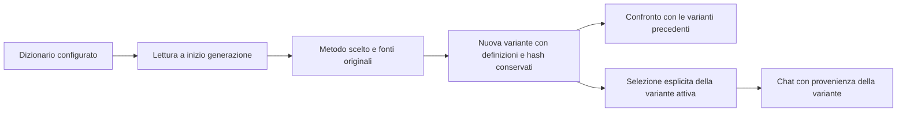

# Varianti investigative e verifica delle fonti — 8 settembre 2026

**Stato: implementazioni e valutazione controllata completate su `dev`.** I tre metodi sono
stati eseguiti sullo stesso corpus RX41 e sul corpus civile. Restano errori semantici e casi
non recuperati, descritti sotto: i test applicativi superati non equivalgono all'accettazione
integrale degli scenari investigativi.

Raven offre tre metodi selezionabili: Affermazioni documentali, Verifica tra fonti ed Eventi e
temporalità. Ogni generazione crea una variante nominata e conserva il manifest degli input.
L'apertura di una variante permette di esaminarla; soltanto la selezione esplicita la rende
attiva per la chat. Le risposte della chat indicano quale variante hanno utilizzato.

I metodi sono indipendenti dal dominio del dizionario. Ogni nuova generazione rilegge i file
configurati e fissa le definizioni per la durata del run. Le nuove varianti conservano anche
le definizioni risolte, così una modifica successiva non ne cambia il significato storico.
Il confronto distingue documenti identici da dizionari identici e mostra le definizioni
aggiunte, rimosse o modificate. I test comprendono un dominio personalizzato modificato mentre
il servizio è già aperto.

> **Citazione e supporto non sono la stessa cosa.** Un intervallo verificato dimostra che la
> citazione compare nell'originale. Il revisore valuta poi se quella citazione sostiene la
> proposizione e la classificazione. Anche un esito `supported` è una valutazione del modello:
> non certifica né l'interpretazione né la verità della fonte. Gli elementi restano proposti.

## RX41: risultati dei tre metodi

Le tre generazioni usano gli stessi documenti e lo stesso dizionario; ogni variante conserva
le definizioni complete. Tutti i 1.990 intervalli registrati fra entità, affermazioni, archi
ed eventi coincidono con gli originali. Sono intervalli dei record, anche ripetuti fra record,
non un conteggio di passaggi originali distinti.

| Metodo | Affermazioni | Archi positivi supportati dal modello | Confronti candidati | Minuti |
| --- | ---: | ---: | ---: | ---: |
| Affermazioni documentali | 170 | 62 | 14 | 71,4 |
| Verifica tra fonti | 165 | 57 | 417 | 114,5 |
| Eventi e temporalità | 266 | 78 | 61 | 107,3 |

La variante documentale `54266b58-3c24-4982-9bd8-120001348475` contiene 170 affermazioni,
62 archi proiettati e 14 confronti candidati. Le 18 pagine sono cinque analizzate e tredici
parziali. La diagnostica conserva anche le riparazioni richieste; lo stato della pagina non
misura da solo la completezza o la precisione semantica.
Non ci sono stati timeout. Tutti i 613 intervalli citati coincidono con gli originali e gli
hash dei documenti e del dizionario sono verificati.

Sono recuperati la classificazione civile di Cellula Verde, il confronto SA-02/CG-01,
il ritiro dell'identità Prisma, la rettifica della data e la storia del supporto grafico.
Alcuni di questi scenari contengono però anche proposizioni imprecise. Il ritiro della
localizzazione diventa erroneamente una cessazione; una relazione editoriale punta al
catalogo anziché al bollettino; alcune assenze di evidenza diventano smentite. Il confronto
fra le affermazioni ST-05/EC-03 manca, pur essendo presenti entrambe con importo e ambito.
Non sono ricostruite le dipendenze NI-01/RI-02.

La [rilettura reale](evaluation/rx41-persistence-readback.json) da MongoDB e Neo4j restituisce
tutte le 170 affermazioni e i 14 confronti, comprese negazioni, valori e operazioni. La richiesta
con un’altra indagine restituisce dati vuoti e la variante attiva originale rimane invariata.

La [verifica per scenario](evaluation/rx41-source-assessment.json) separa recupero e precisione,
riporta gli identificativi delle affermazioni ed elenca tredici difetti confermati anche fra
quelle marcate `supported` dal modello. È una verifica mirata, non un conteggio esaustivo dei
falsi positivi.

La variante tra fonti `34b9bb64-d8c6-4b9b-957e-3e936291ee08` contiene 165 affermazioni,
57 archi e 417 confronti candidati. Cinque pagine sono riutilizzate, una è analizzata e dodici
sono parziali. Il confronto ST-05/EC-03 sui 240 euro viene recuperato, così come i collegamenti
fra l'ipotesi Prisma e il suo ritiro e fra la data originaria e la rettifica. Rimangono entrambe
le fonti e la necessità di revisione dell'identità.

Dei 417 confronti, 266 sono giudicati non correlati dal modello; altri vengono respinti o
restano incerti. Anche questi esiti sono conservati.
Le tre etichette di dipendenza delle fonti riguardano altri casi: non recuperano la trascrizione
NI-01/RI-02. La revisione propaga l'errore sulla localizzazione e interpreta erroneamente
anche una semplice discordanza di date come rettifica. La cessazione del supporto grafico
è presente, ma la pagina finale perde l'intervallo storico esplicito e la conferma della
collaborazione educativa al 5 marzo.

Tutti i 611 intervalli del secondo metodo coincidono con gli originali e gli hash sono corretti.
La rilettura effettiva restituisce tutte le affermazioni e i confronti da MongoDB e Neo4j,
senza troncamenti nelle query per pagina e con la variante attiva originale preservata.
La verifica mirata registra quindici difetti di proposizione e tre difetti nei confronti o
nelle motivazioni: questi conteggi non stimano una precisione generale.

La variante temporale `b2d11b05-3e2c-4a7d-bcdd-cd908b8e349c` contiene 266 affermazioni,
78 archi, 61 confronti e 60 record di evento. Tre pagine sono analizzate e quindici parziali;
non sono state riutilizzate pagine. I suoi 766 intervalli citati sono tutti riscontrati.
Il passaggio dedicato aggiunge valori di data con estremi corretti e permette di collegare
la rettifica del 10 febbraio al precedente valore dell'11 febbraio per lo stesso attacco.
Ricostruisce inoltre il supporto grafico attivo al 1 marzo, il periodo 21 febbraio–2 marzo,
la cessazione dal 3 marzo e la collaborazione educativa ancora attiva.

Questi recuperi convivono con errori. La localizzazione ritirata viene rappresentata due volte
come cessazione. Una seconda smentita EC-03 perde l'intervallo e viene confrontata con ST-05:
quel collegamento non costituisce un recupero corretto dell'intero ambito temporale. UT-09
compare come fonte, ma una nuova affermazione usa il soggetto parlante al posto del soggetto
dell'attribuzione. Il metodo riconosce RT-04 come ripresa di BL-08, ma inventa anche una
dipendenza fra due fonti che riportano la stessa data. NI-01/RI-02 restano non ricostruite.
La verifica mirata registra tredici difetti in affermazioni marcate `supported`; alcuni errori
dei metodi precedenti vengono invece correttamente respinti.

La tabella seguente riguarda il **recupero degli elementi attesi**, non la loro precisione
complessiva. «Recuperato» può coesistere con altre proposizioni errate. La precisione e gli
identificativi dei record sono riportati nella verifica per scenario.

| Scenario | Documentale | Tra fonti | Temporale |
| --- | --- | --- | --- |
| Classificazione civile di Cellula Verde | Recuperato | Recuperato | Recuperato |
| Assenza di riscontro distinta dalla smentita | Parziale | Parziale | Parziale |
| Confronto SA-02/CG-01 | Recuperato | Recuperato | Recuperato |
| Confronto ST-05/EC-03 con ambito esatto | Parziale | Recuperato | Parziale |
| Ritiro dell'identità Prisma e rapporti editoriali | Recuperato | Recuperato | Recuperato |
| Correzione della data dello stesso evento | Recuperato | Recuperato | Recuperato |
| Ritiro della localizzazione | Parziale | Parziale | Parziale |
| Ritiro della certezza attribuita | Parziale | Parziale | Parziale |
| Storia e cessazione del supporto grafico | Recuperato | Parziale | Recuperato |
| Dipendenza delle trascrizioni NI-01/RI-02 | Assente | Assente | Assente |

La rilettura finale da MongoDB e Neo4j ha ritrovato tutte le 601 affermazioni e i 492 confronti
delle tre varianti, senza troncamenti nelle query per pagina. La variante attiva originale è
preservata e non restano elaborazioni attive per l'indagine. Nessuna delle tre varianti supera
integralmente tutti gli scenari di precisione e completezza; non emerge un metodo universalmente
superiore da questa prova.

Una [prova sul recupero effettivo](evaluation/rx41-retrieval-context-verification.json) ha
individuato e corretto un problema distinto dall'estrazione: le coppie giudicate non correlate
allargavano i gruppi di contesto fino a escludere il confronto ST-05/EC-03 dal budget della chat.
Ora solo i confronti significativi con esito supportato o ancora non revisionati richiedono
la lettura congiunta; quelli respinti, non correlati o irrisolti restano nella variante per la
revisione. Dei 417 confronti, 84 soddisfano questo criterio operativo, che non certifica la
correttezza del giudizio del modello. La selezione dai dati reali, anche attraverso Neo4j,
conserva entrambe le affermazioni sui 240 euro e quelle sulla dipendenza di Cerchio Grigio.
Nel contesto della chat vengono conservate anche le motivazioni dei confronti inclusi.
La prova verifica selezione e serializzazione sia a 40.000 caratteri, per la diagnosi, sia al
massimo applicativo di 24.000 caratteri. Budget dinamici inferiori possono ancora escludere
un intero gruppo. Non viene valutata una nuova risposta LLM.

## Prova indipendente

Il corpus civile descrive un contratto di stampa del Kestrel Museum con Birch Printworks,
una correzione da 93 a 39 CHF, una cessazione, la copia di una fonte e l'assenza di evidenza di
una donazione. Nomi, codici, valuta e date sono diversi dagli esempi dei prompt. Il riferimento
atteso è stato specificato prima dell'estrazione; non proviene dall'estrattore valutato.
Questa è una verifica assistita su testi sintetici, non un benchmark annotato da valutatori
umani indipendenti.

| Metodo | Affermazioni | Archi positivi supportati dal modello | Confronti | Proposizioni chiaramente sostenute / marcate `supported` esaminate |
| --- | ---: | ---: | ---: | ---: |
| Affermazioni documentali | 6 | 2 | 0 | 4 / 4 |
| Verifica tra fonti | 7 | 4 | 3 | 6 / 7 |
| Eventi e temporalità | 17 | 6 | 0 | 10 / 15 |

L'ultima colonna riguarda il contenuto della proposizione, con gli elementi ambigui esclusi
dal numeratore. Non misura la completezza dell'attribuzione e non stima un'accuratezza generale.
Le ambiguità riguardano soprattutto il significato dei predicati, l'uso del documento come
proprietario di un valore e alcuni estremi autoreferenziali. La presenza di più affermazioni
non rende quindi automaticamente migliore il risultato.

| Scenario atteso | Documentale | Tra fonti | Temporale |
| --- | --- | --- | --- |
| Prezzo originario e rettifica | Parziale | Parziale | Recuperato |
| Cessazione con data effettiva | Parziale | Recuperata | Recuperata |
| Assenza di riscontro distinta dalla smentita | Parziale | Non recuperata | Parziale |
| Copia Q8 da Q7 | Non recuperata | Recuperata | Recuperata |
| Hazel Society senza classificazione criminale | Recuperata | Recuperata | Recuperata |

La completezza resta insufficiente per un uso automatico: i metodi perdono o rappresentano
male alcune informazioni e le attribuzioni strutturate sono spesso vuote. Il metodo temporale
recupera più aspetti del riferimento, ma introduce anche più proposizioni ambigue. Due dei tre
confronti proposti dal metodo tra fonti vengono correttamente classificati come non correlati;
il terzo riconosce la coerenza fra cessazione e data di terminazione. Non sono tre conflitti.

La verifica degli originali ha controllato **93 intervalli** tra entità, affermazioni, archi ed
eventi: tutti coincidono con gli offset e il testo della fonte; nessun elemento verificato è
privo di supporto. Gli hash dei documenti coincidono per tutti i metodi. Questo risultato
riguarda esclusivamente la provenienza letterale.

## Verifiche applicative e tracciabilità

La suite comprende 450 test passati. I controlli Ruff e di formattazione sono passati. Le prove
Textual coprono 80×24 e 140×45, generazione, confronto, selezione attiva e navigazione da tastiera.
Lo smoke dell'entry point installato è terminato con codice zero e ha ripristinato le impostazioni
del terminale e lo schermo alternativo. Due prove con un server HTTP locale hanno inoltre
verificato che annullamento e scadenza interrompano una richiesta in attesa, chiudano il socket
e rilascino il blocco condiviso. RX41 usa il timeout configurato di 1.200 secondi; la precedente
prova civile aveva un limite di 120 secondi, senza modificarne prompt e schema.
Il budget di riparazione è una richiesta per risposta di estrazione: il metodo temporale
esegue due passaggi distinti e può quindi richiedere due riparazioni sulla stessa pagina.

La prova reale su MongoDB e Neo4j ha verificato isolamento fra indagini e varianti, identificativi
uguali in varianti diverse, lettura di smentite e valori senza secondo estremo, cessazioni,
manifest e definizioni del dizionario, selezione esplicita e conservazione dopo un cambio di
profilo. I dati delle prove isolate sono stati rimossi. Le generazioni RX41 conservano la
variante attiva originale `a8a71612-3a7f-4ca4-aa0f-e422e36170a2`.

I tentativi di sviluppo rimangono documentati: il primo confondeva tutte le affermazioni con
assenze di riscontro; il successivo recuperava 81 affermazioni, ma non le operazioni attese.
La verifica ha portato a correggere schema, identificativi, riparazioni per elemento, contesto
del revisore e dizionari variabili. Questi tentativi non costituiscono prove di qualità della
versione corrente e non sono stati attivati.

I dettagli sono nel [rapporto strutturato](graph-evaluation-2026-09-08.json), nella
[verifica delle citazioni civili](evaluation/independent-v5-literal-audit.json), nella
[valutazione delle proposizioni](evaluation/independent-v5-source-assessment.json) e nella
[verifica dei database](graph-variant-storage-verification-2026-09-08.json).
Le esportazioni [RX41](evaluation/rx41-v5.json.gz) e [civile](evaluation/independent-v5.json.gz)
conservano affermazioni, citazioni, esiti dei revisori, manifest e confronti delle generazioni
completate. La [verifica letterale RX41](evaluation/rx41-literal-audit.json) registra anche
gli offset riscontrati e gli hash degli originali.

Le pagine complete con profilo compatibile possono essere riutilizzate; quelle parziali vengono
rielaborate. Le differenze A/B possono quindi riflettere anche variabilità del modello e recupero
di elementi precedentemente persi. Il confronto non dimostra da solo la superiorità causale di
un metodo. L’allineamento numerico riconosce rappresentazioni equivalenti, come 39 e 39.00,
senza arrotondare valori lunghi o confondere unità e precisioni diverse delle date. I confronti
A/B finali sono stati ricalcolati dagli snapshot immutabili con questa correzione; i prompt e
i dati della generazione restano quelli del protocollo fissato.

Il confronto conserva le differenze di attribuzione, dipendenza delle fonti e riferimenti delle
rettifiche. Risolve gli identificativi delle affermazioni riferite nel rispettivo snapshot e
confronta le proposizioni risultanti. Per una stessa proposizione mostra inoltre eventuali
esiti discordanti dei revisori con entrambe le motivazioni. La diversa segmentazione delle
citazioni sulla stessa pagina non produce da sola una differenza.

Le prove possono essere ripetute con `scripts/evaluate_graph_methods.py`; il controllo degli
intervalli originali usa `scripts/audit_graph_evaluation.py`. Le generazioni sono sequenziali,
non selezionano automaticamente una variante e non modificano l'indice RAG documentale.
