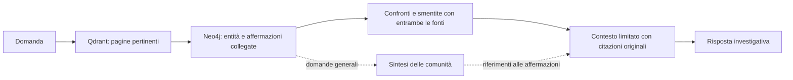

# Recupero ibrido, Graphiti e sintesi delle comunità in Raven

Verifica delle fonti e prova locale: **8 settembre 2026**. Questo documento distingue
le capacità documentate dei progetti esterni dalle misure eseguite sul confronto
sintetico di Raven. L'esperimento non utilizza i documenti o i database dell'utente.

La scelta consigliata è mantenere le affermazioni di Raven come fonte autorevole
del contesto investigativo, usare Qdrant per trovare le pagine pertinenti e Neo4j
per espandere entità, affermazioni e confronti. Graphiti merita una valutazione
ulteriore: il suo motore di recupero ha funzionato realmente nella prova isolata,
ma la sua gestione automatica delle invalidazioni non corrisponde direttamente
alle smentite tra fonti che Raven deve conservare. Per le domande generali,
conviene sperimentare sintesi delle comunità come indice derivato e verificabile.

## Versioni e licenze verificate

Le versioni sono quelle pubblicate su PyPI alla data della verifica, controllate
anche attraverso i metadati JSON del registro. Le licenze dei pacchetti Python
non sostituiscono quelle dei database o dei servizi eventualmente impiegati.

| Progetto | Versione e pubblicazione | Licenza verificata | Valutazione effettuata |
| --- | --- | --- | --- |
| Graphiti | [graphiti-core 0.30.1](https://pypi.org/project/graphiti-core/0.30.1/), 1 settembre 2026 | [Apache 2.0](https://raw.githubusercontent.com/getzep/graphiti/main/LICENSE) | Documentazione, codice e motore reale su Kuzu temporaneo |
| Neo4j GraphRAG Python | [1.19.0](https://pypi.org/project/neo4j-graphrag/1.19.0/), 26 agosto 2026 | [Apache 2.0; alcune parti PSF 2](https://raw.githubusercontent.com/neo4j/neo4j-graphrag-python/main/LICENSE.txt) | Documentazione e codice del retriever Qdrant |
| Microsoft GraphRAG | [3.1.2](https://pypi.org/project/graphrag/3.1.2/), 21 agosto 2026 | [MIT](https://raw.githubusercontent.com/microsoft/graphrag/main/LICENSE) | Documentazione e metodo di sintesi; pacchetto non eseguito |

## Neo4j e Qdrant: adottare il meccanismo, preservare i confini di Raven

`QdrantNeo4jRetriever` esegue una ricerca vettoriale e usa un identificativo del
payload Qdrant per recuperare il nodo corrispondente in Neo4j. Espone
`id_property_external`, `id_property_neo4j`, un eventuale nome del vettore e una
query Cypher di espansione. È quindi un riferimento concreto per l'integrazione
dei due archivi già presenti. [Guida ufficiale del retriever](https://neo4j.com/docs/neo4j-graphrag-python/current/user_guide_rag.html#qdrant-retrievers).

Il codice inoltra gli argomenti aggiuntivi a `query_points`, consentendo il filtro
Qdrant, ma costruisce separatamente i parametri della query Neo4j. Non inserisce
automaticamente i vincoli investigazione, documento attivo e versione del grafo
di Raven. Questi controlli devono appartenere al nostro adattatore, su entrambi
i lati del collegamento; il solo identificativo di un nodo non basta. Anche
l'ordinamento e il recupero delle citazioni devono essere verificati dopo
l'espansione. [Implementazione Qdrant ufficiale](https://raw.githubusercontent.com/neo4j/neo4j-graphrag-python/main/src/neo4j_graphrag/retrievers/external/qdrant/qdrant.py).

Per ora è ragionevole usare i repository Raven e query parametrizzate dedicate.
L'adozione del pacchetto completo richiederebbe verificare le sue dipendenze e il
vantaggio effettivo rispetto all'adattatore già disponibile. Non occorre importare
anche il costruttore automatico del grafo: le funzionalità sotto `experimental`
sono dichiarate instabili dal progetto e sono distinte dai retriever pubblici.
[Stato del namespace sperimentale](https://github.com/neo4j/neo4j-graphrag-python#-experimental-namespace).

## Graphiti: recupero interessante, semantica da adattare

Graphiti combina ricerca lessicale, vettoriale e percorsi del grafo. Nel codice
consultato `search()` restituisce archi; `search_()` consente ricette configurabili
e risultati articolati. `_search()` è deprecato. Il parametro attuale è
`group_ids`, al plurale: alcuni esempi nella pagina sulla suddivisione dei grafi
mostrano ancora `group_id`. Un'integrazione deve riferirsi alla versione fissata,
non copiare indistintamente gli esempi. [API nel codice ufficiale](https://raw.githubusercontent.com/getzep/graphiti/main/graphiti_core/graphiti.py),
[guida alla ricerca](https://help.getzep.com/graphiti/working-with-data/searching).

La separazione per `group_id` è utile per rappresentare un'investigazione. È un
vincolo da fornire nelle operazioni, non una garanzia che qualunque query arbitraria
sia autorizzata: Raven deve costruire il gruppo lato applicazione e controllare
la visibilità dei documenti. Nel confronto sono stati inseriti anche documenti
eliminati e di un altro caso, usando il gruppo dell'indagine e un elenco di
affermazioni provenienti dai soli documenti attivi. [Suddivisione dei grafi](https://help.getzep.com/graphiti/core-concepts/graph-namespacing).

> **Due tempi, tre significati da conservare.** Graphiti distingue l'intervallo
> di validità del fatto (`valid_at`, `invalid_at`) dalla registrazione e
> invalidazione nel sistema (`created_at`, `expired_at`). Raven conserva inoltre
> `asserted_at`: quando la fonte formula l'affermazione. La data di caricamento
> di un PDF non può sostituire né la data dell'evento né quella della fonte.
> L'adattamento deve conservare anche date mancanti e significato degli estremi.

Gli archi Graphiti conservano riferimenti agli episodi e attributi aggiuntivi;
`SearchFilters` offre filtri sui quattro tempi, sui tipi e sugli identificativi.
Il riferimento a un episodio non equivale però alla nostra citazione verificata
su documento e pagina. `EvidenceSpan` va preservato esplicitamente.
[Modello degli archi](https://raw.githubusercontent.com/getzep/graphiti/main/graphiti_core/edges.py),
[filtri di ricerca](https://raw.githubusercontent.com/getzep/graphiti/main/graphiti_core/search/search_filters.py).

La risoluzione dei conflitti può aggiornare `invalid_at` ed `expired_at` degli
archi preesistenti. Questo comportamento è appropriato per fatti che cambiano
nel tempo; adottarlo senza adattamento in Raven rischierebbe di trattare una
smentita come sostituzione della prima fonte. Vanno conservate entrambe le
affermazioni con polarità, attribuzione e confronto, anche quando descrivono lo
stesso periodo. [Risoluzione delle invalidazioni](https://raw.githubusercontent.com/getzep/graphiti/main/graphiti_core/utils/maintenance/edge_operations.py).

I tipi Pydantic personalizzati e `edge_type_map` possono rappresentare il dominio,
ma non sostituiscono la validazione del dizionario chiuso di Raven. Polarità,
modalità, sottotipo e citazioni devono superare i controlli applicativi prima di
essere accettati. La compatibilità documentata con servizi locali tramite
`OpenAIGenericClient` non dimostra la qualità di estrazione del modello configurato
in Raven. [Tipi personalizzati](https://help.getzep.com/graphiti/core-concepts/custom-entity-and-edge-types),
[configurazione dei modelli locali](https://help.getzep.com/graphiti/configuration/llm-configuration).

## La prova Graphiti realmente eseguita

È stato creato un ambiente Python separato sotto `/tmp`, installando
`graphiti-core[kuzu]==0.30.1`, Kuzu 0.11.3 e `httpx==0.28.1`. Nessuna dipendenza
del progetto è stata modificata. Il [runner](../../src/raven/evaluation/graphiti_runner.py)
utilizza il vero `Graphiti.search_()` con la ricetta `EDGE_HYBRID_SEARCH_RRF`, un
database temporaneo con memoria limitata e vettori lessicali deterministici a
512 dimensioni condivisi con gli altri esperimenti. Chiamate al modello e al
reranker neurale sono impedite dal codice. Le affermazioni sono inserite a mano.

La prova ha completato 16 domande, ciascuna ripetuta tre volte. Il recupero a sei
risultati ha trovato tutti i riferimenti attesi in 13 delle 14 domande con una
risposta documentata; nella domanda generale ha trovato cinque delle sette
affermazioni attese. Gli attributi restituiti, comprese negazioni e citazioni,
coincidono con quelli inseriti. Non sono comparsi documenti eliminati o di altre
indagini. Le due domande prive di evidenze pertinenti hanno comunque ottenuto
altri risultati interni al caso: il ranking da solo non stabilisce quando
rispondere «non ci sono evidenze». Dati e confronti completi sono nel
[rapporto del benchmark](retrieval-benchmark.md).

Sono emersi anche due problemi concreti di avvio: l'ambiente risolto non forniva
`httpx`, importato da Graphiti, e il metodo generale di creazione degli indici del
driver Kuzu non creava gli indici testuali. Il runner usa l'implementazione delle
operazioni Kuzu dopo aver caricato la relativa estensione ufficiale FTS. Questi
adattamenti sono espliciti e limitati al confronto.

> **Che cosa dimostra la prova.** Dimostra che il motore installato ricerca dati
> reali nel database temporaneo e restituisce gli attributi forniti. Non misura
> l'estrazione dai PDF, il riconoscimento delle negazioni, l'unificazione delle
> identità, l'invalidazione automatica o la qualità del modello locale. Kuzu è
> ancora presente ma deprecato in Graphiti: è adatto a questa prova usa e getta,
> non è una proposta di backend per Raven. Le latenze riportate valgono solo per
> il piccolo dataset sintetico, non per Neo4j o per un servizio in produzione.

## Comunità: sintesi con rimandi alle affermazioni

Microsoft GraphRAG costruisce comunità gerarchiche con Leiden e genera report
che richiamano entità, relazioni e affermazioni. Il suo flusso opzionale di
estrazione delle affermazioni non coincide con `GraphClaim`: la documentazione
descrive affermazioni positive con stato e intervallo temporale, e richiede
adattamento dei prompt. [Flusso di indicizzazione](https://microsoft.github.io/graphrag/index/default_dataflow/).

La ricerca globale combina report di comunità per rispondere a domande sull'intero
corpus; DRIFT usa informazioni generali per guidare approfondimenti locali.
Sono metodi utili per «quali reti emergono?» e meno diretti per «quale pagina
smentisce TX240?». Il costo cresce con i report e le chiamate di sintesi; va
misurato separatamente dal recupero delle citazioni.
[Ricerca globale](https://microsoft.github.io/graphrag/query/global_search/),
[DRIFT](https://microsoft.github.io/graphrag/query/drift_search/).

In Raven la sintesi dovrebbe essere un artefatto legato a investigazione,
`run_id`, modello e versione del prompt, con elenco completo dei `claim_id`
usati, polarità, conflitti irrisolti e rimandi alle pagine. Una modifica al grafo
deve renderla obsoleta. Il riassunto guida il recupero; la risposta finale deve
poter riaprire le affermazioni originali. Il benchmark corrente confronta una
espansione estrattiva delle comunità: non esegue Microsoft GraphRAG né misura
riassunti generati da un modello. Il repository Microsoft dichiara ora una fase
prevalente di manutenzione; conviene adottare il metodo e valutare separatamente
il costo di introdurne l'intera pipeline. [Stato del progetto](https://raw.githubusercontent.com/microsoft/graphrag/main/README.md).

## Condizioni per il confronto successivo

Il passo successivo è ripetere il confronto su una copia isolata dei tre PDF,
con estrazione e citazioni annotate manualmente, medesimo modello locale,
embedding e limite del contesto. Per distinguere i benefici, confrontare Qdrant,
recupero ibrido Raven, ibrido con sintesi delle comunità e Graphiti adattato.
Cambiare l'ordine di caricamento e introdurre una rettifica tardiva permette di
osservare se un sistema perde o sostituisce una fonte.

I risultati vanno separati per domande locali, temporali, omonimie, negazioni e
sintesi generali. Servono richiamo e precisione delle pagine, recupero di entrambi
i lati delle smentite, correttezza delle citazioni, violazioni dei confini del
caso, astensione quando manca una fonte, latenza e chiamate al modello.
L'adozione richiede un vantaggio ripetibile senza perdita di attribuzione,
polarità o provenienza. Il benchmark attuale è un controllo del recupero e dei
collegamenti: non autorizza ancora a sostituire la pipeline investigativa.
