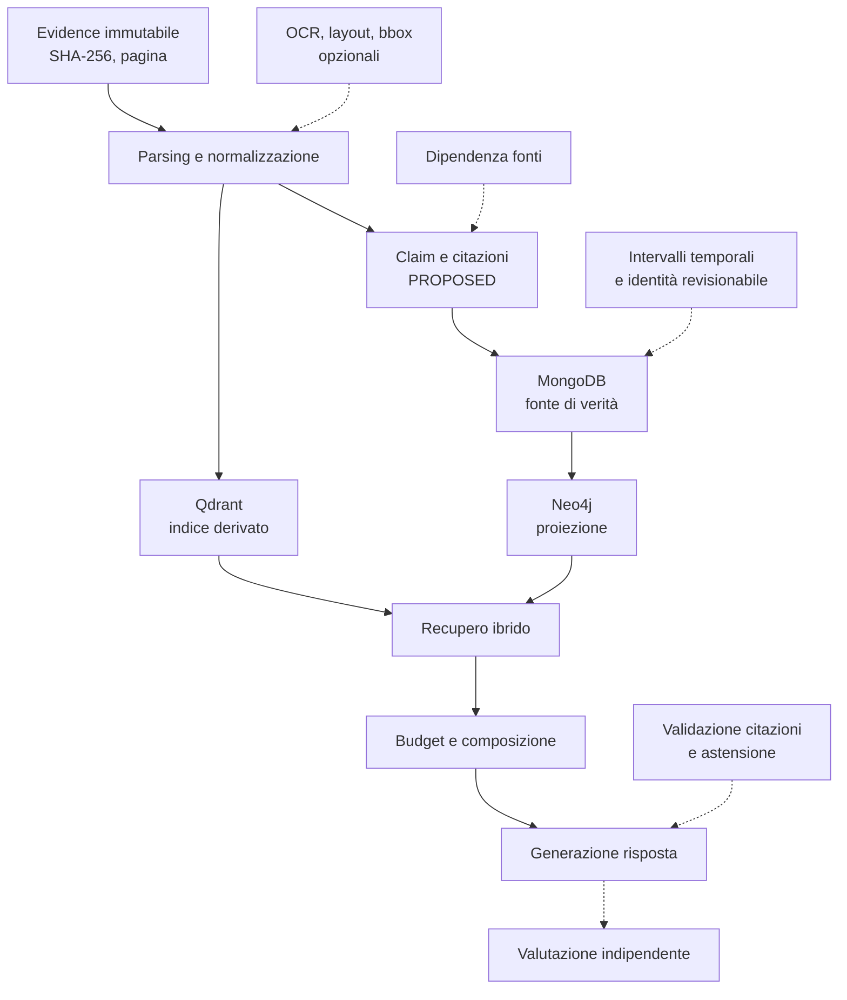

# Ricerca di implementazione per Raven OSINT

**Data:** 8 settembre 2026  
**Ambito:** qualità delle risposte, parsing documentale, dipendenza delle fonti, tempo, identità e recupero associativo

## Scopo e metodo

Questa ricerca mirata individua interventi che possono aumentare l'affidabilità investigativa di Raven senza confondere una proposta architetturale con un risultato già dimostrato. Non è una revisione sistematica: i lavori sono stati scelti perché coprono problemi osservabili nell'architettura corrente e offrono metodi, benchmark o modelli di dati confrontabili. I risultati citati appartengono ai rispettivi autori; le priorità, i punti d'integrazione e i criteri di accettazione descritti qui sono nostre proposte per Raven. In questa ricerca non sono state eseguite nuove repliche o benchmark.

Raven parte da una base prudente. Le copie Evidence sono immutabili e identificate da hash SHA-256; pagina e citazione accompagnano entità, relazioni e claim. MongoDB conserva claim, cache e snapshot, Qdrant è un indice derivato e Neo4j una proiezione. I claim mantengono polarità, modalità, attribuzione, date e qualificatori e restano `PROPOSED` fino alla verifica. Le smentite restano nel confronto e gli omonimi non sono fusi automaticamente.

Il recupero ibrido è già implementato. Il benchmark RX41 comprende sedici domande sintetiche, vettori lessicali deterministici, nessun modello di risposta e nessun gold indipendente. La prova Graphiti riguarda soltanto il recupero su claim inseriti in anticipo. RX41 è utile come regressione dell'isolamento, ma non dimostra correttezza delle risposte, qualità semantica degli embedding o efficacia su indagini reali. Occorre misurare la catena fino alla risposta prima di aggiungere un nuovo paradigma di grafo.

> **Concetto chiave — Evidenza, supporto e verità**  
> Una citazione verificata prova che un passaggio esiste nella pagina indicata. Non prova che la fonte sia attendibile, che il passaggio sostenga davvero l'interpretazione proposta o che il fatto sia vero. In Raven questi tre livelli devono restare distinti: presenza testuale, supporto semantico e giudizio investigativo.

> **Glossario minimo**  
> **RAG** (*Retrieval-Augmented Generation*) indica il recupero di documenti o passaggi seguito dalla generazione di una risposta che li usa come contesto. Un **claim** è un'affermazione attribuita a una fonte, non un fatto automaticamente vero. Il **gold** è l'insieme dei riferimenti corretti annotati con cui si confronta un risultato. Un **MVP** è la minima prova funzionante sufficiente a verificare un'ipotesi. L'**OCR** riconosce il testo contenuto in scansioni o immagini. Una **bbox** (*bounding box*) è il rettangolo di coordinate che localizza un elemento nella pagina. L'**entailment** valuta se un'evidenza sostiene semanticamente un'affermazione.

## Dalla pagina alla risposta: dove intervenire

La figura 1 riassume il flusso desiderato. Le linee continue rappresentano responsabilità presenti; le frecce tratteggiate indicano controlli proposti. Provenienza e valutazione devono attraversare l'intera pipeline.

*Figura 1 — Pipeline Raven e controlli proposti. Il diagramma mostra che ogni arricchimento resta collegato alla pagina originale e che la risposta viene valutata come prodotto finale, separatamente dal solo recupero.*

### Qualità delle risposte e citazioni

ALCE propone un benchmark per sistemi che generano risposte lunghe con citazioni, separando aspetti come correttezza e copertura delle citazioni. Questo suggerisce di valutare se ogni proposizione verificabile possiede un riferimento pertinente e se il riferimento sostiene davvero la proposizione, anziché contare soltanto la presenza di etichette [[Gao et al., 2023](https://aclanthology.org/2023.emnlp-main.398/); [codice ALCE](https://github.com/princeton-nlp/ALCE)]. RAGChecker scompone invece la diagnosi tra recupero e generazione: una risposta può fallire perché il contesto non contiene l'evidenza, perché contiene rumore o perché il modello usa male un passaggio disponibile [[Ru et al., 2024](https://proceedings.neurips.cc/paper_files/paper/2024/hash/27245589131d17368cccdfa990cbf16e-Abstract-Datasets_and_Benchmarks_Track.html); [codice](https://github.com/amazon-science/RAGChecker)]. Alcuni controlli di RAGChecker usano entailment a livello di claim e un modello come giudice: per Raven questi segnali devono essere calibrati rispetto ad annotazioni umane e trattati come stime, non come oracoli.

> **Riferimento essenziale — AVeriTeC**  
> AVeriTeC raccoglie 4.568 claim reali con domande, risposte, evidenze e giustificazioni, offrendo una struttura utile per progettare esempi annotati. Gli autori richiamano anche il rischio di *temporal leakage*, cioè l'uso di informazioni pubblicate dopo il momento in cui il claim avrebbe dovuto essere verificato [[Schlichtkrull, Guo e Vlachos, 2023](https://proceedings.neurips.cc/paper_files/paper/2023/hash/cd86a30526cd1aff61d6f89f107634e4-Abstract-Datasets_and_Benchmarks.html)]. Non è un benchmark italiano e non rappresenta il corpus di Raven: va usato come riferimento di schema e controllo temporale, non come stima delle prestazioni attese.

In Raven il prompt di sistema chiede già citazioni e astensione, ma manca un controllo finale misurato. Dopo lo streaming, [`services/chat.py`](../../src/raven/services/chat.py) salva la risposta senza una validazione semantica completa; [`graph/grounding.py`](../../src/raven/graph/grounding.py) verifica la presenza della citazione come sottostringa con spazi normalizzati, non il sostegno della conclusione. Una citazione letteralmente presente che afferma il contrario deve quindi fallire il controllo di supporto. Proponiamo come MVP un valutatore offline delle risposte, capace di segnalare affermazioni senza supporto, citazioni non pertinenti e astensioni inappropriate. Un successivo controllo durante l'uso dovrebbe esporre stati come “bozza”, “in verifica” ed “esito”, perché il testo già emesso in streaming non deve apparire retroattivamente verificato. Nessun controllo trasformerebbe automaticamente un claim in fatto accertato.

Self-RAG introduce recupero adattivo e token di riflessione in un metodo addestrato [[Asai et al., 2024](https://arxiv.org/abs/2310.11511)]. Per Raven è ragionevole trarne il principio di un ciclo limitato: verificare la risposta, effettuare al massimo un recupero aggiuntivo quando manca supporto e infine rispondere o astenersi. Un simile ciclo orchestrato non sarebbe una replica di Self-RAG e non dovrebbe essere descritto come tale.

Prima di sperimentare nuovi grafi, serve anche una baseline semplice. DOS RAG conserva l'ordine originale dei passaggi e confronta strategie con budget di token uguali [[Laitenberger, Manning e Liu, 2025](https://aclanthology.org/2025.emnlp-main.1656/)]. La proposta è aggiungere al benchmark una variante che riordini i passaggi secondo il documento, mantenendo fisso modello, finestra e budget effettivo in token. Gli esperimenti pubblicati riguardano un singolo documento lungo, domande a scelta multipla o risposte brevi e una famiglia limitata di modelli; la generalizzazione a risposte aperte e collezioni multi-documento resta da dimostrare. Un guadagno pubblicato in un altro corpus non è una promessa per Raven.

### Parsing documentale e provenienza

L'estrazione attuale dei PDF passa principalmente da `PdfReader.page.extract_text` in [`repositories/knowledge_base.py`](../../src/raven/repositories/knowledge_base.py). È una scelta leggera, ma perde struttura quando colonne, tabelle, scansioni o fotografie rompono l'ordine di lettura. Docling presenta una pipeline orientata a layout e tabelle e un modello documentale capace di conservare gerarchia, ordine e provenienza, comprese coordinate quando disponibili [[Auer et al., 2024](https://arxiv.org/abs/2408.09869); [progetto](https://github.com/docling-project/docling); [modello documentale](https://docling-project.github.io/docling/concepts/docling_document/)].

La proposta è un adattatore opzionale OCR/layout. Ogni frammento dovrebbe conservare pagina, ordine, tipo di blocco e, quando disponibile, bounding box. [`models/graph.py`](../../src/raven/models/graph.py) oggi rappresenta `EvidenceSpan` con identificativo Evidence, citazione, pagina e verifica; l'eventuale geometria richiede un'estensione compatibile. Le coordinate non vanno promesse per ogni formato. Prima dell'adozione occorre verificare licenze di dipendenze e pesi, dimensioni operative e compatibilità con Python 3.12.

OmniDocBench valuta il parsing di PDF con layout diversi e annotazioni ampie [[Ouyang et al., 2025](https://openaccess.thecvf.com/content/CVPR2025/html/Ouyang_OmniDocBench_Benchmarking_Diverse_PDF_Document_Parsing_with_Comprehensive_Annotations_CVPR_2025_paper.html)]. Poiché release differenti possono riportare numeri differenti, qui interessa la tassonomia di documenti e difetti, non un valore isolato. Real5-OmniDocBench, preprint del 4 marzo 2026 revisionato il 22 giugno, aggiunge condizioni realistiche quali scansione, curvatura, fotografia di schermo, illuminazione e inclinazione [[Zhou et al., 2026](https://arxiv.org/abs/2603.04205)]. Da questo ricaviamo una proposta di test degradati; il lavoro non prova prestazioni sull'italiano.

> **Approfondimento — Provenienza interoperabile**  
> Il modello W3C PROV descrive entità, attività e agenti per esprimere come un artefatto è stato prodotto o derivato [[W3C PROV-DM, 2013](https://www.w3.org/TR/prov-dm/); [panoramica](https://www.w3.org/TR/prov-overview/)]. Raven può esportare manifest, versioni di parser e relazioni di derivazione in questo lessico. Un record PROV migliora tracciabilità e scambio, ma non certifica autenticità della fonte né validità legale.

### Dipendenza fra fonti, identità e tempo

Due documenti concordi non equivalgono necessariamente a due conferme indipendenti. Il lavoro di Dong, Berti-Équille e Srivastava modella la dipendenza fra fonti nel problema dell'integrazione di dati conflittuali [[2009](https://www.vldb.org/pvldb/vol2/vldb09-pvldb47.pdf)]. Per Raven proponiamo relazioni candidate `copied_from` e `derived_from`, corredate da motivo, passaggi confrontati e revisione umana. La somiglianza non prova plagio e la dipendenza stimata non assegna automaticamente la verità. Il punto d'integrazione naturale è il confronto in [`graph/claims.py`](../../src/raven/graph/claims.py), con campi di dominio in [`models/graph.py`](../../src/raven/models/graph.py).

La riconciliazione delle identità richiede la stessa cautela. Ditto formula l'entity matching come classificazione supervisionata di coppie [[Li et al., 2020](https://www.vldb.org/pvldb/vol14/p50-li.pdf); [preprint](https://arxiv.org/abs/2004.00584); [codice](https://github.com/megagonlabs/ditto)]. Raven può usare l'idea per ordinare candidati da revisionare in [`graph/extraction.py`](../../src/raven/graph/extraction.py), senza fusione automatica. Gli identificatori forti in conflitto devono bloccare il merge; ogni decisione deve essere reversibile. Il repository pubblicato e le sue dipendenze sono datati, e il lavoro non consente di dedurre qualità multilingue sul dominio Raven.

Per il tempo, [`graph/claims.py`](../../src/raven/graph/claims.py) confronta già periodi e date parziali per evitare conflitti fra intervalli non sovrapposti. IA-RAG usa gli intervalli di Allen, un insieme di relazioni qualitative che descrive come due intervalli temporali si collocano tra loro, e il raffinamento di date incerte nel recupero [[Wang et al., 2026](https://arxiv.org/abs/2606.06044)]. La proposta è estendere le query con predicati come `prima`, `durante` e `sovrapposto`, mantenendo sempre separati il testo temporale dichiarato dalla fonte e l'intervallo inferito. Il preprint è recente e la sua configurazione sperimentale non consente di trasferire direttamente la latenza a un'applicazione desktop; non giustifica neppure la sostituzione delle date originali.

### Recupero associativo come esperimento successivo

HippoRAG 2 integra passaggi tramite Personalized PageRank, un algoritmo che parte dai nodi legati alla domanda e propaga nel grafo un punteggio di pertinenza, per ottenere un recupero associativo [[Gutierrez et al., 2025](https://proceedings.mlr.press/v267/gutierrez25a.html); [codice](https://github.com/OSU-NLP-Group/HippoRAG)]. LightRAG combina recupero locale e globale con aggiornamento incrementale [[Guo et al., 2025](https://aclanthology.org/2025.findings-emnlp.568/); [codice](https://github.com/HKUDS/LightRAG)]. Sono candidati sensati per un confronto isolato, ma soltanto dopo aver stabilito una valutazione indipendente della risposta. Ogni adattatore dovrebbe preservare claim, negazioni, qualificatori, ambito e provenienza, senza appiattire il modello Raven in triple prive di contesto.

L'esperimento dovrebbe collegarsi a [`services/retrieval.py`](../../src/raven/services/retrieval.py), rispettare i limiti di [`services/context_budget.py`](../../src/raven/services/context_budget.py) ed essere misurato tramite [`evaluation/retrieval.py`](../../src/raven/evaluation/retrieval.py). L'adozione avrebbe senso soltanto se migliora risultati predefiniti sul test separato, a parità di modello e budget di token, con costi e latenza accettabili.

## Priorità proposta

La priorità seguente è una scelta progettuale nostra, non una graduatoria ricavata dagli articoli.

| Tranche | Obiettivo | Perché viene prima | Esito richiesto |
| --- | --- | --- | --- |
| P0 | Benchmark indipendente di risposte, citazioni e astensione; baseline DOS | Stabilisce se il problema nasce dal recupero o dalla generazione | Metriche ripetibili, split indipendente, budget token uguale |
| P1 | Parsing OCR/layout e dipendenza delle fonti | Migliora l'unità documentale e impedisce di contare copie come conferme autonome | Provenienza pagina/blocco conservata; candidati revisionabili |
| P2 | Timeline e identità con revisione | Riduce fusioni e conflitti temporali fuorvianti | Inferenze separate dagli originali; merge reversibile |
| P3 | HippoRAG 2 o LightRAG in ambiente sperimentale | Aggiunge complessità solo dopo una misura end-to-end | Adozione solo con miglioramento misurato e costi esposti |

## Protocollo di valutazione proposto

Il nuovo insieme di test deve essere separato per documento e per famiglia di fonti, così versioni quasi duplicate non compaiono tra addestramento, sviluppo e verifica. Un sottoinsieme va annotato da due persone; divergenze e regole di adjudication devono essere registrate. Non occorre fingere consenso quando l'evidenza è ambigua.

Le metriche devono distinguere recupero, risposta e comportamento in assenza di supporto. Oltre al richiamo delle pagine, si misurano copertura delle affermazioni citabili, supporto delle citazioni e astensioni corrette ed errate. I controlli di sicurezza richiedono zero contaminazioni da altro caso o da documenti rimossi e zero gruppi di affermazione/smentita spezzati nei test che dichiarano di preservarli. Una risposta prudente ma inutilmente vuota deve essere penalizzata come astensione errata; una risposta sicura senza evidenza come mancata astensione. L'assenza di evidenza nel corpus va distinta dall'indisponibilità dovuta al budget, all'indice incompleto o a un servizio non raggiungibile: i casi richiedono messaggi e metriche differenti.

I confronti usano lo stesso modello, la stessa configurazione e lo stesso budget effettivo di token, non soltanto lo stesso numero di caratteri o passaggi. Vanno riportati latenza, consumo di token, numero di chiamate, costo quando applicabile e picchi CPU/RAM. Per ogni prova comparativa, la metrica primaria e il margine minimo utile devono essere fissati prima di osservare il test separato; l'esito deve mostrare il delta e nessuna regressione sugli invarianti di isolamento e integrità dei gruppi. I risultati sintetici restano regressioni ingegneristiche; una tranche successiva richiede casi realistici autorizzati e anonimizzati.

> **Attenzione — Lettura dei risultati**  
> Un aumento del richiamo può introdurre rumore e peggiorare la risposta. Una riduzione delle allucinazioni può derivare da troppe astensioni. Per questo ogni tabella deve mostrare insieme recupero, supporto, astensione, contaminazione e costo, con intervalli o dispersione quando il campione lo consente.

## Backlog di ricerca e MVP

| ID | Obiettivo MVP | Punto d'integrazione | Criterio di accettazione | Dipendenze | Complessità |
| --- | --- | --- | --- | --- | --- |
| RAV-R01 | Fixture indipendente di domande, claim e risposte annotate | [`evaluation/retrieval.py`](../../src/raven/evaluation/retrieval.py) | Split per documento/famiglia; doppia annotazione su un sottoinsieme; schema versionato | Linee guida annotazione | Alta |
| RAV-R02 | Valutare citazioni e astensione end-to-end | [`services/chat.py`](../../src/raven/services/chat.py), [`graph/grounding.py`](../../src/raven/graph/grounding.py) | Supporto citazioni e astensioni corrette/errate riportati; nessun cambio automatico di stato | RAV-R01 | Alta |
| RAV-R03 | Baseline DOS a budget di token uguale | [`services/retrieval.py`](../../src/raven/services/retrieval.py), [`services/context_budget.py`](../../src/raven/services/context_budget.py) | Confronto stesso modello/configurazione; ordine originale verificabile | RAV-R01 | Media |
| RAV-R04 | Adattatore opzionale OCR/layout | [`repositories/knowledge_base.py`](../../src/raven/repositories/knowledge_base.py), [`graph/pages.py`](../../src/raven/graph/pages.py) | Pagina e ordine preservati; bbox solo se disponibile; fallback corrente; licenze registrate | Valutazione Docling/OCR | Alta |
| RAV-R05 | Candidati di dipendenza fra fonti | [`graph/claims.py`](../../src/raven/graph/claims.py), [`models/graph.py`](../../src/raven/models/graph.py) | Motivazione e citazioni visibili; nessun voto di verità; revisione umana | RAV-R04 utile, non obbligatorio | Media |
| RAV-R06 | Coda revisionabile per entity matching | [`graph/extraction.py`](../../src/raven/graph/extraction.py), [`models/graph.py`](../../src/raven/models/graph.py) | Conflitti di identificatori forti mai fusi; merge e annullamento tracciati | Dataset di coppie | Alta |
| RAV-R07 | Predicati temporali su date incerte | [`agents/claims.py`](../../src/raven/agents/claims.py), [`graph/claims.py`](../../src/raven/graph/claims.py) | Originale e inferenza distinti; test per prima/durante/sovrapposto e date parziali | RAV-R01 | Media |
| RAV-R08 | Adapter benchmark HippoRAG 2/LightRAG | [`services/retrieval.py`](../../src/raven/services/retrieval.py), [`evaluation/retrieval.py`](../../src/raven/evaluation/retrieval.py) | Claim, smentite e scope preservati; delta oltre margine prefissato sul set separato; nessuna regressione degli invarianti; costi pubblicati | RAV-R01–R03 | Alta |

Questi ticket definiscono esperimenti e criteri di uscita, non autorizzano modifiche dell'applicazione.

## Limiti dell'evidenza

I lavori provengono da compiti, lingue, corpus e infrastrutture differenti e le loro metriche non sono trasferibili direttamente a Raven. AVeriTeC e i benchmark di parsing guidano i test, ma non validano il corpus italiano. Self-RAG è un metodo addestrato; un ciclo applicativo ispirato resta un sistema diverso. Docling, HippoRAG e LightRAG introducono dipendenze operative e di licenza da verificare.

La maturità delle fonti è eterogenea. ALCE, RAGChecker, AVeriTeC, Self-RAG, DOS RAG, OmniDocBench, HippoRAG 2, LightRAG, Ditto e il lavoro sulla dipendenza delle fonti hanno sedi di pubblicazione indicate. Il rapporto Docling è un preprint tecnico associato a un progetto software; Real5-OmniDocBench e IA-RAG sono preprint recenti. W3C PROV è una raccomandazione normativa per la rappresentazione della provenienza, non uno studio di accuratezza. Questa distinzione deve accompagnare ogni decisione di adozione.

## Bibliografia annotata

1. **Gao et al. (2023), “Enabling Large Language Models to Generate Text with Citations”.** ALCE formalizza la valutazione di risposte lunghe con citazioni e rende disponibile il [paper](https://aclanthology.org/2023.emnlp-main.398/) e il [codice](https://github.com/princeton-nlp/ALCE). È il riferimento principale per copertura e correttezza delle citazioni, non una garanzia per Raven.
2. **Ru et al. (2024), “RAGChecker: A Fine-grained Framework for Diagnosing Retrieval-Augmented Generation”.** Il [benchmark NeurIPS](https://proceedings.neurips.cc/paper_files/paper/2024/hash/27245589131d17368cccdfa990cbf16e-Abstract-Datasets_and_Benchmarks_Track.html) e il [repository](https://github.com/amazon-science/RAGChecker) separano errori di recupero e generazione; la tassonomia è utile per diagnosi end-to-end.
3. **Schlichtkrull, Guo e Vlachos (2023), “AVeriTeC: A Dataset for Real-world Claim Verification with Evidence from the Web”.** Il [dataset NeurIPS](https://proceedings.neurips.cc/paper_files/paper/2023/hash/cd86a30526cd1aff61d6f89f107634e4-Abstract-Datasets_and_Benchmarks.html) struttura claim reali, domande, evidenze e giustificazioni. Offre un modello annotativo, ma non copre lingua e corpus Raven.
4. **Asai et al. (2024), “Self-RAG: Learning to Retrieve, Generate, and Critique through Self-Reflection”.** Il [paper ICLR](https://arxiv.org/abs/2310.11511) combina recupero adattivo e riflessione in un modello addestrato. Raven può usare il principio di verifica limitata senza rivendicare equivalenza metodologica.
5. **Laitenberger, Manning e Liu (2025), “Stronger Baselines for Retrieval-Augmented Generation with Long-Context Language Models”.** Il [paper EMNLP](https://aclanthology.org/2025.emnlp-main.1656/) mostra il valore di preservare l'ordine dei passaggi e di confrontare budget equivalenti; fornisce una baseline a bassa complessità.
6. **Auer et al. (2024), “Docling Technical Report”.** Il [rapporto](https://arxiv.org/abs/2408.09869), il [software](https://github.com/docling-project/docling) e il [document model](https://docling-project.github.io/docling/concepts/docling_document/) descrivono parsing strutturato e provenienza. L'adozione richiede verifica operativa e delle licenze.
7. **Ouyang et al. (2025), “OmniDocBench: Benchmarking Diverse PDF Document Parsing with Comprehensive Annotations”.** Il [paper CVPR](https://openaccess.thecvf.com/content/CVPR2025/html/Ouyang_OmniDocBench_Benchmarking_Diverse_PDF_Document_Parsing_with_Comprehensive_Annotations_CVPR_2025_paper.html) offre categorie e annotazioni per layout documentali diversi; è utile per disegnare la matrice di test.
8. **Zhou et al. (2026), “Real5-OmniDocBench: A Full-Scale Physical Reconstruction Benchmark for Robust Document Parsing in the Wild”.** Il [preprint](https://arxiv.org/abs/2603.04205) considera cinque condizioni di acquisizione reale. Motiva test degradati, ma non dimostra accuratezza sull'italiano.
9. **Dong, Berti-Équille e Srivastava (2009), “Integrating Conflicting Data: The Role of Source Dependence”.** Il [paper PVLDB](https://www.vldb.org/pvldb/vol2/vldb09-pvldb47.pdf) mostra perché fonti dipendenti non vadano conteggiate come conferme autonome; Raven deve mantenere il giudizio revisionabile.
10. **W3C (2013), “PROV Data Model”.** La [raccomandazione](https://www.w3.org/TR/prov-dm/) e la [panoramica](https://www.w3.org/TR/prov-overview/) definiscono entità, attività e agenti per lo scambio della provenienza. Non certificano autenticità o valore probatorio.
11. **Gutierrez et al. (2025), “From RAG to Memory: Non-Parametric Continual Learning for Large Language Models”.** Il [paper ICML](https://proceedings.mlr.press/v267/gutierrez25a.html) e il [repository](https://github.com/OSU-NLP-Group/HippoRAG) propongono HippoRAG 2 e il recupero associativo con Personalized PageRank; per Raven è una variante sperimentale da isolare.
12. **Guo et al. (2025), “LightRAG: Simple and Fast Retrieval-Augmented Generation”.** Il [paper Findings of EMNLP](https://aclanthology.org/2025.findings-emnlp.568/) e il [codice](https://github.com/HKUDS/LightRAG) combinano recupero locale, globale e incrementale. Va confrontato senza sostituire prematuramente l'ibrido corrente.
13. **Li et al. (2020), “Deep Entity Matching with Pre-Trained Language Models”.** Il [paper PVLDB](https://www.vldb.org/pvldb/vol14/p50-li.pdf), il [preprint](https://arxiv.org/abs/2004.00584) e il [codice](https://github.com/megagonlabs/ditto) presentano Ditto per l'entity matching supervisionato a coppie. L'uso proposto è ranking per revisione, non fusione automatica.
14. **Wang et al. (2026), “IA-RAG: Interval-Algebra-Driven Temporal Reasoning for Dynamic Knowledge Retrieval”.** Il [preprint](https://arxiv.org/abs/2606.06044) applica relazioni temporali e raffinamento di date incerte al RAG. Offre un vocabolario utile, con evidenza ancora preliminare.
