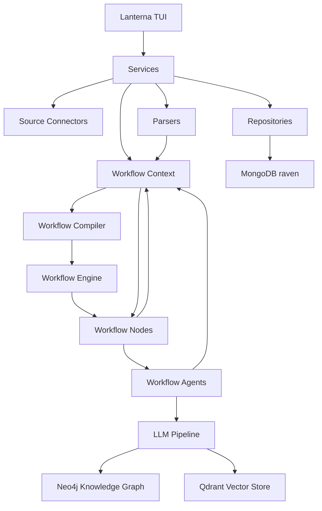

# Technical Architecture

## Overview

Raven is a standalone Java 21 Maven application. It is currently a terminal-first OSINT workspace with a layered architecture intended to keep UI, orchestration, persistence and domain models separate.



## Runtime Stack

- Java 21
- Maven
- Lanterna for terminal UI
- MongoDB Java Driver sync
- Neo4j Java Driver
- Qdrant Java Client
- Jackson for JSON/YAML serialization
- Lombok for DTO boilerplate
- JUnit 5 for tests
- LangChain4j and LangGraph4j dependencies are present for future graph/agent workflows

## Package Layout

Current package responsibilities:

```text
it.osint.raven
  config/          typed configuration and YAML persistence
  connectors/      source connector contracts
  dto/article/     structured intelligence article DTOs
  dto/source/      source and raw document DTOs
  repositories/    MongoDB persistence adapters
  services/        connection status and use-case services
  tui/             Lanterna windows and widgets
  utils/           stateless helpers
  workflow/        engine-independent workflow context, node and agent contracts, artifacts and events
  workflow/compiler/ runtime-independent workflow compiler and execution plan
  workflow/engine/ runtime-independent workflow engine contract and sequential reference implementation
  workflow/definition/ YAML-backed workflow goal definitions
  workflow/registry/ central node and agent registry for future workflow compilation
```

## Core Model Boundaries

Raven separates acquisition from interpretation:

- `SourceDto` represents an operational source configuration.
- `SourceConnector` fetches content from a source.
- `RawDocumentDto` stores acquired raw content without interpreting it.
- Parsers convert raw documents into structured documents such as `ArticleDto`.
- `WorkflowContext` carries the source, raw document, structured document and all shared node outputs during execution.
- `WorkflowNode` is the domain contract implemented by executable workflow steps.
- `WorkflowAgent` is the reusable business-logic contract that can be called by workflow nodes, REST endpoints, CLI commands or batch jobs.
- LLM or rule-based analysis enriches structured documents with entities, claims, events and assessments.

This prevents `ArticleDto` from knowing whether content came from a website, RSS feed, Telegram channel, PDF, API or filesystem.

## Workflow Domain Boundary

Raven's engine-independent workflow domain is located under:

```text
it.osint.raven.workflow
```

This package contains the state and contracts that describe a workflow run without committing the domain model to a specific engine. The current core types are:

- `WorkflowContext`
- `WorkflowNode`
- `WorkflowNodeCategory`
- `WorkflowArtifact`
- `WorkflowEvent`
- `WorkflowEventType`
- `WorkflowError`
- `WorkflowStatus`
- `StructuredDocument`

The workflow agent contracts live in:

```text
it.osint.raven.workflow.agent
```

The current agent types are:

- `WorkflowAgent`
- `WorkflowAgentType`
- `DeterministicAgent`
- `LlmAgent`
- `ConnectorAgent`

The workflow registry lives in:

```text
it.osint.raven.workflow.registry
```

It provides the central `WorkflowRegistry` contract for registering and discovering workflow nodes and agents.

Workflow definitions live in:

```text
it.osint.raven.workflow.definition
```

`WorkflowDefinition` describes workflow goals and safe metadata. It does not describe a DAG and does not list nodes.

The workflow compiler lives in:

```text
it.osint.raven.workflow.compiler
```

`WorkflowCompiler` transforms `WorkflowDefinition` plus `WorkflowRegistry` into an engine-independent `ExecutionPlan`.

The workflow engine lives in:

```text
it.osint.raven.workflow.engine
```

`WorkflowEngine` executes an `ExecutionPlan` against a `WorkflowContext` and returns a `WorkflowResult`. `SequentialWorkflowEngine` is the reference implementation and executes nodes in the compiler-provided order without depending on LangGraph4j.

`WorkflowContext` is intentionally not a LangGraph4j state class. `WorkflowNode` is intentionally not a LangGraph4j node action. `WorkflowAgent` is intentionally not a Spring service, LangChain4j assistant or model client. LangGraph4j can execute or checkpoint a graph that passes `WorkflowContext` between `WorkflowNode` implementations, and nodes can delegate to agents, but the context, node and agent contracts remain Raven domain objects.

The dependency direction should stay this way:

```text
WorkflowDefinition + WorkflowRegistry -> WorkflowCompiler -> ExecutionPlan -> WorkflowEngine -> WorkflowResult
WorkflowEngine -> SequentialWorkflowEngine
WorkflowEngine -> LangGraphWorkflowEngine (planned)
WorkflowNode -> WorkflowAgent -> WorkflowContext
```

The workflow package must not import LangGraph4j, LangChain4j, OpenAI clients, Spring, MongoDB, Neo4j, Qdrant or framework-specific serializers.

## Workflow Context

The context contains:

- workflow identifiers and timestamps;
- `WorkflowStatus`;
- the current `SourceDto`;
- the acquired `RawDocumentDto`;
- a parser output through the `StructuredDocument` marker interface;
- typed shared outputs through `Map<Class<?>, WorkflowArtifact>` for legacy/type lookup;
- named shared outputs through workflow capability ids;
- temporary variables;
- audit events;
- warnings;
- structured errors;
- metrics.

The shared output map is the extension point for node results. Instead of adding a new field for every agent result, nodes store typed artifacts:

```java
context.put("metadata-agent", metadata);
context.put("entity-agent", ENTITY_EXTRACTION, entityExtractionResult);

MetadataDto metadata = context.require(MetadataDto.class);
EntityExtractionResult entities = context.require(ENTITY_EXTRACTION);
```

Each stored `WorkflowArtifact` includes provenance: id, declared type, value, producer and production timestamp. Capability-based storage adds a stable logical id, such as `entity-extraction` or `organization-resolution`, so two outputs with similar Java shapes do not collide in the DAG.

See [Workflow context](workflow-context.md) for the full API and usage rules.

## Workflow Node Contract

`WorkflowNode` describes a single executable unit in a Raven workflow. Connectors, parsers, enrichment processors, AI extractors, validators, persistence adapters and exporters can all implement the same contract:

```java
WorkflowContext execute(WorkflowContext context) throws Exception;
```

Every node also declares:

- stable `id`;
- human-readable `name`;
- short `description`;
- `WorkflowNodeCategory`;
- required capabilities through `requires`;
- produced capabilities through `produces`;
- default execution policy metadata such as timeout, retry count, parallelization, idempotency and priority.

The key design choice is the capability declaration:

```java
Set<WorkflowCapability> requires();
Set<WorkflowCapability> produces();
```

This gives `WorkflowCompiler` enough information to reason about ordering without relying only on Java classes. A node that requires capability `structured-document` cannot run before a parser has produced that capability. A relationship extraction node can require `entity-extraction`, while an organization enrichment node can require `organization-resolution`, even if both payloads contain entity-like data.

The default `canExecute` method checks the declared requirements with `WorkflowContext.contains(WorkflowCapability)`. It does not use reflection over fields or annotations.

See [Workflow nodes](workflow-nodes.md) for the full contract and implementation guidance.

## Workflow Agent Contract

`WorkflowAgent` describes reusable business logic that consumes and enriches a `WorkflowContext`:

```java
WorkflowContext execute(WorkflowContext context) throws Exception;
```

The same agent can be reused by multiple callers:

```text
MetadataWorkflowNode -> MetadataExtractionAgent
REST Endpoint       -> MetadataExtractionAgent
CLI Command         -> MetadataExtractionAgent
Batch Job           -> MetadataExtractionAgent
```

Every agent declares:

- stable `id`;
- human-readable `name`;
- short `description`;
- `WorkflowAgentType`;
- type-level requirements through `Set<Class<?>> requires()`;
- type-level outputs through `Set<Class<?>> produces()`;
- optional document support through `supports(StructuredDocument)`;
- optional safe configuration metadata;
- AI metadata such as `aiPowered`, `deterministic`, `modelName` and `promptId`.

`WorkflowAgent` requirements intentionally use Java classes, while `WorkflowNode` requirements use named `WorkflowCapability` values. The agent declaration describes reusable business inputs and outputs. The node declaration describes DAG dependencies and can map an agent's type-level capabilities to stable workflow capability ids.

See [Workflow agents](workflow-agents.md) for the full contract and implementation guidance.

## Workflow Registry

`WorkflowRegistry` is the central engine-independent registry for workflow nodes and agents:

```java
WorkflowRegistry registry = WorkflowRegistry.create()
        .registerNode(metadataNode)
        .registerAgent(metadataAgent);
```

It supports:

- registering `WorkflowNode` instances;
- registering `WorkflowAgent` instances;
- finding nodes and agents by stable id;
- finding nodes that produce a `WorkflowCapability`;
- finding nodes that require a `WorkflowCapability`;
- discovery through Java `ServiceLoader`.

The registry deliberately does not use Spring component scanning. It is the base for the future workflow compiler, which can inspect registered nodes, compare `requires()` and `produces()`, and build a DAG without depending on LangGraph4j in the domain model.

See [Workflow registry](workflow-registry.md) for the full contract and usage rules.

## Workflow Definition

`WorkflowDefinition` is the YAML-backed domain description of a workflow request:

```yaml
workflow:
  id: libya-observer
  version: 1.0

goals:
  - metadata
  - entities
  - claims
  - assessment
```

It intentionally lists goals, not nodes. A future compiler will resolve these goals against `WorkflowRegistry` and registered `WorkflowCapability` declarations.

See [Workflow definitions](workflow-definitions.md) for the full contract and YAML format.

## Workflow Compiler

`WorkflowCompiler` resolves a workflow definition into an execution plan:

```java
ExecutionPlan plan = new WorkflowCompiler()
        .compile(definition, registry);
```

The compiler:

- reads workflow goals;
- finds nodes that produce those capabilities;
- resolves required capabilities recursively;
- adds dependency nodes automatically;
- builds a dependency graph;
- performs Kahn topological sort;
- returns `ExecutionPlan`.

It raises dedicated exceptions for missing capabilities, ambiguous producers and circular dependencies.

See [Workflow compiler](workflow-compiler.md) for the full algorithm and output model.

## Workflow Engine

`WorkflowEngine` is the runtime contract for executing compiled plans:

```java
WorkflowResult result = engine.execute(plan, context);
```

The current `SequentialWorkflowEngine`:

- follows `ExecutionPlan.executionOrder()`;
- executes nodes one at a time;
- calls node lifecycle hooks;
- updates `WorkflowContext`;
- applies retry only to idempotent nodes;
- measures timeout after synchronous node execution;
- records observability through context events, warnings, errors and metrics;
- returns a `WorkflowResult` with status, timestamps, duration and node outcome lists.

It does not build DAGs, resolve dependencies or choose nodes. It also does not use LangGraph4j, Spring, MongoDB, Neo4j or Qdrant.

See [Workflow engine](workflow-engine.md) for the full contract and execution behavior.

## Structured Document Boundary

Raven uses `StructuredDocument` as the common contract for parser outputs consumed by workflow nodes.

`ArticleDto` currently implements `StructuredDocument`, but the boundary is intentionally broader. Future parser outputs such as Telegram messages, PDF documents or API payload documents should implement the same interface instead of forcing every workflow to operate on `ArticleDto`.

This keeps the document chain generic:

```text
RawDocumentDto -> StructuredDocument -> WorkflowContext -> WorkflowNode
```

Specialized nodes may still check for a concrete subtype when they truly need article-specific behavior.

## Persistence

MongoDB database:

```text
raven
```

Collections:

- `sources`
- `raw_documents`
- `articles`

Repository classes:

- `MongoSourceRepository`
- `MongoRawDocumentRepository`
- `MongoArticleRepository`

The repositories store DTOs as BSON documents through Jackson conversion. Public DTO JSON names use `snake_case` through explicit `@JsonProperty` annotations.

## Serialization

`OsintObjectMapper` is the shared mapper for OSINT DTO serialization.

Important mapper behavior:

- Java time support through `JavaTimeModule`;
- dates and instants as ISO strings;
- durations as ISO-8601 strings such as `PT30M`;
- DTO field names controlled by `@JsonProperty`.

## Configuration

Raven configuration is stored at:

```text
config/raven.yaml
```

The configuration contains endpoint settings for Neo4j, Qdrant and MongoDB, plus terminal theme and density settings.

## Security Notes

Source authentication DTOs can represent usernames, passwords, API keys and bearer tokens. They must not be logged, displayed in normal TUI screens or included in diagnostic output.

Planned hardening:

- secret masking in source management screens;
- environment-variable backed secret resolution;
- encrypted local secret storage or external secret provider integration.
