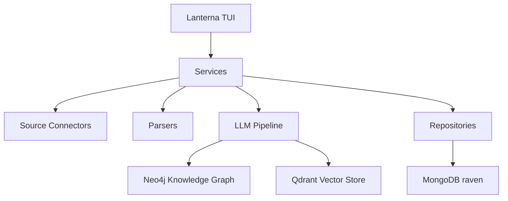

# Technical Architecture

## Overview

Raven is a standalone Java 21 Maven application. It is currently a terminal-first OSINT workspace with a layered architecture intended to keep UI, orchestration, persistence and domain models separate.



## Runtime Stack

- Java 21
- Maven
- Lanterna for terminal UI
- MongoDB Java Driver sync
- Neo4j Java Driver
- Qdrant Java Client
- Jackson for JSON/YAML serialization
- Lombok for DTO boilerplate
- JUnit 5 for tests
- LangChain4j and LangGraph4j dependencies are present for future graph/agent workflows

## Package Layout

Current package responsibilities:

```text
it.osint.raven
  config/          typed configuration and YAML persistence
  connectors/      source connector contracts
  dto/article/     structured intelligence article DTOs
  dto/source/      source and raw document DTOs
  repositories/    MongoDB persistence adapters
  services/        connection status and use-case services
  tui/             Lanterna windows and widgets
  utils/           stateless helpers
```

## Core Model Boundaries

Raven separates acquisition from interpretation:

- `SourceDto` represents an operational source configuration.
- `SourceConnector` fetches content from a source.
- `RawDocumentDto` stores acquired raw content without interpreting it.
- Parsers convert raw documents into structured documents such as `ArticleDto`.
- LLM or rule-based analysis enriches structured documents with entities, claims, events and assessments.

This prevents `ArticleDto` from knowing whether content came from a website, RSS feed, Telegram channel, PDF, API or filesystem.

## Persistence

MongoDB database:

```text
raven
```

Collections:

- `sources`
- `raw_documents`
- `articles`

Repository classes:

- `MongoSourceRepository`
- `MongoRawDocumentRepository`
- `MongoArticleRepository`

The repositories store DTOs as BSON documents through Jackson conversion. Public DTO JSON names use `snake_case` through explicit `@JsonProperty` annotations.

## Serialization

`OsintObjectMapper` is the shared mapper for OSINT DTO serialization.

Important mapper behavior:

- Java time support through `JavaTimeModule`;
- dates and instants as ISO strings;
- durations as ISO-8601 strings such as `PT30M`;
- DTO field names controlled by `@JsonProperty`.

## Configuration

Raven configuration is stored at:

```text
config/raven.yaml
```

The configuration contains endpoint settings for Neo4j, Qdrant and MongoDB, plus terminal theme and density settings.

## Security Notes

Source authentication DTOs can represent usernames, passwords, API keys and bearer tokens. They must not be logged, displayed in normal TUI screens or included in diagnostic output.

Planned hardening:

- secret masking in source management screens;
- environment-variable backed secret resolution;
- encrypted local secret storage or external secret provider integration.
