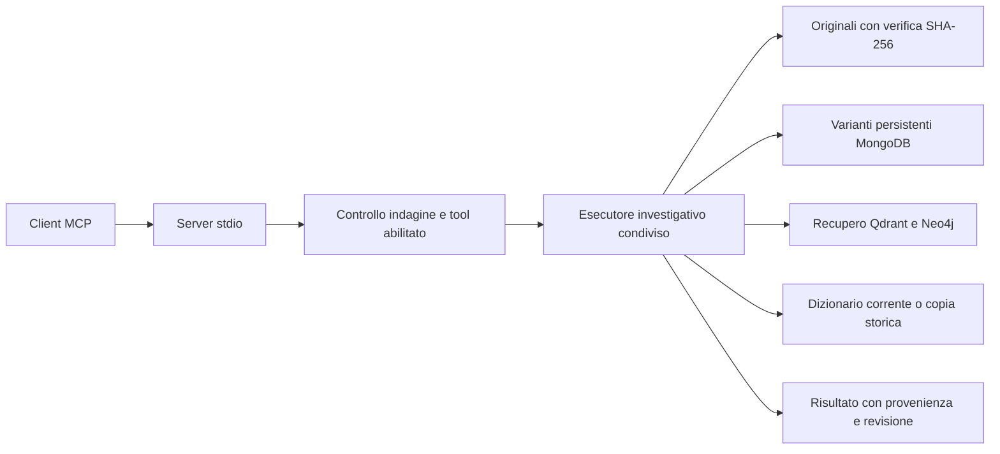

# Tool investigativi e server MCP di Raven

Raven espone 18 operazioni di consultazione attraverso un registro comune alla schermata
**Skills & Tools**, al catalogo delle capacità e al server MCP. Il server permette a un
client compatibile di leggere le fonti, consultare i grafi persistenti, recuperare contesto
investigativo e confrontare varianti. Non richiede l'avvio dell'interfaccia Textual.

Il perimetro riguarda le funzioni di consultazione individuate durante l'inventario.
Generazione e attivazione delle varianti, importazione di documenti, modifiche alle indagini
e revisione manuale degli elementi rimangono nei servizi e nelle schermate di Raven.
Non sono esposte come operazioni MCP in questa versione.

> **Che cosa significa MCP.** Model Context Protocol definisce il dialogo tra un client
> e un programma che offre strumenti. Il client scopre nomi e schemi tramite `tools/list`,
> quindi invoca uno strumento tramite `tools/call`. Raven usa il trasporto `stdio`: il client
> avvia un processo e comunica attraverso il suo ingresso e la sua uscita standard.
> Non viene aperta una porta HTTP. La compatibilità è verificata usando il client ufficiale
> del pacchetto Python MCP, con versione bloccata da `uv.lock` nel ramo 1.x.

## Consultazione dei cataloghi in Raven

Il pulsante **Cataloghi** nella barra principale apre le schede **Skills** e **Tools**.
Dalla home si può usare anche **S**; **Esc** torna alla schermata precedente. Rimane
accessibile il percorso **Configurazione → Skills & Tools → Gestisci**.

In entrambi i cataloghi l'elenco occupa il pannello sinistro e la scheda selezionata
quello destro. Il separatore verticale si trascina per regolare le larghezze; da tastiera
si raggiunge con **Tab** e si sposta con **←/→**. **Home** o un doppio clic sul separatore
ripristinano le proporzioni iniziali. Ogni scheda mantiene la propria proporzione finché
il catalogo rimane aperto, anche passando all'altro catalogo o ridimensionando il terminale.
Elenco e dettagli scorrono indipendentemente; **Invio** sull'elenco porta il focus ai dettagli.

La ricerca si attiva con **/**. Il selettore accanto alla ricerca limita l'elenco a tutte
le capacità, a quelle disponibili, a quelle disabilitate oppure a quelle da verificare.
Una skill è disponibile per il catalogo di selezione quando il file è valido, è abilitata,
la descrizione AI è aggiornata e tutti i tool dichiarati sono disponibili. Per un tool,
la disponibilità indica l'abilitazione: la raggiungibilità dei servizi viene verificata
quando viene eseguito. I conteggi mostrano quanti elementi corrispondono ai filtri. **F3** apre la scheda
selezionata a tutto schermo, con testo scorrevole; **Esc** torna al catalogo.

**Tool usati** passa dalla skill selezionata all'elenco delle sue dipendenze;
**Tutti i tool** ripristina la consultazione completa. La scheda del tool mostra le skill
che lo dichiarano, il perimetro dei dati, il timeout, lo schema MCP effettivo e il contratto
locale. La ricerca ibrida è identificata come accesso a Qdrant, Neo4j e al modello di
embedding. L'abilitazione e la disabilitazione rimangono condivise con il server MCP.

> **Catalogo consultabile anche senza connessione AI.** La descrizione salvata viene
> confrontata con il profilo configurato anche quando il nodo AI non è ancora connesso.
> Un cambio di modello, di skill o dei contratti dei tool continua a richiedere
> l'aggiornamento del catalogo. La sola consultazione non effettua chiamate al modello.

## Avvio e accesso alle indagini

Dalla cartella del progetto, dopo `uv sync`, il comando è:

```bash
uv run raven-mcp --investigation e8891841-187b-4231-bcad-7fa351e413fa
```

L'identificatore dell'esempio appartiene al caso di verifica RX41. Per altre indagini va
sostituito con il relativo UUID. Ripetere `--investigation UUID` autorizza altre indagini
nello stesso processo. Il parametro è obbligatorio: non esiste un valore implicito che
renda accessibili tutte le indagini. `--config /percorso/config.json` seleziona un altro
file di configurazione; in sua assenza viene caricata la configurazione ordinaria di Raven,
comprese le impostazioni d'ambiente e le credenziali gestite dall'applicazione.

Per un client che accetta una configurazione `mcpServers`, una configurazione di esempio è:

```json
{
  "mcpServers": {
    "raven": {
      "command": "/Users/administrator/WORK/Progetti/OSINT/osint/.venv/bin/raven-mcp",
      "args": ["--investigation", "e8891841-187b-4231-bcad-7fa351e413fa"]
    }
  }
}
```

Il formato del contenitore dipende dal client; comando e argomenti identificano il processo
Raven da avviare. Non inserire credenziali negli argomenti. Il server viene avviato e chiuso
dal client. Eseguirlo direttamente in un terminale lo lascia in attesa del protocollo:
non presenta un prompt interattivo. `raven-mcp --help` è invece un normale comando informativo.

> **Due livelli di autorizzazione.** Gli UUID passati all'avvio stabiliscono il perimetro
> del processo. La preferenza di abilitazione del singolo tool, salvata nella cartella delle
> skill, stabilisce quali operazioni sono disponibili. Entrambe vengono controllate prima
> della lettura; lo stato del tool viene ricontrollato prima di restituire contenuti. Un tool
> disabilitato scompare alla successiva richiesta `tools/list` e viene rifiutato anche se il
> client ne conserva una vecchia scheda. Metadati delle capacità illeggibili impediscono
> l'accesso anziché abilitare implicitamente tutti gli strumenti.

## Contratti e inventario

Tutti i tool MCP richiedono `investigation_id`, tranne `list_investigations`. Nell'esecutore
Python l'identificatore è un argomento separato dal dizionario degli argomenti del tool:
questo permette al chiamante Raven di stabilire il contesto autorizzato. Il trasporto MCP
lo aggiunge allo schema pubblicato e lo verifica contro il perimetro del processo.
Gli argomenti sconosciuti vengono rifiutati; non sono ammessi percorsi arbitrari, query SQL,
query Cypher o nomi di funzioni da caricare dinamicamente.

| Tool | Argomenti specifici | Risultato e uso |
| --- | --- | --- |
| `list_investigations` | Paginazione | Solo le indagini autorizzate, con domande e dominio. |
| `get_investigation` | Nessuno | Metadati dell'indagine selezionata. |
| `list_documents` | Paginazione | Identificatori, nomi originali, SHA-256, pagine e stato d'ingestione; nessun percorso fisico. |
| `read_page` | `document_id`, `page` | Testo originale normalizzato e provenienza. |
| `verify_quote` | `document_id`, `page`, `quote` | Presenza esatta della citazione nella pagina originale. |
| `search_evidence` | `query` | Prima occorrenza per pagina, fino a 20 pagine, con estratti e provenienza. |
| `list_graph_methods` | Paginazione | Identificatori, versioni e scopi dei tre metodi investigativi. |
| `list_graph_variants` | Paginazione | Varianti persistenti e manifesti, senza incorporare le definizioni del dizionario. |
| `open_graph_variant` | `variant_id` | Manifesto, data, nome e conteggi; non modifica la selezione attiva. |
| `list_graph_entities` | `variant_id`, filtri, paginazione | Entità, classificazioni, alias, supporti e stato di revisione. |
| `list_graph_claims` | `variant_id`, filtri, paginazione | Affermazioni con polarità, modalità, attribuzione, tempi e citazioni. |
| `list_graph_relationships` | `variant_id`, filtri, paginazione | Relazioni proiettate e identificatori delle affermazioni da cui derivano. |
| `list_graph_events` | `variant_id`, filtri, paginazione | Eventi con ruoli, valori, tempi, affermazioni e supporti. |
| `list_graph_comparisons` | `variant_id`, filtri, paginazione | Confronti con entrambe le affermazioni e indicazione della completezza del contesto. |
| `read_page_coverage` | `variant_id`, `document_id` facoltativo, paginazione | Stato di ogni pagina registrata, impronte, catalogazione e conteggi. |
| `read_dictionary` | `variant_id` | Definizioni risolte correnti oppure copia storica della variante, con hash e versioni. |
| `retrieve_evidence` | `variant_id`, `query` | Contesto ibrido documenti/grafo e diagnostica del recupero. |
| `compare_graph_variants` | `first_variant_id`, `second_variant_id`, `section`, paginazione | Riepilogo completo del confronto e una sezione di differenze. |

La paginazione usa `offset`, inizialmente zero, e `limit`, inizialmente 50, con massimo 100.
La risposta include `total`, `offset` e `next_offset`; quest'ultimo vale `null` quando non
ci sono altre righe. Gli ordinamenti sono deterministici. Per le collezioni del grafo sono
ammessi `item_id` e `document_id` facoltativi; la copertura usa soltanto `document_id`.
Il filtro documento sui confronti seleziona i confronti che coinvolgono quel documento,
ma conserva comunque entrambe le affermazioni coinvolte.

Gli schemi dei record di entità, affermazioni, relazioni, eventi, confronti e copertura
sono derivati dai modelli di dominio. Il server pubblica sia `inputSchema` sia
`outputSchema`. Ogni successo contiene `structuredContent` e una rappresentazione JSON
identica nel contenuto testuale, per client con capacità differenti. Gli errori usano
`isError: true` e non includono stack trace, credenziali o risposte grezze dei servizi.

## Varianti e dizionari modificabili

`variant_id` è obbligatorio per le letture del grafo. Può contenere l'UUID di una variante
o `active`, che viene risolto sul database al momento della chiamata. La risposta contiene
sempre il `run_id` effettivo. Per continuare una paginazione va riutilizzato quel `run_id`:
una successiva chiamata con `active` potrebbe risolvere una selezione diversa se nel frattempo
un operatore l'ha cambiata. Nessun tool di consultazione cambia questa selezione.

`read_dictionary` ammette anche `current`: risolve di nuovo il dominio configurato per
l'indagine, inclusa l'ereditarietà tra dizionari. Con una variante legge invece la copia
conservata nel manifesto. Nei grafi storici privi di copia completa restituisce
`available: false` e `definition: null`, conservando hash e versioni se disponibili.
I tool funzionano quindi con dizionari variabili e con domini generici: non contengono
regole specifiche per il terrorismo.



## Ricerca, confronto e interpretazione

`search_evidence` è una ricerca letterale senza distinzione tra maiuscole e minuscole.
Non ordina per rilevanza e si ferma a 20 pagine corrispondenti; non rappresenta quindi un
conteggio esaustivo delle occorrenze. `verify_quote` è invece sensibile alle maiuscole:
controlla che la sequenza di caratteri sia presente nel testo normalizzato della pagina.
Prima di leggere il testo, l'esecutore controlla l'appartenenza del documento all'indagine,
la posizione della copia locale e la sua impronta SHA-256; ricontrolla l'impronta dopo
l'estrazione. File mancanti, modificati o collegamenti simbolici vengono rifiutati.

`retrieve_evidence` usa il modello di embedding configurato per la domanda, la ricerca
vettoriale in Qdrant e il recupero del contesto del grafo. Il manifesto MongoDB rimane
l'autorità per il significato dei record. Si riutilizza il recuperatore di Raven, inclusi
i controlli su indagine, variante, impronte dei documenti e contesto congiunto dei confronti.
Il modello di chat non viene inizializzato né chiamato. Se un servizio non è disponibile,
la risposta registra gli avvisi in `trace.warnings` e restituisce il contesto recuperabile.
Con `active` e nessun grafo esistente può ancora recuperare documenti; una variante esplicita
inesistente produce invece un errore.

> **Disponibilità del contesto e verità.** Una citazione presente dimostra che il testo è
> nella fonte, non che l'evento sia avvenuto. Una revisione semantica favorevole valuta il
> supporto della fonte all'affermazione. Le negazioni, le incertezze, le attribuzioni e gli
> stati di revisione devono accompagnare i risultati anche nelle risposte elaborate da
> un client esterno. Una ricerca vuota con servizi indisponibili non dimostra assenza di prove.

Il confronto A/B riutilizza l'allineamento semantico di Raven, senza basarsi sull'uguaglianza
degli UUID delle entità. `section` seleziona una delle sezioni `lost`, `gained`,
`classification_differences`, `review_differences`, `dictionary_added`, `dictionary_removed`
e `dictionary_changed`. Ogni risposta conserva il riepilogo, gli identificatori effettivi
di A e B, le metriche e i conteggi di tutte le sezioni. L'assenza di definizioni storiche
viene dichiarata separatamente da una differenza vuota. Le differenze indicano cambiamenti
tra elaborazioni; non stabiliscono automaticamente quale elaborazione sia corretta.

## Limiti operativi e stato delle skill

Il limite della risposta JSON è 2 MiB. Le collezioni sono paginabili; una singola risposta
più grande viene rifiutata con un messaggio che invita a restringere la richiesta.
La preparazione degli originali ammette fino a 2000 pagine, 100.000 caratteri per pagina
e complessivamente 20 MiB di testo. Questi limiti sono controllati durante la preparazione;
l'estrattore del formato può leggere il documento completo prima che venga verificata
la dimensione del testo estratto. Per leggere una pagina o verificarne una citazione
viene preparato soltanto il documento richiesto.

I tre tool sulle fonti conservano il limite di cinque secondi; gli altri hanno un limite
di 60 secondi. Il server risponde al timeout e inoltra la cancellazione all'esecutore.
Le letture in corso possono terminare al timeout del rispettivo driver: la cancellazione
è cooperativa. Un solo esecutore per processo accede ai servizi alla volta; richieste
concorrenti ricevono un errore temporaneo se una lettura è ancora in corso. L'avvio delle
connessioni usa `bootstrap=False`: non crea collezioni, indici o marcatori di schema.

Le skill `.SKILL` restano contratti e procedure catalogate. Questo intervento rende i tool
eseguibili via MCP e attraverso `InvestigationToolService`, ma non aggiunge un agente che
selezioni ed esegua automaticamente le skill. L'ampliamento del registro cambia l'impronta
del catalogo: le descrizioni AI precedenti possono risultare da aggiornare. I nuovi tool
possono ora essere dichiarati nella proprietà `tools` delle skill successive.

## Verifica riproducibile

I test automatici verificano schemi, autorizzazione, cancellazione, varianti, dizionari,
provenienza, hash degli originali e connessioni prive di bootstrap. Un test avvia il server
`stdio` reale con un archivio isolato e usa il client MCP ufficiale per inizializzazione,
scoperta, invocazione, paginazione e revoca di un tool già scoperto.

Lo script `scripts/verify_mcp_tools.py` prova tutti i 18 tool contro un'indagine esistente:
richiede `--investigation`, `--first`, `--second` e `--output`. Salva soltanto esiti,
conteggi e diagnostica, senza riportare le pagine originali. Confronta inoltre un'impronta
dell'indagine, di tutte le varianti MongoDB, del grafo attivo e dei metadati di schema prima
e dopo la sessione. Il resoconto del caso RX41 si trova in
`docs/research/mcp-verification-2026-09-09.json`.

La verifica finale del 9 settembre 2026 ha superato **488 test**, il controllo Ruff,
la verifica della formattazione e il controllo degli spazi nel diff. L'eseguibile `raven`
installato è stato avviato in un terminale 80×24 ed è terminato regolarmente con `q`.
La prova MCP sul caso RX41 ha eseguito tutti i 18 tool; il recupero ibrido ha restituito
12 risultati vettoriali e contesto Neo4j, senza avvisi di indisponibilità. Il contesto
risulta limitato, come dichiarato da `trace.truncated: true`: non va interpretato come
esportazione completa del grafo. Le impronte di persistenza prima e dopo coincidono.

La verifica dei cataloghi comprende navigazione dal menu e dalla home, filtri, dipendenze,
schede a tutto schermo e corrispondenza degli schemi MCP, a 80×24 e 140×45.
La consultazione in sola lettura del registro configurato ha rilevato 6 skill e 18 tool
abilitati; al momento della verifica una scheda AI era da aggiornare e cinque da catalogare.
