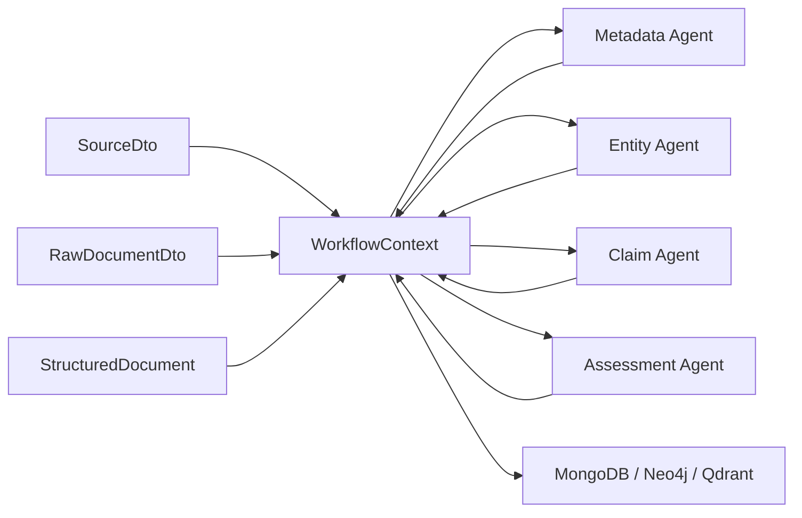

# Workflow Context

## Purpose

`WorkflowContext` is the shared execution state for Raven workflow runs.

It is deliberately small in concept and broad in use: every workflow node or workflow agent receives the same context, reads what previous steps produced, adds new outputs, records warnings and errors, updates metrics, and leaves an audit trail of what happened. The context is the collaboration surface between connectors, parsers, deterministic processors and AI-capable agents.

The class lives in:

```text
it.osint.raven.workflow.WorkflowContext
```

The package is independent from the future workflow engine. Even when Raven uses LangGraph4j to orchestrate graph execution, the domain model does not depend on LangGraph4j classes. This keeps the workflow state portable, testable and usable by other orchestration approaches.

## Position in the Raven Pipeline

The high-level Raven pipeline is:

```text
Source
  -> Connector
  -> RawDocumentDto
  -> Parser
  -> StructuredDocument
  -> WorkflowContext
  -> Workflow nodes / Workflow agents
  -> MongoDB / Neo4j / Qdrant
```

`WorkflowContext` starts becoming important after acquisition and parsing. At that point Raven no longer has only raw bytes or a source configuration; it has a structured document plus a set of intermediate results that multiple nodes can enrich.

A typical execution can look like this:



The important rule is that workflow nodes do not need to extend `WorkflowContext` every time a new result type appears. They publish outputs into a typed artifact map.

## Engine Independence

`WorkflowContext` must remain independent from:

- Spring
- LangGraph4j
- MongoDB
- Neo4j
- Qdrant
- Jackson-specific serialization choices

The current implementation uses only Java 21 and Raven DTOs from the domain layer:

- `SourceDto`
- `RawDocumentDto`
- `StructuredDocument`

This boundary matters because the context is domain state, not engine state. LangGraph4j can pass it around, checkpoint it, or wrap it, but LangGraph4j should not leak into the model itself.

The same rule applies to the node and agent contracts. `WorkflowNode` lives in the same package because it is a Raven domain contract, not a LangGraph4j node type. `WorkflowAgent` lives under `it.osint.raven.workflow.agent` because it is reusable business logic, not a Spring service, LangChain4j assistant or model client. A future adapter can wrap `WorkflowNode` instances for LangGraph4j execution, and a node can delegate to a `WorkflowAgent`, but none of these domain contracts should import LangGraph4j.

## Structured Documents

Raven should not assume that every parsed document is an `ArticleDto`.

For that reason, the workflow package defines:

```java
public interface StructuredDocument {
}
```

`ArticleDto` currently implements this marker interface. Future structured DTOs can do the same:

```text
ArticleDto
TelegramMessageDto
PdfDocumentDto
EmailDocumentDto
ApiPayloadDto
```

The context field is:

```java
private StructuredDocument document;
```

This gives the workflow run a canonical current document while allowing specialized nodes to inspect a concrete subtype when needed:

```java
if (context.getDocument() instanceof ArticleDto article) {
    // article-specific enrichment
}
```

There is one important distinction: `canExecute` checks required inputs through `context.contains(capability)`, and capability lookup uses named workflow artifacts. Therefore, if a node declares the `structured-document` capability in `requires()`, the parser or engine should also publish the document under that capability:

```java
WorkflowCapability structuredDocument =
        WorkflowCapability.produced("structured-document", StructuredDocument.class);

context
        .document(article)
        .put("html-parser", structuredDocument, article);
```

The `document` field is the convenient current-document pointer. The capability artifact entry is the dependency declaration surface used by nodes, `WorkflowCompiler` and future DAG adapters.

## Core Fields

`WorkflowContext` contains stable execution metadata:

```text
workflowId     UUID
workflowName   String
startedAt      Instant
updatedAt      Instant
status         WorkflowStatus
```

It also contains the current source and document chain:

```text
source         SourceDto
rawDocument    RawDocumentDto
document       StructuredDocument
```

`updatedAt` is refreshed whenever the context is mutated through the provided fluent API.

## Status Model

Workflow execution status is represented by `WorkflowStatus`:

```text
CREATED
RUNNING
COMPLETED
FAILED
PARTIAL
```

Use the status to describe the whole execution, not a single node. A node-level failure should be recorded as a `WorkflowError` and an audit event. The workflow status should change to `FAILED` only when execution cannot continue, or to `PARTIAL` when useful outputs were produced but one or more branches failed or degraded.

Example:

```java
context
        .status(WorkflowStatus.RUNNING)
        .event("entity-agent", WorkflowEventType.NODE_STARTED, "Entity extraction started");
```

## Shared Outputs

Shared outputs are the most important part of the context.

Workflow nodes and agents will produce many different objects:

- `MetadataDto`
- `TaxonomyDto`
- `List<EntityDto>`
- `List<RelationshipDto>`
- `AssessmentDto`
- embeddings
- graph projection objects
- quality reports
- temporary domain-specific results

Adding one field per output type would make `WorkflowContext` grow forever. Instead, the context stores outputs in:

```java
Map<Class<?>, WorkflowArtifact> outputs
```

The public API hides most of that structure. Class-based lookup remains available:

```java
context.put(metadata);
context.put(taxonomy);
context.put(List.class, entities);

Optional<MetadataDto> metadata = context.get(MetadataDto.class);
TaxonomyDto taxonomy = context.require(TaxonomyDto.class);
boolean hasAssessment = context.contains(AssessmentDto.class);
```

For workflow node dependencies, prefer capability-based lookup:

```java
WorkflowCapability entityExtraction =
        WorkflowCapability.produced("entity-extraction", EntityExtractionResult.class);

context.put("entity-agent", entityExtraction, result);

EntityExtractionResult result = context.require(entityExtraction);
boolean hasEntities = context.contains(entityExtraction);
```

The capability id prevents collisions when two outputs share the same Java type or a similar internal structure.

### Why WorkflowArtifact Exists

The map does not store raw objects directly. It stores `WorkflowArtifact` records:

```java
record WorkflowArtifact(
    String id,
    Class<?> type,
    Object value,
    String producedBy,
    Instant producedAt
)
```

This gives every output provenance:

- which node produced it;
- when it was produced;
- what declared type it was stored under;
- the artifact id useful for debugging and future persistence.

This is especially useful when multiple LLM agents collaborate in the same workflow. If a later assessment is wrong, Raven can inspect the context and see whether the problem came from entity extraction, taxonomy, claims, relationship inference or a downstream assessment step.

Example:

```java
context.put("metadata-agent", metadata);

WorkflowArtifact artifact = context.getArtifact(MetadataDto.class).orElseThrow();
String producer = artifact.producedBy();
Instant producedAt = artifact.producedAt();
```

## Type-Safe API

The main API is:

```java
<T> WorkflowContext put(T object)
<T> WorkflowContext put(String producedBy, T object)
<T> WorkflowContext put(Class<? super T> type, T object)
<T> WorkflowContext put(String producedBy, Class<? super T> type, T object)
<T> Optional<T> get(Class<T> type)
boolean contains(Class<?> type)
<T> T require(Class<T> type)
```

`get` returns `Optional<T>` so callers can explicitly handle missing optional outputs.

`require` is for mandatory dependencies between nodes. It throws `IllegalStateException` when the requested output is absent. This is intentional: a node that cannot run without a required upstream result should fail loudly and leave a clear execution error.

Example:

```java
MetadataDto metadata = context.require(MetadataDto.class);

context
        .event("taxonomy-agent", WorkflowEventType.NODE_STARTED, "Taxonomy extraction started")
        .put("taxonomy-agent", taxonomy)
        .event("taxonomy-agent", WorkflowEventType.NODE_COMPLETED, "Taxonomy extraction completed");
```

### Generic Collections

Java type erasure means Raven cannot distinguish `List<EntityDto>` from `List<ClaimDto>` using only `Class<?>`.

When storing a list, use a declared type that is meaningful for retrieval:

```java
List<EntityDto> entities = List.of(entity);
context.put("entity-agent", List.class, entities);
```

For workflow node outputs, prefer introducing small typed result DTOs and named capabilities instead of storing multiple unrelated values under `List.class`.

For example:

```text
EntityExtractionResult
RelationshipExtractionResult
ClaimExtractionResult
```

Each of those result types can then be stored and retrieved without ambiguity:

```java
WorkflowCapability entityExtraction =
        WorkflowCapability.produced("entity-extraction", EntityExtractionResult.class);

context.put("entity-agent", entityExtraction, entityExtractionResult);
EntityExtractionResult result = context.require(entityExtraction);
```

## WorkflowNode Contract

`WorkflowNode` is the executable companion to `WorkflowContext`.

Where `WorkflowContext` answers "what state is being passed through the workflow?", `WorkflowNode` answers "what is one modular step allowed to do with that state?"

The interface is:

```java
public interface WorkflowNode {
    String id();
    String name();
    String description();
    WorkflowNodeCategory category();
    Set<WorkflowCapability> requires();
    Set<WorkflowCapability> produces();
    WorkflowContext execute(WorkflowContext context) throws Exception;
}
```

The node receives a context, reads data from it, produces new capability artifacts, updates observations and returns the same enriched context. It should not require an engine-specific state object.

Example capability declaration:

```java
private static final WorkflowCapability STRUCTURED_DOCUMENT =
        WorkflowCapability.required("structured-document", StructuredDocument.class);

private static final WorkflowCapability METADATA =
        WorkflowCapability.produced("metadata-extraction", MetadataDto.class);

@Override
public Set<WorkflowCapability> requires() {
    return Set.of(STRUCTURED_DOCUMENT);
}

@Override
public Set<WorkflowCapability> produces() {
    return Set.of(METADATA);
}
```

This declaration is how Raven will later build a DAG from registered nodes. If one node produces `structured-document` and another requires it, the engine can infer that the producer must run first. If two nodes both require `structured-document` and produce different capabilities, they may be parallelization candidates when their runtime policies allow it.

Because `canExecute` is based on capability artifacts, initial workflow setup must seed required starting values as artifacts when they participate in dependency checks. For a parsed article, that typically means both setting the current document and storing it under the `structured-document` capability:

```java
context
        .document(article)
        .put("parser", STRUCTURED_DOCUMENT, article);
```

`WorkflowNode` also provides:

```java
default boolean canExecute(WorkflowContext context)
default Map<String, Object> configuration()
default void beforeExecute(WorkflowContext context)
default void afterExecute(WorkflowContext context)
default void onError(WorkflowContext context, Exception ex)
default Duration timeout()
default int maxRetries()
default boolean parallelizable()
default boolean idempotent()
default int priority()
```

The default `canExecute` implementation checks every capability declared in `requires()` by calling `context.contains(capability)`. There is no reflection-based discovery and no framework metadata lookup. The contract stays explicit: if a node needs a value, it declares the capability id and value type.

The default runtime policy is conservative:

- timeout: five minutes;
- retries: zero;
- parallelizable: true;
- idempotent: true;
- priority: `100`;
- configuration: empty map.

Those defaults are declarations for workflow engines. The interface itself does not start threads, enforce timeouts, perform retries or choose branches. `SequentialWorkflowEngine` currently reads timeout, retry and idempotency metadata while executing a compiled plan.

Node categories are represented by `WorkflowNodeCategory`:

```text
CONNECTOR
PARSER
ENRICHMENT
AI
PERSISTENCE
VALIDATION
UTILITY
EXPORT
```

The category helps discovery and documentation. The actual DAG dependency logic should come from capability ids in `requires()` and `produces()`, not from the category name.

See [Workflow nodes](workflow-nodes.md) for the dedicated node contract guide.

## WorkflowAgent Contract

`WorkflowAgent` is the reusable business-logic companion to `WorkflowContext`.

Where `WorkflowNode` answers "what is one executable DAG step?", `WorkflowAgent` answers "what business capability can enrich this context regardless of the caller?"

The interface is:

```java
public interface WorkflowAgent {
    String id();
    String name();
    String description();
    WorkflowAgentType type();
    Set<Class<?>> requires();
    Set<Class<?>> produces();
    boolean supports(StructuredDocument document);
    WorkflowContext execute(WorkflowContext context) throws Exception;
}
```

The same agent can be invoked by a workflow node, REST endpoint, CLI command or batch job:

```java
WorkflowAgent agent = new MetadataExtractionAgent();
context = agent.execute(context);
```

Agents can record metrics and observations directly in the context:

```java
context
        .put("metadata-agent", metadata)
        .metric("metadata_fields_extracted", 5);
```

Agent requirements use `Set<Class<?>>` because they describe reusable business inputs and outputs. Workflow node requirements use `WorkflowCapability` because they describe named DAG dependencies. A node that wraps an agent can map the agent's type-level metadata to named capabilities.

See [Workflow agents](workflow-agents.md) for the dedicated agent contract guide.

## Variables

Variables are temporary execution values:

```java
Map<String, Object> variables
```

Use variables for values that help orchestrate execution but are not final domain outputs:

- correlation ids;
- retry counters;
- branch decisions;
- node-local hints;
- transient routing information.

Example:

```java
context.variable("correlation_id", correlationId);
context.variable("retry_count", 1);
```

Variables are intentionally keyed by string because they are operational metadata, not typed domain artifacts. Do not use variables as a replacement for shared outputs. If a value is a domain result another node will depend on, store it with `put`.

## Metrics

Metrics are execution measurements:

```java
Map<String, Object> metrics
```

Examples:

```text
tokens_used
llm_latency
entities_found
relationships_found
claims_found
embedding_dimensions
qdrant_points_upserted
```

Example:

```java
context
        .metric("tokens_used", 1834)
        .metric("llm_latency", "PT2.350S")
        .metric("entities_found", entities.size());
```

Metrics are kept generic for now because Raven does not yet have a metrics backend or schema registry. When that layer is introduced, this map can be transformed into structured telemetry events without changing node code.

## Audit Trail

Workflow nodes can record audit events:

```java
List<WorkflowEvent> events
```

`WorkflowEvent` contains:

```text
timestamp
node
type
message
```

Event types are represented by `WorkflowEventType`. The initial set includes lifecycle, node, output, warning, error, metric, variable and status events.

Example:

```java
context.event(
        "relationship-agent",
        WorkflowEventType.NODE_COMPLETED,
        "Relationship extraction completed"
);
```

The audit trail is not a replacement for application logs or persistent audit records. It is the in-memory execution trace attached to the context. A future workflow engine or persistence service can decide how much of it to store.

Do not put raw document content, prompts, credentials, bearer tokens or full LLM payloads into event messages.

## Warnings

Warnings are non-fatal anomalies:

```java
List<String> warnings
```

Use warnings when the workflow can continue but the result may be degraded:

- low confidence extraction;
- missing optional metadata;
- partial parser output;
- fallback model used;
- source timestamp absent;
- unsupported optional field ignored.

Example:

```java
context.warning("Publication date missing; using acquisition time as fallback");
```

Warnings also create a `WorkflowEventType.WARNING` event.

## Errors

Errors are structured execution failures:

```java
List<WorkflowError> errors
```

`WorkflowError` contains:

```text
node
exception
message
timestamp
```

The `exception` field stores the exception class name instead of a `Throwable` instance. This makes the context easier to serialize and safer to persist. Stack traces can contain sensitive details and can be very large; they belong in controlled logs, not in the shared domain state.

Example:

```java
try {
    runEntityExtraction(context);
} catch (Exception ex) {
    context
            .error("entity-agent", ex)
            .status(WorkflowStatus.PARTIAL);
}
```

Errors also create a `WorkflowEventType.ERROR` event.

## Thread Safety

`WorkflowContext` is designed for concurrent node execution.

The implementation uses:

- `ConcurrentHashMap` for outputs, variables and metrics;
- `CopyOnWriteArrayList` for events, warnings and errors;
- `volatile` for `updatedAt` and `status`;
- synchronized fluent setters for core mutable fields.

This is sufficient for the current model, where nodes append observations and replace typed outputs atomically. It does not make arbitrary mutable values stored inside the context thread-safe. If a node stores a mutable list or DTO and another node mutates that same instance concurrently, the safety of that object is the caller's responsibility.

Recommended practice:

- treat stored artifacts as immutable after `put`;
- prefer replacing outputs with a new value over mutating an existing stored value;
- use small result DTOs for complex multi-field outputs;
- avoid storing live service clients, database handles or framework objects in the context.

## Serialization Considerations

The context is intended to be easily serializable, but it is not tied to Jackson or MongoDB annotations.

Design choices that help serialization:

- records for `WorkflowArtifact`, `WorkflowEvent` and `WorkflowError`;
- simple Java time and UUID fields;
- no framework references;
- exception represented as a string;
- outputs wrapped with declared type and provenance.

The main serialization caveat is the pair of output indexes:

```text
Map<Class<?>, WorkflowArtifact>
Map<String, WorkflowArtifact>
```

A persistence adapter may need to convert class keys to class names and capability ids to stable document keys:

```text
it.osint.raven.dto.article.MetadataDto -> WorkflowArtifact
entity-extraction -> WorkflowArtifact
```

That conversion should live in a persistence or checkpoint adapter, not in the domain model.

## Example Node Pattern

```java
public final class MetadataExtractionNode implements WorkflowNode {

    private static final WorkflowCapability STRUCTURED_DOCUMENT =
            WorkflowCapability.required("structured-document", StructuredDocument.class);

    private static final WorkflowCapability METADATA =
            WorkflowCapability.produced("metadata-extraction", MetadataDto.class);

    @Override
    public String id() {
        return "metadata-extractor";
    }

    @Override
    public String name() {
        return "Metadata Extraction";
    }

    @Override
    public String description() {
        return "Extracts metadata from a structured document.";
    }

    @Override
    public WorkflowNodeCategory category() {
        return WorkflowNodeCategory.ENRICHMENT;
    }

    @Override
    public Set<WorkflowCapability> requires() {
        return Set.of(STRUCTURED_DOCUMENT);
    }

    @Override
    public Set<WorkflowCapability> produces() {
        return Set.of(METADATA);
    }

    @Override
    public WorkflowContext execute(WorkflowContext context) throws Exception {
        context.event(id(), WorkflowEventType.NODE_STARTED, "Metadata extraction started");

        StructuredDocument document = context.require(STRUCTURED_DOCUMENT);
        MetadataDto metadata = extractMetadata(document);

        return context
                .put(id(), METADATA, metadata)
                .metric("metadata_fields_found", countFields(metadata))
                .event(id(), WorkflowEventType.NODE_COMPLETED, "Metadata extraction completed");
    }
}
```

The node reads from the context, writes a typed result, records telemetry and returns the same context. Nothing in the method depends on LangGraph4j.

## Design Rules for Future Nodes

- Accept and return `WorkflowContext` or mutate the provided context consistently.
- Use `require` for mandatory upstream outputs.
- Use `get` for optional upstream outputs.
- Use `put(producedBy, value)` for domain outputs.
- Use `variable` only for temporary execution metadata.
- Use `metric` for counts, latency and resource consumption.
- Use `warning` for recoverable degradation.
- Use `error` for failures that should be visible after execution.
- Use `event` for lifecycle trace.
- Implement `requires` and `produces` accurately; those declarations are future DAG inputs, not decorative metadata.
- Override `parallelizable`, `idempotent`, `timeout`, `maxRetries` or `priority` when the defaults would mislead the engine.
- Do not add node-specific fields to `WorkflowContext` unless the field is truly universal.
- Do not store Spring beans, LangGraph4j state, database clients or serializers in the context.

## Current Implementation Status

Implemented:

- `WorkflowContext`
- `WorkflowArtifact`
- `StructuredDocument`
- `WorkflowStatus`
- `WorkflowEvent`
- `WorkflowEventType`
- `WorkflowError`
- `ArticleDto implements StructuredDocument`
- `WorkflowCapability`
- `WorkflowNode`
- `WorkflowNodeCategory`
- unit tests for typed outputs, capability outputs, provenance, status, variables, metrics, warnings, errors and events
- unit tests for node requirement checking and default execution policies

Not implemented yet:

- workflow engine;
- concrete production workflow nodes;
- automatic node registration;
- DAG construction from node capability declarations;
- LangGraph4j graph definition;
- checkpoint persistence;
- agent execution layer;
- MongoDB or JSON serialization adapters for workflow context snapshots.
