# Workflow Guide

## Target Operating Model

Raven is being shaped around a generic OSINT acquisition workflow:

```mermaid
flowchart LR
    Source["Source"]
    Connector["Connector"]
    RawDocument["Raw Document"]
    Parser["Parser"]
    Structured["Structured Document"]
    Context["Workflow Context"]
    Nodes["Workflow Nodes"]
    Agents["Workflow Agents"]
    Pipeline["LLM / Rule Pipeline"]
    Stores["MongoDB / Qdrant / Neo4j"]

    Source --> Connector
    Connector --> RawDocument
    RawDocument --> Parser
    Parser --> Structured
    Structured --> Context
    Context --> Nodes
    Nodes --> Context
    Nodes --> Agents
    Agents --> Context
    Agents --> Pipeline
    Pipeline --> Stores
```



`WorkflowContext` is the shared execution object passed through workflow nodes and workflow agents. It keeps the source, raw document, structured document, typed outputs, audit events, warnings, errors and metrics together without coupling the domain model to LangGraph4j.

`WorkflowNode` is the domain contract for each executable step. A node declares named `WorkflowCapability` inputs and outputs, then executes against the shared context. This lets Raven move toward modular DAG construction without making the domain model depend on LangGraph4j or guessing dependencies from Java classes alone.

`WorkflowAgent` is the reusable business-logic contract. A node can wrap an agent, but the same agent can also be called directly from REST, CLI or batch execution. Agents declare type-level `requires()` and `produces()` metadata, while nodes declare named workflow capabilities for DAG construction.

## Workflow 1: Configure Infrastructure

Implemented in the current TUI.

1. Start Raven.
2. Open `Config`.
3. Set Neo4j, Qdrant and MongoDB endpoints.
4. Save the configuration.
5. Use `Refresh` to verify connection status.

Expected result:

- configuration is written to `config/raven.yaml`;
- connection probes show `online`, `offline` or `invalid`.

## Workflow 2: Register a Source

Planned TUI workflow, persistence layer implemented.

1. Open Sources.
2. Create a new source.
3. Choose `SourceType`, for example `WEBSITE`, `RSS`, `TELEGRAM`, `API` or `FILESYSTEM`.
4. Set endpoint, polling interval, priority and tags.
5. Add configuration map values specific to the connector.
6. Save the source.

Expected persistence:

- saved to MongoDB collection `sources`;
- source status defaults to `ENABLED`;
- scheduler can later select enabled sources ordered by priority.

Example RSS source:

```json
{
  "name": "Libya Observer RSS",
  "type": "RSS",
  "endpoint": "https://example.org/feed.xml",
  "status": "ENABLED",
  "priority": 10,
  "polling_interval": "PT30M",
  "configuration": {
    "maxItems": 100
  },
  "tags": ["Libia", "Politica"]
}
```

## Workflow 3: Acquire Raw Documents

Planned execution workflow, connector contract and persistence layer implemented.

1. Scheduler selects enabled sources by priority.
2. The source type resolves to a connector implementation.
3. The connector calls `fetch(SourceDto source)`.
4. Each returned `RawDocumentDto` is saved.
5. Duplicates are avoided through `source_id + original_uri` and `source_id + content_hash`.
6. Source execution timestamps are updated.

Expected persistence:

- raw content is saved in `raw_documents`;
- source operational state is updated in `sources`.

## Workflow 4: Parse Raw Documents

Planned.

1. Parser selects raw documents by MIME type or source type.
2. Parser extracts structured content.
3. Website or RSS HTML becomes `ArticleDto`.
4. Telegram content may become a future `PostDto` or `MessageDto`.
5. PDF content may become a future `DocumentDto`.
6. Structured documents keep a reference to `raw_document_id`.

Important rule:

Structured documents do not know the source directly. They trace back through `RawDocumentDto`.

## Workflow 5: Enrich Intelligence Article

Partially modeled, workflow context and node contract implemented, concrete pipeline execution planned.

1. Load an `ArticleDto`.
2. Create a `WorkflowContext` with workflow id, source, raw document and structured document.
3. Mark the context `RUNNING`.
4. Publish the structured document as a named capability artifact if downstream nodes declare `structured-document` in `requires()`.
5. Run a metadata extraction `WorkflowNode` that requires `structured-document`, produces `metadata-extraction` and may delegate business logic to a reusable `WorkflowAgent`.
6. Run a taxonomy classification node and store its result as a typed workflow artifact.
7. Run entity extraction.
8. Run relationship extraction after entity output is available.
9. Run event extraction.
10. Separate facts, claims and evidence.
11. Create intelligence assessment and quality assessment.
12. Create embedding references or vector payload.
13. Record warnings, errors, metrics and audit events as the nodes execute.
14. Store related links and provenance.
15. Mark the context `COMPLETED`, `PARTIAL` or `FAILED`.

Expected outputs:

- updated `articles` document in MongoDB;
- planned vector entry in Qdrant;
- planned graph nodes and relationships in Neo4j.
- in-memory `WorkflowContext` containing typed artifacts and execution trace.

Example context operations:

```java
context
        .status(WorkflowStatus.RUNNING)
        .put("metadata-agent", metadata)
        .put("taxonomy-agent", taxonomy)
        .metric("entities_found", entities.size())
        .event("entity-agent", WorkflowEventType.NODE_COMPLETED, "Entity extraction completed");
```

Important rule:

Do not add a new field to `WorkflowContext` for every future agent output. Store node outputs as typed `WorkflowArtifact` values through `put`.

## Workflow 6: Build Knowledge Graph

Planned.

1. Load enriched articles.
2. Upsert entities as graph nodes.
3. Upsert relationships as graph edges.
4. Upsert claims as attributed assertions.
5. Attach evidence and provenance.
6. Link events to participants, locations and related documents.

Graph principle:

Claims must not be treated as verified facts unless a later verification process promotes or confirms them.

## Workflow 7: Execute a Context-Based Analysis Run

Sequential reference engine implemented; concrete OSINT node pipelines are still planned.

This workflow describes how `WorkflowContext`, `WorkflowNode`, `WorkflowCompiler` and `WorkflowEngine` fit together.

1. An orchestration layer creates a new `WorkflowContext`.
2. The context receives `SourceDto`, `RawDocumentDto` and a `StructuredDocument`.
3. Starting values that participate in dependency checks are seeded as capability artifacts, for example `put("parser", STRUCTURED_DOCUMENT, article)`.
4. The orchestration layer discovers or receives a set of `WorkflowNode` implementations through `WorkflowRegistry`.
5. A `WorkflowDefinition` declares target goals.
6. `WorkflowCompiler` resolves goals and node requirements into an `ExecutionPlan`.
7. `WorkflowEngine` receives the plan and context.
8. The current `SequentialWorkflowEngine` follows the plan's execution order.
9. Before executing a node, the engine calls `canExecute(context)`.
10. Each node reads required inputs using `require`.
11. Each node reads optional inputs using `get`.
12. Each node publishes outputs using `put`.
13. Each node records metrics, warnings, errors and events.
14. The engine records lifecycle events, applies retry/timeout policy and returns a `WorkflowResult`.
15. The orchestration layer inspects `WorkflowResult`, `WorkflowStatus`, warnings and errors to decide whether to persist outputs, surface partial results or schedule follow-up work.
16. A persistence adapter stores the final domain outputs and, if needed, a sanitized execution trace.

The context does not know whether the orchestration layer is `SequentialWorkflowEngine`, LangGraph4j or another engine. That separation is deliberate.

Minimal execution example:

```java
WorkflowDefinition definition = WorkflowDefinition.load(path);
WorkflowRegistry registry = WorkflowRegistry.create()
        .registerNode(parserNode)
        .registerNode(entityNode)
        .registerNode(assessmentNode);

ExecutionPlan plan = new WorkflowCompiler().compile(definition, registry);
WorkflowContext context = new WorkflowContext("article-analysis")
        .put("parser", STRUCTURED_DOCUMENT, article);

WorkflowEngine engine = new SequentialWorkflowEngine();
WorkflowResult result = engine.execute(plan, context);
```

Recommended node style:

```java
public final class EntityExtractionNode implements WorkflowNode {

    private static final WorkflowCapability STRUCTURED_DOCUMENT =
            WorkflowCapability.required("structured-document", StructuredDocument.class);

    private static final WorkflowCapability ENTITY_EXTRACTION =
            WorkflowCapability.produced("entity-extraction", EntityExtractionResult.class);

    @Override
    public String id() {
        return "entity-extractor";
    }

    @Override
    public String name() {
        return "Entity Extraction";
    }

    @Override
    public String description() {
        return "Extracts entities from a structured document.";
    }

    @Override
    public WorkflowNodeCategory category() {
        return WorkflowNodeCategory.AI;
    }

    @Override
    public Set<WorkflowCapability> requires() {
        return Set.of(STRUCTURED_DOCUMENT);
    }

    @Override
    public Set<WorkflowCapability> produces() {
        return Set.of(ENTITY_EXTRACTION);
    }

    @Override
    public WorkflowContext execute(WorkflowContext context) throws Exception {
        context.event(id(), WorkflowEventType.NODE_STARTED, "Entity extraction started");

        StructuredDocument document = context.require(STRUCTURED_DOCUMENT);
        EntityExtractionResult entities = extractEntities(document);

        return context
                .put(id(), ENTITY_EXTRACTION, entities)
                .metric("entities_found", entities.entities().size())
                .event(id(), WorkflowEventType.NODE_COMPLETED, "Entity extraction completed");
    }
}
```

The capability id is what keeps `entity-extraction` distinct from a future `organization-resolution` capability, even if both payloads contain collections of entity-like values.

The same business logic can also live behind a reusable agent:

```java
WorkflowAgent agent = new MetadataExtractionAgent();
context = agent.execute(context);
```

In that shape, the agent knows only `WorkflowContext`. A workflow node, REST endpoint, CLI command or batch job can decide how to call it.
