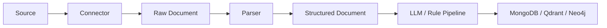

# Workflow Guide

## Target Operating Model

Raven is being shaped around a generic OSINT acquisition workflow:



## Workflow 1: Configure Infrastructure

Implemented in the current TUI.

1. Start Raven.
2. Open `Config`.
3. Set Neo4j, Qdrant and MongoDB endpoints.
4. Save the configuration.
5. Use `Refresh` to verify connection status.

Expected result:

- configuration is written to `config/raven.yaml`;
- connection probes show `online`, `offline` or `invalid`.

## Workflow 2: Register a Source

Planned TUI workflow, persistence layer implemented.

1. Open Sources.
2. Create a new source.
3. Choose `SourceType`, for example `WEBSITE`, `RSS`, `TELEGRAM`, `API` or `FILESYSTEM`.
4. Set endpoint, polling interval, priority and tags.
5. Add configuration map values specific to the connector.
6. Save the source.

Expected persistence:

- saved to MongoDB collection `sources`;
- source status defaults to `ENABLED`;
- scheduler can later select enabled sources ordered by priority.

Example RSS source:

```json
{
  "name": "Libya Observer RSS",
  "type": "RSS",
  "endpoint": "https://example.org/feed.xml",
  "status": "ENABLED",
  "priority": 10,
  "polling_interval": "PT30M",
  "configuration": {
    "maxItems": 100
  },
  "tags": ["Libia", "Politica"]
}
```

## Workflow 3: Acquire Raw Documents

Planned execution workflow, connector contract and persistence layer implemented.

1. Scheduler selects enabled sources by priority.
2. The source type resolves to a connector implementation.
3. The connector calls `fetch(SourceDto source)`.
4. Each returned `RawDocumentDto` is saved.
5. Duplicates are avoided through `source_id + original_uri` and `source_id + content_hash`.
6. Source execution timestamps are updated.

Expected persistence:

- raw content is saved in `raw_documents`;
- source operational state is updated in `sources`.

## Workflow 4: Parse Raw Documents

Planned.

1. Parser selects raw documents by MIME type or source type.
2. Parser extracts structured content.
3. Website or RSS HTML becomes `ArticleDto`.
4. Telegram content may become a future `PostDto` or `MessageDto`.
5. PDF content may become a future `DocumentDto`.
6. Structured documents keep a reference to `raw_document_id`.

Important rule:

Structured documents do not know the source directly. They trace back through `RawDocumentDto`.

## Workflow 5: Enrich Intelligence Article

Partially modeled, pipeline implementation planned.

1. Load an `ArticleDto`.
2. Extract metadata and taxonomy.
3. Extract entities.
4. Extract relationships.
5. Extract events.
6. Separate facts, claims and evidence.
7. Create intelligence assessment and quality assessment.
8. Create embedding references or vector payload.
9. Store related links and provenance.

Expected outputs:

- updated `articles` document in MongoDB;
- planned vector entry in Qdrant;
- planned graph nodes and relationships in Neo4j.

## Workflow 6: Build Knowledge Graph

Planned.

1. Load enriched articles.
2. Upsert entities as graph nodes.
3. Upsert relationships as graph edges.
4. Upsert claims as attributed assertions.
5. Attach evidence and provenance.
6. Link events to participants, locations and related documents.

Graph principle:

Claims must not be treated as verified facts unless a later verification process promotes or confirms them.
